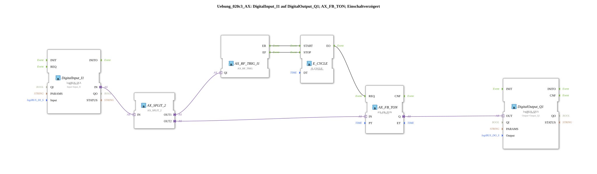

# Exercise_020c3_AX: DigitalInput_I1 to DigitalOutput_Q1; AX_FB_TON; Power-On Delay
This article describes the logiBUS® exercise `Uebung_020c3_AX`. It uses the adapter-based IEC 61131-3 timer block `AX_FB_TON`, which requires regular triggering (clock) to update its internal status (ET).
----
## Objective of the Exercise
The objective is to implement a power-on delay using classic PLC behavior (including an ET output) in an event-driven environment. Since `AX_FB_TON` expects cyclic behavior for timing calculations, a clock generator (`E_CYCLE`) is used.

-----

## Description and Components

The subapplication `Uebung_020c3_AX.SUB` uses a `E_CYCLE` function block to generate the clock signal for the timer.

### Function Blocks (FBs)

* **`DigitalInput_I1`**: Reads the input state via an AX adapter.
* **`AX_FB_TON`**: The power-on delay timer with adapter interfaces. It requires cyclic events at the `REQ` input.
* **`E_CYCLE`**: Generates an event every 500 ms as long as the `I1` input is active.
* **`AX_SWITCH`**: Starts and stops `E_CYCLE` based on the input state.
* **`DigitalOutput_Q1`**: Outputs the delayed signal via an AX adapter.

-----

## Functionality

1. **Start**: As soon as the button `I1` is pressed, `AX_SWITCH` activates `E_CYCLE`.

2. **Clocking**: `E_CYCLE` sends an event to `AX_FB_TON.REQ` every 500 ms.

3. **Delay**: After 5 seconds (PT), the timer's output `Q` becomes active.

4. **Stop**: When the button is released, `E_CYCLE` stops and the timer is reset.

-----

## Conclusion

This example illustrates that components with IEC 61131-3 behavior (such as the `AX_FB_*` series) require a continuous event source to correctly process time values like `ET`.