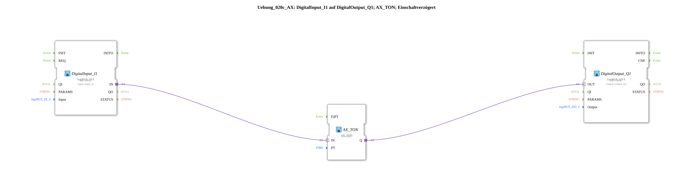

# Exercise_020c_AX: DigitalInput_I1 to DigitalOutput_Q1; AX_TON; On-Delay

[(https://notebooklm.google.com/notebook/041f4df4-b729-484d-b786-b6dcdf151961)
This article describes the logiBUS® exercise `Uebung_020c_AX`.
----
## Objective of the Exercise

To become familiar with the timer block `AX_TON`.

-----

## Description and Components

[cite_start]The subapplication `Uebung_020c_AX.SUB` delays the on-signal[cite: 1].

### Function Blocks (FBs)

* **`AX_TON`**: Timer On-Delay.
* **Parameter `PT`**: Preset Time (here 5 seconds).

-----

## Functionality

1. Input `I1` becomes TRUE.
2. `AX_TON` starts the timer.
3. After 5 seconds, output `Q` becomes TRUE -> the light turns on.
4. If `I1` becomes FALSE again before the 5 seconds have elapsed, the timer stops and the light remains off.
5. When `I1` is switched off, the light turns off immediately (no switch-off delay).

-----

## Application Example

**Start-up Warning**: Before a conveyor belt starts, a horn sounds for 5 seconds. Only then does the engine start.