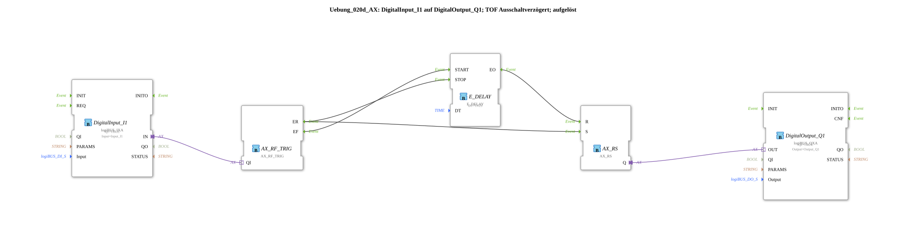

# Exercise_020d_AX: DigitalInput_I1 to DigitalOutput_Q1; TOF Off-Delay; resolved

[(https://notebooklm.google.com/notebook/041f4df4-b729-484d-b786-b6dcdf151961)
This article describes the logiBUS® exercise `Uebung_020d_AX`. Here, an off-delay (TOF) is constructed using discrete event and memory blocks
----

## Objective of the Exercise

The objective of this exercise is to analyze the off-delay at the logic level. Unlike the on-delay (`Uebung_020b_AX`), the timer only starts when the button is *released*.

-----

## Description and Components

[cite_start]The subapplication `Uebung_020d_AX.SUB` uses an event switch to immediately set the memory when the button is pressed and reset it after a time delay when released.[cite: 1]

### Function Blocks (FBs)

- **`DigitalInput_I1`**: Type `logiBUS_IXA`. Signal input.
- **`AX_SWITCH`**: [cite_start]Separates rising (`EO1`) and falling (`EO0`) edges.[cite: 1]
- **`AX_RS`**: The result memory.
- **`E_DELAY`**: [cite_start]Delays the reset event by 2 seconds (`DT = T#2S`)[cite: 1].
- **`DigitalOutput_Q1`**: Type `logiBUS_QXA`. Signal output.

-----

## Functionality

The logic works as follows:

1. **Power On (Immediate)**:

When `I1` is pressed, the switch sends an event to `EO1`. This event immediately sets the memory `AX_RS.S` -> `Q1` is activated. Simultaneously, any delay still in progress is stopped (`E_DELAY.STOP`).

1. **Release (Start of Delay)**:

When `I1` is released, the switch sends an event to `EO0`. This event starts the timer `E_DELAY.START`. The memory remains set to TRUE for the time being.

1. **Switch Off (After Time Expires)**:

After 2 seconds, `E_DELAY.EO` fires. This event resets the memory (`AX_RS.R`) -> `Q1` switches off.

As a result, the indicator light illuminates immediately upon pressing and remains on for exactly 2 seconds after release.
...
# 2 -----

## Application Example

**Run-on Control**: A stairwell light or a fan should switch on immediately when the switch is pressed, but continue to run for a certain period of time after the room has been vacated.
