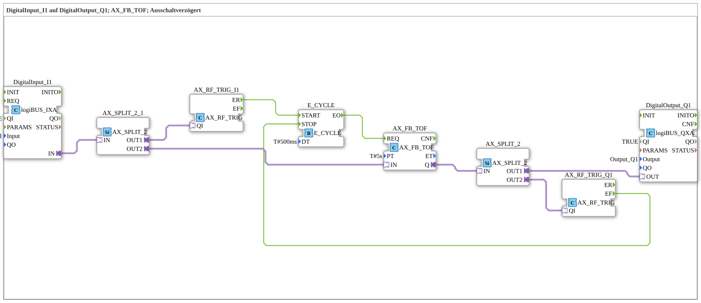

# Exercise_020e2_AX: DigitalInput_I1 to DigitalOutput_Q1; AX_FB_TOF; Switch-Off Delay

This article describes the logiBUS® exercise `Uebung_020e2_AX`. It uses the adapter-based IEC 61131-3 timer block `AX_FB_TOF`, which requires regular triggering (clocking).
----
## Objective of the Exercise

Implementation of a switch-off delay that also updates its status (`ET`) during the overrun time.
-----

## Description and Components

The sub-application `Uebung_020e2_AX.SUB` uses a `E_CYCLE` block for clocking.

### Function Blocks (FBs)

* **`AX_FB_TOF`**: The off-delay timer.
* **`E_CYCLE`**: Provides the clock signal (500 ms) for the timer.
* **`AX_SWITCH_I1`**: Starts the clock signal when the input is activated.
* **`AX_SWITCH_Q1`**: Stops the clock signal only when the timer output has also dropped out (run-on timer complete).

-----

## Functionality

1. **Activation**: On `I1 = TRUE`, the output is immediately activated and the clock signal starts.
2. **Run-on**: When `I1` drops out, the timer continues to run. The output `E_CYCLE` remains active because the output `Q` is still `TRUE`.
3. **Termination**: Once the 5 seconds have elapsed, `Q` drops out and `E_CYCLE` stops.

-----

## Conclusion

This exercise demonstrates the complex control of a switch-off delay, where the clock generator must remain active for the entire duration (switch-on time + delay time).