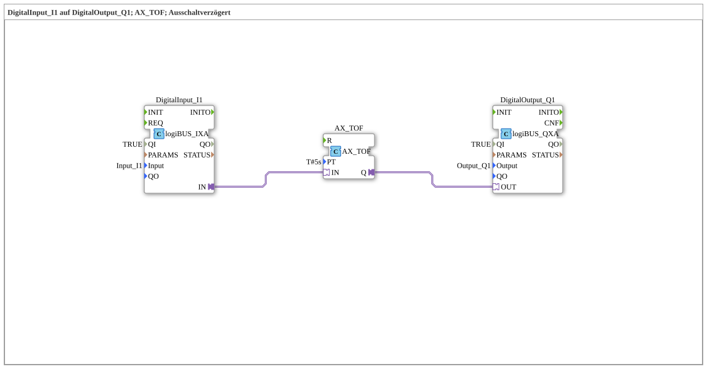

# Exercise_020e_AX: DigitalInput_I1 to DigitalOutput_Q1; AX_TOF; Off-Delay

This article describes the logiBUS® exercise `Uebung_020e_AX`.
----
## Objective of the Exercise
To become familiar with the timer block `AX_TOF`.

-----

## Description and Components

[cite_start]The subapplication `Uebung_020e_AX.SUB` delays the off-signal[cite: 1].

### Function Blocks (FBs)

* **`AX_TOF`**: Timer Off-Delay.
* **Parameter `PT`**: Preset Time (here 5 seconds).

-----

## Functionality

1. Input `I1` becomes TRUE -> Lamp turns on **immediately**.

2. Input `I1` becomes FALSE -> Timer starts.

3. After 5 seconds, output `Q` becomes FALSE -> Lamp turns off.

-----

## Application Example

**Run-on Time**: A bathroom fan continues to run for 5 minutes after the light is switched off.