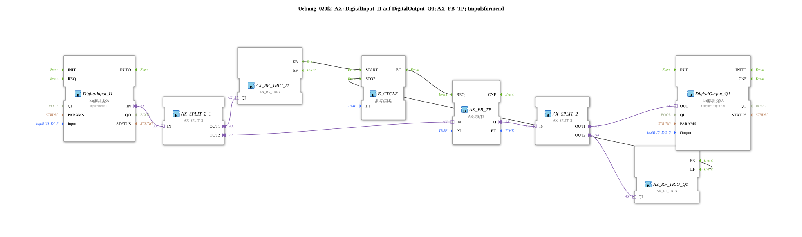

# Exercise_020f2_AX: DigitalInput_I1 to DigitalOutput_Q1; AX_FB_TP; Pulse Shaping

[(https://notebooklm.google.com/notebook/041f4df4-b729-484d-b786-b6dcdf151961)
This article describes the logiBUS® exercise `Uebung_020f2_AX`. Here, the adapter-based IEC 61131-3 timer block `AX_FB_TP` is used, which requires regular triggering (clocking).
----
## Objective of the Exercise

The objective is to bridge the gap between classic PLC programming (cyclic) and IEC 61499 (event-based). Since a `AX_FB_TP` internally counts the time, its `REQ` input must be regularly supplied with events while the timer is running.

-----

## Description and Components

The subapplication `Uebung_020f2_AX.SUB` uses a `E_CYCLE` function block to generate the clock signal for the timer.

### Function Blocks (FBs)

- **`AX_FB_TP`**: The pulse timer with adapter interfaces. It reacts to the rising edge at the input and holds the output TRUE for the time `PT`.

- **`AX_FB_TP`**: The pulse timer with adapter interfaces. It reacts to the rising edge at the input and holds the output TRUE for the time `PT`.
- * **`E_CYCLE`**: Generates an event every 500ms to update the timer.
- **`AX_SWITCH`**: Monitors the status to start or stop the clock as needed.

-----

## Functionality

1. **Start**: Pressing the button triggers a pulse at `AX_FB_TP` and starts `E_CYCLE`.
2. **Clocking**: `E_CYCLE` sends an event to `AX_FB_TP.REQ` every 500ms. With each event, the timer checks the elapsed time and updates its status.
3. **Pulse**: As long as the pulse is active, output `Q` remains true.
4. **Stop**: Once the 5 seconds have elapsed, the `E_CYCLE` stops via corresponding logic (`AX_SWITCH`).

This example shows that while classic function blocks can be used, they require more effort for event management than specialized adapter function blocks (such as `AX_TP`).

-----

## Application Example

**Integration of Legacy Code**: This clock pattern is essential when existing function blocks from the "old" PLC world, which rely on cyclic execution, are to be adopted.
