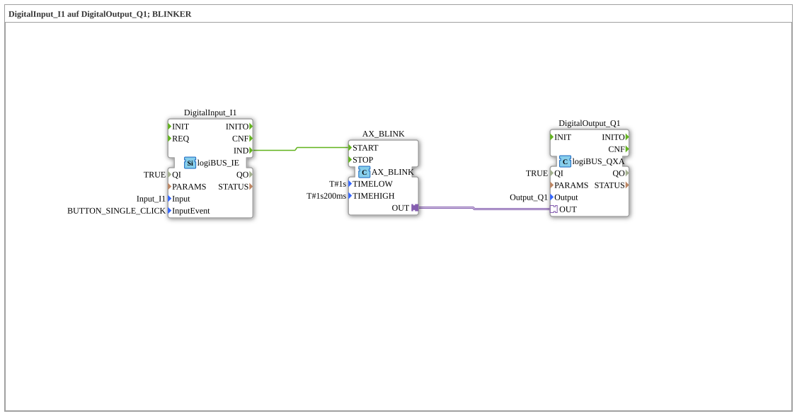

# Exercise_020f3_AX: DigitalInput_I1 to DigitalOutput_Q1; Flasher

[(https://notebooklm.google.com/notebook/041f4df4-b729-484d-b786-b6dcdf151961)
This article describes the logiBUS® exercise `Uebung_020f3_AX`
----

## Objective of the Exercise

Using the `AX_BLINK` block for asymmetric flashing.

-----

## Description and Components

[cite_start]The subapplication `Uebung_020f3_AX.SUB` uses a specialized flasher block[cite: 1].

### Function Blocks (FBs)

- **`AX_BLINK`**: Generates a flashing signal.
- **Parameter `TIMELOW`**: Time for "Off" (1 s).
- **Parameter `TIMEHIGH`**: Time for "On" (1.2 s).

----

## Functionality

An event at input `START` (here supplied by button `I1`) starts the blinker. It then runs for the parameterized times. The function block essentially integrates the logic of two timers and a flip-flop.

-----

## Application Example

**Error Code**: An LED blinks in a specific pattern (short on, long off) to signal an error code.
