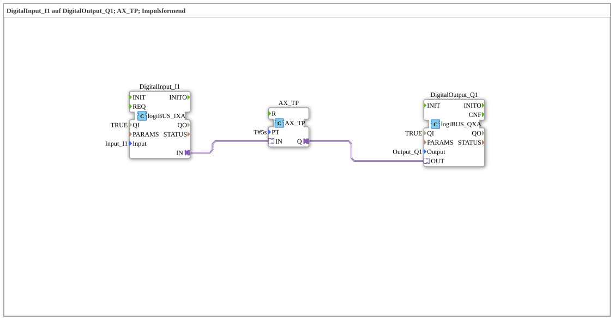

# Exercise_020f_AX: DigitalInput_I1 to DigitalOutput_Q1; AX_TP; Pulse Shaping

This article describes the logiBUS® exercise `Uebung_020f_AX`. Here, a pulse timer (TP - Timer Pulse) is used to enforce a defined on-time.

----

## Objective of the Exercise

The objective of this exercise is to use the `AX_TP` function block. A pulse element is ideal when an action needs to be executed for a precise duration, regardless of how long the triggering button remains pressed.

-----

## Description and Components

[cite_start]The subapplication `Uebung_020f_AX.SUB` uses an adapter timer of type `AX_TP`[cite: 1].

### Function Blocks (FBs)

* **`DigitalInput_I1`**: Type `logiBUS_IXA`. The trigger.

* **`AX_TP`**: [cite_start]Generates a pulse of length `PT` (here 5 seconds) at the output `Q`[cite: 1] on a rising edge at the input.

* **`DigitalOutput_Q1`**: Type `logiBUS_QXA`. The actuator.

-----

## Functionality

1. **Triggering**: As soon as the input `I1` reaches the state `TRUE`, the timer starts.

2. **Activation**: The output `Q` immediately becomes `TRUE`, and the lamp `Q1` illuminates.

3. **Timeout**: Even if the user releases the button immediately (or holds it down for 10 seconds), the lamp remains on for exactly **5 seconds**.

4. **End**: After 5 seconds, the lamp automatically turns off. A new pulse can only be triggered after the next edge transition at the input.

-----

## Application Example

**Lubrication or Cleaning**: A central lubrication system on a machine or a cleaning nozzle should be active for exactly 5 seconds after a start signal to deliver the correct amount of fluid.