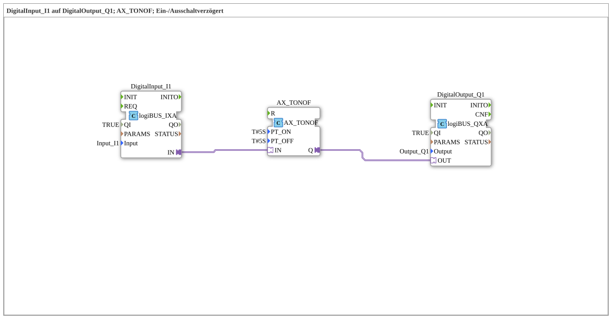

# Exercise_020g_AX: DigitalInput_I1 to DigitalOutput_Q1; AX_TONOF; On/Off Delay

This article describes the logiBUS® exercise `Uebung_020g_AX`. Here, the combined delay block `AX_TONOF` is used.
----
## Objective of the Exercise

The objective is to filter a signal in both directions over time. Short pulses (both positive and negative) are ignored. Only if a state remains stable for longer than the defined time is it passed to the output.

-----

## Description and Components

[cite_start]The subapplication `Uebung_020g_AX.SUB` uses the function block `AX_TONOF`[cite: 1].

### Function Blocks (FBs)

* **`DigitalInput_I1`**: Type `logiBUS_IXA`.
* **`AX_TONOF`**: [cite_start]Combines the power-on delay (`PT_ON`) and the power-off delay (`PT_OFF`) in one function block. Here, both times are set to 5 seconds[cite: 1].
* * **`DigitalOutput_Q1`**: Type `logiBUS_QXA`.

-----

## Functionality

1. **Power On**: When `I1` is pressed, nothing happens at the output initially. `Q1` is only powered on after **5 seconds** of continuous pressure.
2. **Power Off**: When `I1` is released, `Q1` remains on initially. `Q1` is only powered off after **5 seconds** of being released.

A brief tap (< 5s) does not power on. A brief release (< 5s) does not power off.

-----

## Application Example

**Level Monitoring**: A float switch in a tank where the medium sloshes around. The pump should only switch on when the sensor reports "Empty" for 5 seconds and only switch off when it reports "Full" for 5 seconds. This prevents the pump from vibrating erratically due to ripples.