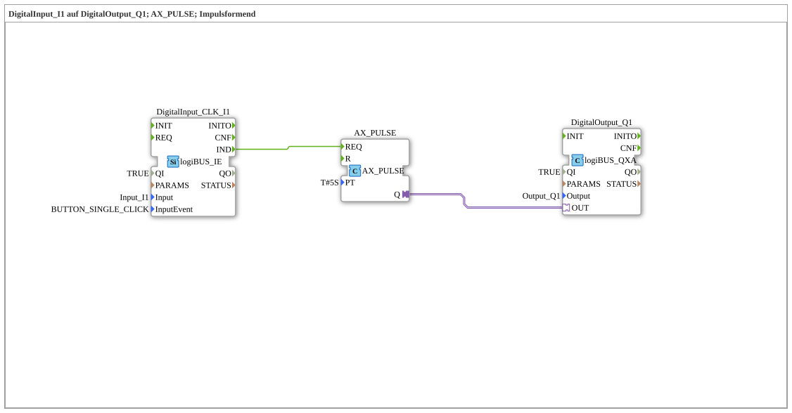

# Exercise_020h_AX: DigitalInput_I1 to DigitalOutput_Q1; AX_PULSE; Pulse Shaping

This article describes the logiBUS® exercise `Uebung_020h_AX`. Here, the function block `AX_PULSE` is used, which, unlike `AX_TP`, operates purely on an event-based basis.
----
## Objective of the Exercise

The objective is to transform a single, short event (e.g., a mouse click or button press) into a longer-lasting action. The focus here is on the purely event-oriented interface of the function block.

-----

## Description and Components

[cite_start]The subapplication `Uebung_020h_AX.SUB` combines an event input with an adapter pulse block[cite: 1].

### Function Blocks (FBs)

* **`DigitalInput_CLK_I1`**: Type `logiBUS_IE`. Returns an event on a single click (`BUTTON_SINGLE_CLICK`).
* **`AX_PULSE`**: [cite_start]Starts a timer when an event arrives at the `REQ` input. The output `Q` remains TRUE for `PT` (5 seconds) [cite: 1].
* **`DigitalOutput_Q1`**: Type `logiBUS_QXA`.

-----

## Functionality

1. **Event**: The user briefly clicks the button `I1`.
2. **Trigger**: The input block sends a `IND` event to the `REQ` input of `AX_PULSE`.
3. **Action**: The timer starts immediately. The adapter output `Q` becomes `TRUE` and switches on the lamp `Q1`.
4. **Autonomy**: Since the module is event-driven, the input does not need to be held. It "remembers" the start pulse.
5. **End**: After 5 seconds, the output automatically switches back to `FALSE`.

-----

## Application Example

**Door Opener**: A short press of a button on the intercom triggers an electric door opener for exactly 5 seconds, allowing the visitor to enter.