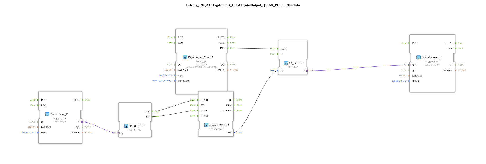

# Exercise_020i_AX: DigitalInput_I1 to DigitalOutput_Q1; AX_PULSE; Teach-In

[(https://notebooklm.google.com/notebook/041f4df4-b729-484d-b786-b6dcdf151961)
This article describes the logiBUS® exercise `Uebung_020i_AX`. This exercise combines time measurement and time control into a self-learning pulse function.
----
## Objective of the Exercise

The objective is to implement a teach-in procedure. Instead of hardcoding the time `PT` in the program, the operator can specify the desired duration by holding down a button. The controller stores this time and applies it to future pulses.

## Description and Components

[cite_start]The subapplication `Uebung_020i_AX.SUB` uses a stopwatch to dynamically change the time setting for a pulse block[cite: 1].

### Function Blocks (FBs)

- **`DigitalInput_I2` (Teach Button)**: Type `logiBUS_IXA`. Measures how long the button is pressed.
- **`AX_SWITCH`**: Converts the press/release of `I2` into start/stop signals for the stopwatch.
- **`E_STOPWATCH`**: [cite_start]Measures the time between `START` and `STOP` and outputs the duration at output `TD`[cite: 1].
- **`AX_PULSE`**: The pulse module. Its time parameter `PT` is linked to the measured value `TD` of the stopwatch.
- **`DigitalInput_CLK_I1` (Start button)**: Type `logiBUS_IE`. Triggers the pulse.
- **`DigitalOutput_Q1`**: Type `logiBUS_QXA`. Signal output.

-----

## Functionality

The application is performed in two steps:

1. **Teach-In**:

The user presses and holds button `I2` for the desired duration (e.g., 3.5 seconds).

- Pressing the button starts `E_STOPWATCH`.
- Releasing the button stops the measurement. The value (3.5 seconds) is now present at input `PT` of `AX_PULSE`.
2. **Execute**:

The user briefly clicks button `I1`.

- `AX_PULSE` is triggered and switches on the lamp `Q1` for exactly the previously learned 3.5 seconds.

Each new learning step via `I2` overwrites the stored time for the next pulse.

-----

## Application Example

**Dosing Control**: A farmer wants to manually calibrate the application rate of an additive. He holds the fill button until the desired test quantity is reached. The controller remembers this time and can then precisely repeat the dosing process with a simple button press.
