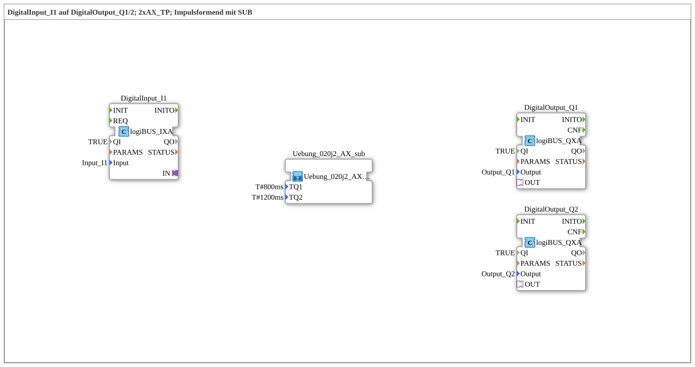

Here is the documentation for exercise `Uebung_020j2_AX`, based on the provided XML data.
# Exercise_020j2_AX: DigitalInput_I1 to DigitalOutput_Q1/2; 2xAX_TP; Pulse Shaping with SUB

* * * * * * * * * *
## Introduction
This exercise demonstrates the processing of signals using adapter connections (AX) within an IEC 61499 application. A digital input signal (`DigitalInput_I1`) is used to drive two separate digital outputs (`DigitalOutput_Q1` and `DigitalOutput_Q2`). The unique aspect of this exercise lies in the use of an encapsulated sub-application (`Uebung_020j2_AX_sub`) that splits the input signal and controls two independent pulse timers.

## Function Blocks Used

The following blocks are used in the main network:

* **DigitalInput_I1** (`logiBUS::io::DI::logiBUS_IXA`): Represents the physical input `Input_I1`.
* **DigitalOutput_Q1** (`logiBUS::io::DQ::logiBUS_QXA`): Represents the physical output `Output_Q1`.
* **DigitalOutput_Q2** (`logiBUS::io::DQ::logiBUS_QXA`): Represents the physical output `Output_Q2`.
* **Exercise_020j2_AX_sub** (`Uebungen::Uebung_020j2_AX_sub`): A user-defined sub-application containing the logic for pulse shaping and signal distribution.

### Sub-Blocks: Exercise_020j2_AX_sub

This sub-application encapsulates the logic for splitting the adapter signal and generating the time pulses.

- **Type**: SubAppType
- **Interfaces**:
- **Input Variables**: `TQ1` (time value for Timer 1), `TQ2` (time value for Timer 2).
- **Adapter Input (Socket)**: `IN` (Type: `AX`).
- **Adapter Outputs (Plugs)**: `Q1`, `Q2` (Type: `AX`).
- **Internal Function Blocks Used**:
- **AX_SPLIT_2**: `adapter::events::unidirectional::AX_SPLIT_2`
- **Function**: Splits one incoming adapter connection into two outgoing adapter connections (OUT1 and OUT2).
- **Connection**: The input `IN` of the sub-app is connected to the input of this function block.
- **AX_TP_Q1**: `adapter::events::unidirectional::timers::AX_TP`
- **Parameter**: `PT` (Pulse Time) is set by the sub-app input `TQ1`.
- **Input**: Connected to `OUT1` of `AX_SPLIT_2`.
- **Output**: Connected to the adapter plug `Q1` of the sub-app.
- **AX_TP_Q2**: `adapter::events::unidirectional::timers::AX_TP`
- **Parameter**: `PT` (Pulse Time) is set by the sub-app input `TQ2`.
- **Input**: Connected to `OUT2` of `AX_SPLIT_2`.
- **Output**: Connected to the adapter plug `Q2` of the sub-application.
- **Functionality**:

The incoming signal at adapter `IN` is duplicated by the `AX_SPLIT_2` module. Both signal paths then each pass through their own pulse timer (`AX_TP`). These timers generate a pulse of defined length (`TQ1` or `TQ2`) on the adapter line as soon as an input signal is detected. The resulting signals are routed to outputs `Q1` and `Q2`.

## Program Flow and Connections

The exercise proceeds as follows:

1. **Signal Input**:

The system reads the state of the digital input `Input_I1` via the function block `DigitalInput_I1`.

2. **Processing in the Sub-Application**:

* The adapter connection of the input is forwarded to the sub-application `Uebung_020j2_AX_sub`.
* Within the sub-application, the signal is split.
* Two independent timers are started, their time values defined via parameters in the main network:
* **Path 1**: Duration `T#800ms` (parameter `TQ1`).
* **Path 2**: Duration `T#1200ms` (parameter `TQ2`).

3. **Signal Output**:

* The output `Q1` of the sub-application (800ms pulse) controls `DigitalOutput_Q1`.
* The output `Q2` of the sub-application (1200ms pulse) controls `DigitalOutput_Q2`.

This allows a single input signal to activate two outputs, which remain active for different durations (pulse shaping).

## Summary

Exercise `Uebung_020j2_AX` clearly demonstrates the use of unidirectional adapter connections (`AX`) for signal processing. It shows how logic can be encapsulated in sub-applications to create clear and reusable complex functions (here: signal splitting and parallel timer control). Learning objectives include working with the `AX_SPLIT` function block and configuring timer function blocks (`AX_TP`) via sub-application interfaces.
