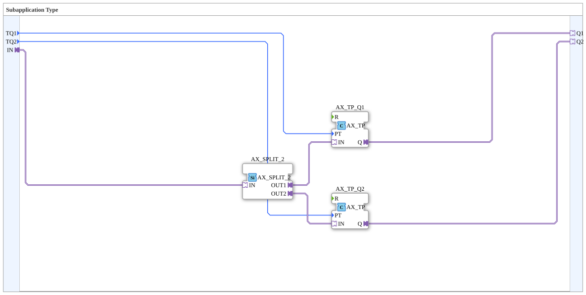

# Exercise_020j2_AX_sub: Subapplication Type

* * * * * * * * * *
## Introduction
This subapplication serves as a building block for controlling two outputs (`Q1`, `Q2`) with time-delayed pulses. It is controlled via a single input (`IN`) and allows individual adjustment of the pulse durations for each output (via the parameters `TQ1` and `TQ2`). The subapplication encapsulates the logic for splitting an input event and timing two independent output signals.

## Function Blocks (FBs) Used

The subapplication consists of a user-defined SubAppType containing the following internal function blocks:

### Sub-Block: `Uebung_020j2_AX_sub`
- **Type**: SubAppType (user-defined subapplication, reusable as a block)
- **Internal FBs Used**:
- **`AX_SPLIT_2`**
- **Type**: `adapter::events::unidirectional::AX_SPLIT_2`
- **Parameters**: No direct parameters (standard block)
- **Event Output/Input**: Event input `IN` → Event outputs `OUT1`, `OUT2`
- **Data Output/Input**: No data
- **Functionality**: Distributes an incoming event across two Outputs. This forwards the input signal in parallel to the subsequent timers.
- **`AX_TP_Q1`**
- **Type**: `adapter::events::unidirectional::timers::AX_TP`
- **Parameter**: Duration `PT` = `TQ1` (from the sub-application input)
- **Event Output/Input**: Event input `IN` → Event output `Q` (after the set time has elapsed)
- **Data Output/Input**: Data input `PT` (time)
- **Functionality**: Upon an event at the input, a pulse is generated at the output, the duration of which is determined by the parameter `PT`.
- **`AX_TP_Q2`**
- **Type**: `adapter::events::unidirectional::timers::AX_TP`
- **Parameters**: Duration `PT` = `TQ2` (from the subapplication input)
- **Event output/input**: See `AX_TP_Q1`
- **Data output/input**: See `AX_TP_Q1`
- **Functionality**: Identical to `AX_TP_Q1`, but with its own time setting `TQ2`.

## Program Flow and Connections

The flow within the subapplication is as follows:

1. An event at the adapter input `IN` is forwarded to the splitter `AX_SPLIT_2.IN`.

`` 2. The splitter splits the event between its two outputs:

- `AX_SPLIT_2.OUT1` → connected to `AX_TP_Q1.IN`
- `AX_SPLIT_2.OUT2` → connected to `AX_TP_Q2.IN`
3. Simultaneously, the time values are passed from the data parameters of the subapplication:

- `TQ1` (data input of the subapplication) → `AX_TP_Q1.PT`
- `TQ2` (data input of the subapplication) → `AX_TP_Q2.PT`
4. Each timer generates an output event after its respective time has elapsed:

- `AX_TP_Q1.Q` → connected to adapter output `Q1`
- `AX_TP_Q2.Q` → connected to adapter output `Q2`

**Learning Objectives of this Exercise**:

- Understanding and creating a subapplication in 4diac IDE.
- Working with adapters for unidirectional event and data communication.
- Using standard function blocks such as the splitter (`AX_SPLIT_2`) and timer (`AX_TP`).
- Parameterizing function blocks via subapplication inputs.

## Summary

The subapplication `Uebung_020j2_AX_sub` implements a simple but frequently needed function: Two time-independent output pulses are generated from an incoming event. The pulse durations can be set via the inputs `TQ1` and `TQ2`. Encapsulation within a subapplication enables easy reuse and contributes to structuring more complex automation solutions.

---

### 🌐 Related topic subpages on ms-muc-docs.de
* [🌐 Eclipse 4diac IDE & Color Reference on ms-muc-docs.de](https://www.ms-muc-docs.de/iec-61499/eclipse-4diac/)

]
