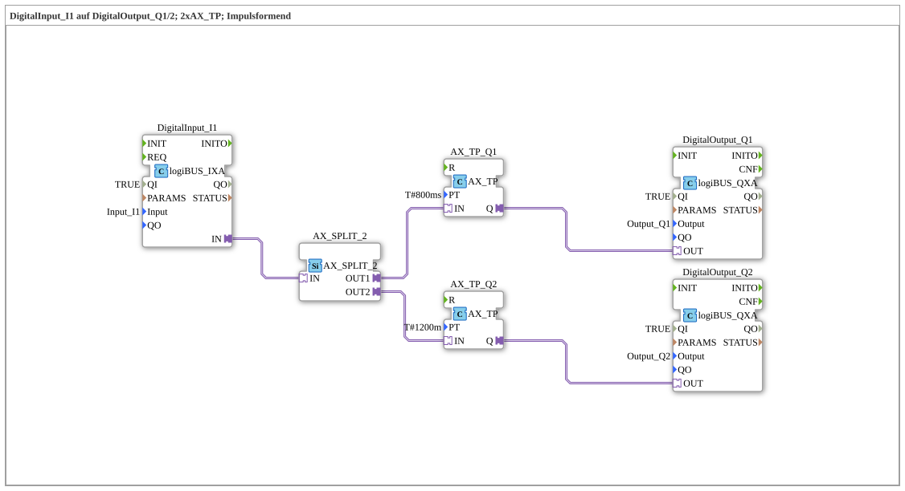

Here is the documentation for exercise `Uebung_020j_AX` based on the provided XML data.
# Exercise_020j_AX: DigitalInput_I1 to DigitalOutput_Q1/2; 2xAX_TP; Pulse Shaping

* * * * * * * * * *
## Introduction
Exercise **Exercise_020j_AX** demonstrates the use of adapter connections for signal processing. A digital input signal (`Input_I1`) is read, split, and used to control two digital outputs (`Output_Q1` and `Output_Q2`). Pulse-shaping timers are used, communicating via adapter interfaces.

## Function Blocks (FBs) Used

In this exercise, various function blocks are interconnected within the network to implement the desired logic.

### Sub-Blocks: DigitalInput_I1
- **Type**: `logiBUS::io::DI::logiBUS_IXA`
- **Description**: This block establishes the interface to the physical input.
- **Parameters**:
- `QI` = `TRUE` (Block enabled)
- `Input` = `Input_I1` (Hardware resource assignment)

### Sub-Blocks: AX_SPLIT_2
- **Type**: `adapter::events::unidirectional::AX_SPLIT_2`
- **Description**: A splitter block for adapter connections. It receives an incoming adapter connection and splits it into two outputs to forward the signal to multiple receivers.

### Sub-Blocks: AX_TP_Q1
- **Type**: `adapter::events::unidirectional::timers::AX_TP`
- **Description**: A pulse timer based on adapter technology. It generates a pulse of defined length.
- **Parameters**:
- `PT` = `T#800ms` (pulse duration of 800 milliseconds)

### Sub-Blocks: AX_TP_Q2
- **Type**: `adapter::events::unidirectional::timers::AX_TP`
- **Description**: A second pulse timer for the second output path.
- **Parameters**:
- `PT` = `T#1200m` (pulse duration of 1200 minutes – *Note: According to IEC 61131-3 syntax, this refers to minutes. In the context of exercises, milliseconds (ms) are often meant, but the code specifies `m`*).

### Sub-modules: DigitalOutput_Q1
- **Type**: `logiBUS::io::DQ::logiBUS_QXA`
- **Description**: Interface to the first physical output.

### Sub-modules: DigitalOutput_Q1
- **Type**: `logiBUS::io::DQ::logiBUS_QXA`
- **Description**: Interface to the first physical output. - **Parameters**:
- `QI` = `TRUE`
- `Output` = `Output_Q1`

### Sub-modules: DigitalOutput_Q2
- **Type**: `logiBUS::io::DQ::logiBUS_QXA`
- **Description**: Interface to the second physical output.
- `logiBUS::io::DQ::logiBUS_QXA`
- **Description**: Interface to the second physical output. - **Parameters**:
- `QI` = `TRUE`
- `Output` = `Output_Q2`

## Program Flow and Connections

The exercise proceeds as follows:

1. **Signal Input**: The signal is retrieved into the system via the function block `DigitalInput_I1` (resource `Input_I1`).

2. **Signal Distribution**: The adapter connection from the input (`IN`) goes to the input of the `AX_SPLIT_2` function block. This duplicates the adapter information to two outputs (`OUT1` and `OUT2`).

3. **Signal Processing Path 1**:

- The splitter's output `OUT1` is connected to the timer `AX_TP_Q1`.
- As soon as a signal event occurs, this timer generates a pulse of **800 ms**.
- The timer's output (`Q`) directly controls the `DigitalOutput_Q1`.

4. **Signal Processing Path 2**:

- The splitter's output `OUT2` is connected to the timer `AX_TP_Q2`.
- This timer is configured for a duration of **1200 m** (minutes).
- The output of this timer (`Q`) controls the `DigitalOutput_Q2`.

**Learning Objectives:**

- Understanding adapter concepts in 4diac (`AX` blocks).
- Using `AX_SPLIT` blocks to branch data and event flows encapsulated in adapters.
- Parameterizing adapter timers (`AX_TP`).

## Summary
Exercise `Uebung_020j_AX` demonstrates a parallel connection of two outputs triggered by a common input. By using adapter timers, different pulse durations are implemented for `Q1` and `Q2` without having to create separate event and data connections. Particular attention is paid to the correct use of the splitter block and the time syntax of the parameters.

---

### 🌐 Related topic subpages on ms-muc-docs.de
* [🌐 Eclipse 4diac IDE & Color Reference on ms-muc-docs.de](https://www.ms-muc-docs.de/iec-61499/eclipse-4diac/)
* [🌐 Total Resistance in Series & Parallel Circuits on ms-muc-docs.de](https://www.ms-muc-docs.de/elektrotechnik/elektrik/widerstand/widerstand-theorie/gesamtwiderstand-reihen-parallelschaltung/)

]
