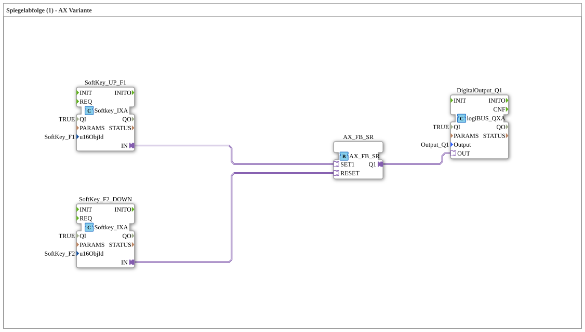

# Exercise_021_AX: Mirror Sequence (1) - AX Variant

* * * * * * * * * *
## Introduction
This exercise implements a simple control for a **mirror sequence (1)** – AX variant. A digital output can be set and reset using two softkeys (F1 and F2). The function block forms a kind of **start/stop logic** for a drive (AX) that is controlled by the softkeys. The exercise provides basic knowledge about the use of softkeys, SR flip-flops, and digital outputs in the 4diac IDE.

## Function Blocks (FBs) Used

### Softkey_UP_F1
- **Type**: `isobus::UT::io::Softkey::Softkey_IXA`
- **Parameters**:
- `QI` = TRUE (Block active)
- `u16ObjId` = `SoftKey_F1` (uses the F1 key defined in the pool)
- **Adapter Output**: `IN` – connected to the set input of the SR flip-flop.
- **Function**: Sends a signal (pulse) to the connected adapter when the F1 softkey is pressed.

### SoftKey_F2_DOWN
- **Type**: `isobus::UT::io::Softkey::Softkey_IXA`
- **Parameters**:
- `QI` = TRUE
- `u16ObjId` = `SoftKey_F2` (F2 key)
- **Adapter Output**: `IN` – connected to the reset input of the SR flip-flop.
- **Function**: Sends a signal to the SR circuit when the F2 softkey is pressed.

### AX_FB_SR
- **Type**: `adapter::iec61131::bistableElements::AX_FB_SR`
- **Parameters**: none
- **Adapter Inputs**:
- `SET1` – controlled by SoftKey_UP_F1
- `RESET` – controlled by SoftKey_F2_DOWN
- **Adapter Output**:
- `Q1` – output signal that controls the digital output
- **Function**: An **SR flip-flop** (set – reset). As long as the set input is active, Q1 remains TRUE. A signal at the reset input sets Q1 to FALSE.

### DigitalOutput_Q1
- **Type**: `logiBUS::io::DQ::logiBUS_QXA`
- **Parameters**:
- `QI` = TRUE (Block active)
- `Output` = `Output_Q1` (the physical or virtual output address)
- **Adapter Input**: `OUT` – receives the control signal from the SR flip-flop.
- **Function**: Controls the digital output Q1 according to the applied signal (TRUE → output active, FALSE → output inactive).

## Program Flow and Connections

1. **Initial State**: The SR output `Q1` is FALSE, the digital output `Output_Q1` is inactive.

2. **Start (Softkey F1)**: When the **F1** key is pressed (labeled "START button"), `SoftKey_UP_F1` sends a pulse to `AX_FB_SR.SET1`. This sets the flip-flop: `Q1` becomes TRUE and remains so – even after the key is released.

3. **Stop (Softkey F2)**: When the **F2** key is pressed (labeled "End Position"), `SoftKey_F2_DOWN` sends a pulse to `AX_FB_SR.RESET`. The flip-flop is reset: `Q1` becomes FALSE, and the output switches off.

The connections are implemented as **adapter connections** (arrows between the adapters):

- `SoftKey_UP_F1.IN` → `AX_FB_SR.SET1`
- `SoftKey_F2_DOWN.IN` → `AX_FB_SR.RESET`
- `AX_FB_SR.Q1` → `DigitalOutput_Q1.OUT`

**Learning Objectives**:

- Setting up and configuring softkeys in 4diac
- Using an SR flip-flop for memory logic
- Controlling a digital output
- Understanding adapter connections (communication between function blocks)

**Required Prerequisites**: Basic operation of the 4diac IDE, knowledge of the libraries `isobus` and `logiBUS`.

## Summary

Exercise **Exercise_021_AX** demonstrates a simple mirror sequence for controlling a digital output using two softkeys. An SR flip-flop serves as the memory element, which is set by pressing F1 and reset by pressing F2. Output Q1 is switched accordingly. This exercise is suitable as an introduction to signal processing with bistable elements and the use of softkey function blocks for human-machine communication.

---

### 🌐 Related topic subpages on ms-muc-docs.de
* [🌐 Eclipse 4diac IDE & color reference on ms-muc-docs.de](https://www.ms-muc-docs.de/iec-61499/eclipse-4diac/)

]
