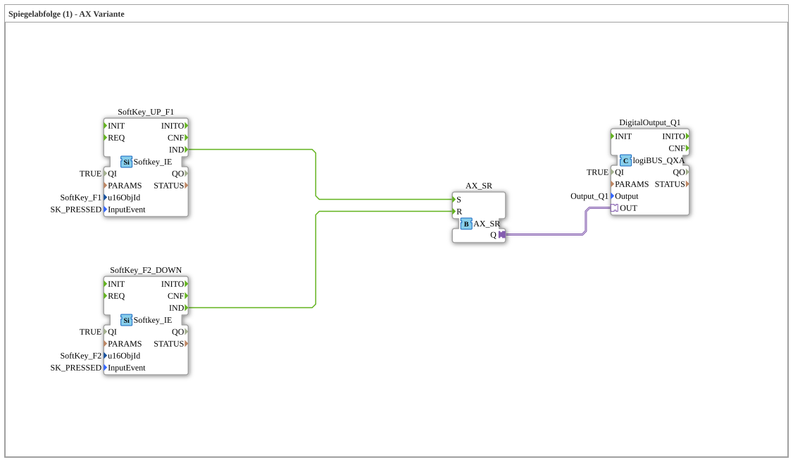

# Exercise_021b_AX2: Mirror Sequence (1) - AX Variant

* * * * * * * * * *
## Introduction
This exercise demonstrates the control of a simple mirror sequence using an AX flip-flop (AX_SR). The sequence is started and reset using two softkeys (F1 and F2). The flip-flop's output controls a digital output (Output_Q1), which can, for example, drive a mirror actuator. This exercise demonstrates the basic handling of adapter-based event flip-flops and digital outputs in the 4diac IDE.

## Function Blocks Used (FBs)
- **DigitalOutput_Q1**
- **Type**: `logiBUS::io::DQ::logiBUS_QXA`
- **Parameters**:
- `QI` = `TRUE`
- `Output` = `Output_Q1`
- **Event Inputs**: `OUT` (Adapter)
- **Function**: Sets the physical output `Output_Q1` to TRUE as soon as a TRUE signal is present at the adapter input.
- **SoftKey_UP_F1**
- **Type**: `isobus::UT::io::Softkey::Softkey_IE`
- **Parameters**:
- `QI` = `TRUE`
- `u16ObjId` = `SoftKey_F1` (Softkey F1)
- `InputEvent` = `SK_PRESSED`
- **Event Outputs**: `IND`
- **Function**: Generates an event at output `IND` as soon as the assigned softkey (F1) is pressed. The softkey is always enabled (QI=TRUE).
- **AX_FB_SR**
- **Type**: `adapter::events::unidirectional::AX_SR`
- **Parameters**: No parameters
- **Event Inputs**: `S` (Set), `R` (Reset)
- **Adapter Output**: `Q`
- **Function**: An asynchronous SR flip-flop adapter. An event on `S` sets the output `Q` to TRUE; an event on `R` resets it to FALSE. The output remains in this state until the next event.

`` - **SoftKey_F2_DOWN**

- **Type**: `isobus::UT::io::Softkey::Softkey_IE`
- **Parameters**:
- `QI` = `TRUE`
- `u16ObjId` = `SoftKey_F2` (Softkey F2)
- `InputEvent` = `SK_PRESSED`
- **Event Outputs**: `IND`
- **Function**: Like SoftKey_UP_F1, but responds to Softkey F2. Generates an event when F2 is pressed.

```
## Program Flow and Connections

The flow is divided into two comment fields:

- **START Button** (with softkey F1)
- **END POSITION** (with softkey F2)

### Event Connections
- `SoftKey_UP_F1.IND` → `AX_FB_SR.S`

Pressing softkey F1 sends an event to the set input of the flip-flop.

- `SoftKey_F2_DOWN.IND` → `AX_FB_SR.R`

Pressing softkey F2 sends an event to the reset input of the flip-flop.

## Adapter Connection
- `AX_FB_SR.Q` → `DigitalOutput_Q1.OUT`

The flip-flop output is forwarded as an adapter signal to the digital output module. If Q is TRUE, the output `Output_Q1` is enabled.

## Functionality

1. **Start of Mirror Sequence**: Pressing softkey F1 → Sets the AX flip-flop. Output Q becomes TRUE → the digital output is enabled (e.g., mirror extends).

2. **End Position / Reset**: Pressing softkey F2 → Resets the flip-flop. Q becomes FALSE → the digital output is disabled (mirror retracts).

3. The state is retained until the other softkey is pressed.

## Summary

This exercise uses an AX-SR flip-flop to implement a simple mirror control. You will learn:

- How to integrate softkey events into the control logic.
- The functionality of an adapter-based SR flip-flop (setting and resetting via events).
- Controlling a digital output (logiBUS_QXA) via adapter connections.
- Basic event wiring and parameter configuration in the 4diac IDE.

This exercise is suitable for beginners in event-driven programming with 4diac and lays the foundation for more complex sequence control systems.

--

### 🌐 Related topic subpages on ms-muc-docs.de
* [🌐 Eclipse 4diac IDE & color reference on ms-muc-docs.de](https://www.ms-muc-docs.de/iec-61499/eclipse-4diac/)

]
