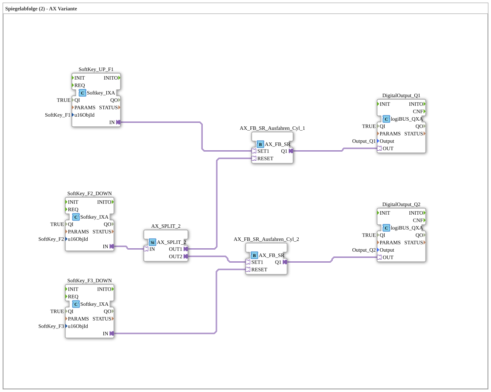

# Exercise_022_AX: Mirror Sequence (2) - AX Variant

No image available.

* * * * * * * * * *

## Introduction

This exercise implements a **mirror sequence** for two cylinders using the **AX variant** (adapter-based function blocks). Control is via three softkeys (F1, F2, F3). The operation is as follows:

- **Softkey F1** → Cylinder 1 extends.

- **Softkey F2** → Cylinder 1 retracts, and simultaneously Cylinder 2 extends (mirror image).

- **Softkey F3** → Cylinder 2 retracts.

The digital outputs Q1 and Q2 control the end positions of the cylinders (e.g., valves). The sequence is typical for industrial sequential control systems with a "shift" of the active cylinder.

## Function Blocks (FBs) Used

The exercise consists of a SubApp network with seven function blocks and an event splitter.

### Sub-Blocks

### DigitalOutput_Q1, DigitalOutput_Q2

- **Type**: `logiBUS::io::DQ::logiBUS_QXA`
- **Parameters**:

- `QI` = `TRUE`

- `Output` = `Output_Q1` or `Output_Q2`
- **Functionality**: Represents a digital output. The output becomes active when the input (via the adapter port `OUT`) receives a signal.

### SoftKey_UP_F1, SoftKey_F2_DOWN, SoftKey_F3_DOWN

- **Type**: `isobus::UT::io::Softkey::Softkey_IXA`
- **Parameters**:

- `QI` = `TRUE`

- `u16ObjId` = Reference to the corresponding softkey (`SoftKey_F1`, `SoftKey_F2`, `SoftKey_F3`)

- **Functionality**: Generates an event at the adapter output `IN` as soon as the assigned key (F1, F2, F3) is pressed. The input `QI` activates the component.

### AX_FB_SR_Extend_Cyl_1, AX_FB_SR_Extend_Cyl_2

- **Type**: `adapter::iec61131::bistableElements::AX_FB_SR`
- **Parameters**: None (all configuration via adapter interface)

- **Internal FBs Used**:

- This is an **SR flip-flop** (set-reset) in the AX adapter variant.

- **Adapter Ports**: `SET1` (set), `RESET` (reset), `Q1` (output).

- **Functionality**: A set pulse at `SET1` sets the output `Q1` to `TRUE` and holds it until a reset pulse at `RESET` is received. This behavior corresponds to a dominant set flip-flop.

### AX_SPLIT_2

- **Type**: `adapter::events::unidirectional::AX_SPLIT_2`
- **Parameters**: None
- **Functionality**: An event splitter. An incoming event at input `IN` is distributed to two outputs (`OUT1`, `OUT2`) – both are activated simultaneously. Used to forward a key press to two destinations.

## Program Flow and Connections

The flow is determined by the adapter connections in the SubApp network:

1. **F1 (SoftKey_UP_F1)** → sets `AX_FB_SR_Ausfahren_Cyl_1` (via `SET1`).

- The output `Q1` from Cyl_1 becomes `TRUE` and activates **DigitalOutput_Q1** (cylinder 1 extends).

2. **F2 (SoftKey_F2_DOWN)** → is distributed via `AX_SPLIT_2` to two paths:

- **OUT1** → `RESET` from `AX_FB_SR_Ausfahren_Cyl_1` → cylinder 1 retracts (Q1 = FALSE).

- **OUT2** → `SET1` from `AX_FB_SR_Ausfahren_Cyl_2` → Cylinder 2 extends (Q2 = TRUE).

- This achieves the mirroring: The active cylinder switches from 1 to 2.

3. **F3 (SoftKey_F3_DOWN)** → `RESET` from `AX_FB_SR_Ausfahren_Cyl_2` → Cylinder 2 retracts (Q2 = FALSE).

**Overview of signal flows:**

- F1 → Set Cyl_1 → Q1 active
- F2 → Reset Cyl_1 + Set Cyl_2 → Q1 inactive, Q2 active

- F3 → Reset Cyl_2 → Q2 inactive

The comments in the network mark the softkeys as the "START button" (F1) and the end positions of the cylinders.

## Summary

Exercise **Exercise_022_AX** demonstrates a simple mirror sequence for two cylinders using AX adapter blocks. Control is purely event-driven via three softkeys. An SR flip-flop for each cylinder stores the state, while an event splitter distributes the command from F2 to two targets. This structure is typical for implementing sequence control in IEC 61499 with adapter interfaces.