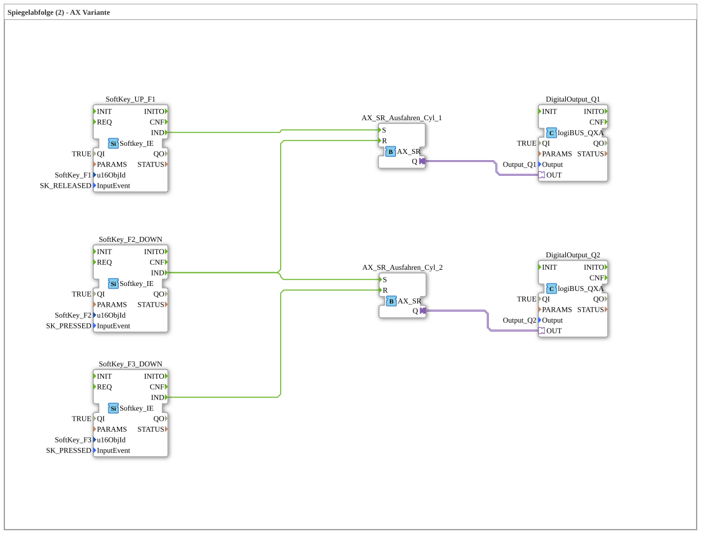

# Exercise_022b_AX2: Mirror Sequence (2) - AX Variant



* * * * * * * * * *

## Introduction

This exercise implements a **mirror sequence** for two pneumatic cylinders (Cyl_1 and Cyl_2) using softkeys as controls and AX_SR function blocks to control the digital outputs. The sequence is controlled by three keys (F1, F2, F3): F1 extends cylinder 1, F2 retracts cylinder 1 and simultaneously extends cylinder 2, and F3 retracts cylinder 2. This exercise teaches the use of set-reset adapter blocks and their integration with events and data outputs.


* * * * * * * * * *

## Function Blocks Used (FBs)

The exercise consists of five function blocks that are wired in the SubApp network:

1. **SoftKey_UP_F1**

- **Type**: `isobus::UT::io::Softkey::Softkey_IE`

- **Parameters**:

- `QI` = `TRUE`

- `u16ObjId` = `SoftKey_F1`

- `InputEvent` = `SK_RELEASED` (Event triggered when the F1 key is released)

- **Event Output**: `IND` (Triggered when the key is pressed)

2. **SoftKey_F2_DOWN**

- **Type**: `Softkey_IE`

- **Parameters**:

- `QI` = `TRUE`

- `u16ObjId` = `SoftKey_F2`

- `InputEvent` = `SK_PRESSED` (Event on pressing the F2 key)

- **Event Output**: `IND`

3. **SoftKey_F3_DOWN**

- **Type**: `Softkey_IE`

- **Parameters**:

- `QI` = `TRUE`

- `u16ObjId` = `SoftKey_F3`

- `InputEvent` = `SK_PRESSED` (Event on pressing the F3 key)

- **Event output**: `IND`

4. **AX_SR_Extend_Cyl_1**

- **Type**: `adapter::events::unidirectional::AX_SR` (Set-Reset function block)

- **Adapter**: unidirectional, output `Q` provides `TRUE` when set

- **Event inputs**:

- `S` – Set (Output Q = TRUE)

- `R` – Reset (Output Q = FALSE)

5. **AX_SR_Extend_Cyl_2**

- **Type**: `AX_SR` (identical to Cyl_1)

- **Event Inputs**:

- `S` – Set

- `R` – Reset

6. **DigitalOutput_Q1**

- **Type**: `logiBUS::io::DQ::logiBUS_QXA`

- **Parameters**:

- `QI` = `TRUE` (Output enabled)

- `Output` = `Output_Q1` (physical output)

- **Adapter input**: `OUT` – controls the output at `TRUE`

7. **DigitalOutput_Q2**

- **Type**: `logiBUS_QXA`

- **Parameters**:

- `QI` = `TRUE`

- `Output` = `Output_Q2`

- **Adapter input**: `OUT`

### Sub-modules

No separate sub-modules exist. All logic is implemented directly in the SubApp network.

* * * * * * * * * *

## Program Flow and Connections

The control follows a fixed sequence:

1. **Release F1 key** → Event from `SoftKey_UP_F1.IND`

→ Sets `AX_SR_Ausfahren_Cyl_1.S` → **Cylinder 1 extends** (DigitalOutput_Q1 = TRUE).

2. **Press F2 key** → Event from `SoftKey_F2_DOWN.IND`

→ Distributed to two destinations:

- `AX_SR_Ausfahren_Cyl_1.R` → **Cylinder 1 retracts** (Q1 = FALSE).

- `AX_SR_Ausfahren_Cyl_2.S` → **Cylinder 2 extends** (Q2 = TRUE).


3. **Press F3** → Event from `SoftKey_F3_DOWN.IND`

→ Sets `AX_SR_Ausfahren_Cyl_2.R` → **Cylinder 2 retracts** (Q2 = FALSE).

The connections in detail:

| From | To | Type |

|-----|------|-----|

| `SoftKey_UP_F1.IND` | `AX_SR_Ausfahren_Cyl_1.S` | Event |

| `SoftKey_F2_DOWN.IND` | `AX_SR_Ausfahren_Cyl_1.R` | Event |

| `SoftKey_F2_DOWN.IND` | `AX_SR_Ausfahren_Cyl_2.S` | Event |

| `SoftKey_F3_DOWN.IND` | `AX_SR_Ausfahren_Cyl_2.R` | Event |

| `AX_SR_Ausfahren_Cyl_1.Q` | `DigitalOutput_Q1.OUT` | Adapter |

| `AX_SR_Ausfahren_Cyl_2.Q` | `DigitalOutput_Q2.OUT` | Adapter |

**Simplified Flowchart:**


**```
F1 (loslassen)  → Setze SR1 (Zyl1 aus)
F2 (drücken)    → Rücksetze SR1 (Zyl1 ein) + Setze SR2 (Zyl2 aus)
F3 (drücken)    → Rücksetze SR2 (Zyl2 ein)
```
**Learning Objectives:**

- Using set-reset function blocks (AX_SR) in 4diac.

- Linking multiple event sources to a single target (fan-out).

- Controlling digital outputs via adapters.

- Creating a simple sequence control using key inputs.

**Difficulty Level:** Easy
**Prerequisites:** Basic knowledge of IEC 61499, familiarity with the 4diac IDE

**Instructions for Getting Started:**

This exercise is pre-built as a SubApp type. Integrate it into a suitable project and run it with a runtime system (e.g., FORTE). The physical outputs Q1 and Q2 must be connected according to the components used (e.g., valves).


* * * * * * * * * *

## Summary

Exercise **Exercise_022b_AX2** demonstrates a two-stage sequence control for two cylinders using AX_SR function blocks. A "mirror sequence" is achieved through the clever distribution of events (F2 triggers both resetting the first cylinder and setting the second). The setup is simple, extensible, and illustrates the basic principles of event-driven automation in 4diac. The use of adapters instead of direct data connections ensures a clean separation of control logic and actuators.

---

### 🌐 Related topic subpages on ms-muc-docs.de

* [🌐 Eclipse 4diac IDE & color reference on ms-muc-docs.de](https://www.ms-muc-docs.de/iec-61499/eclipse-4diac/)

]