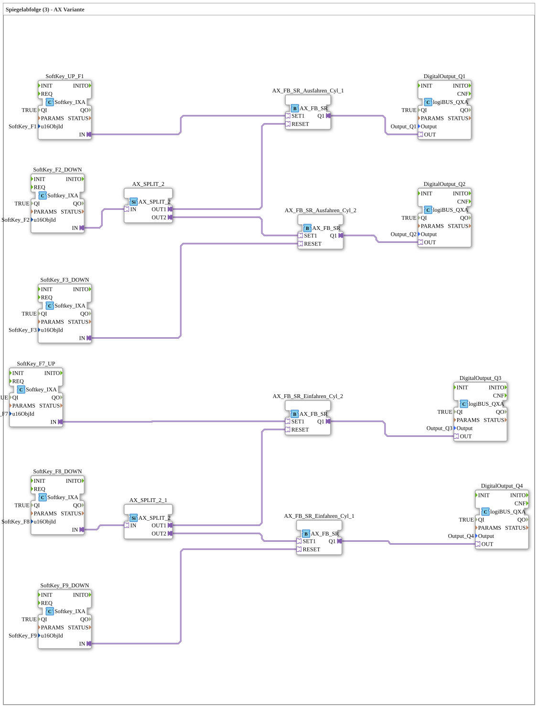

# Exercise_023_AX: Mirror Sequence (3) - AX Variant

* * * * * * * * * *

## Introduction

This exercise implements a **mirror sequence** for two double-acting cylinders. The goal is to build a sequential control for extending and retracting two cylinders using AX function blocks (SR bistables) and softkeys. The control is operated via softkeys on the terminal, and the digital outputs control the actuators (e.g., valves).

The sequence is divided into two parts:

- **Extension of the cylinders** (cylinders 1 and 2)

- **Retraction of the cylinders** (cylinders 2 and 1)

The AX_SPLIT adapters distribute events across multiple paths, ensuring that the command sequences run in the correct order.

## Function Blocks (FBs) Used

No additional sub-blocks (SubAppTypes) are used – all function blocks are directly integrated into the network.

### Input Blocks (Softkeys)

- **SoftKey_F1 (UP)**

Type: `isobus::UT::io::Softkey::Softkey_IXA`

Parameters:

- `QI` = TRUE

- `u16ObjId` = SoftKey_F1

Function: Start button **Extend** for cylinder 1.

- **SoftKey_F2 (DOWN)**

Type: `isobus::UT::io::Softkey::Softkey_IXA`

Parameters:

- `QI` = TRUE

- `u16ObjId` = SoftKey_F2

Function: Triggers the resetting of cylinder 1's extension and the simultaneous setting of cylinder 2's extension (mirroring) via `AX_SPLIT_2`.

- **SoftKey_F3 (DOWN)**

Type: `isobus::UT::io::Softkey::Softkey_IXA`

Parameters:

- `QI` = TRUE

- `u16ObjId` = SoftKey_F3

Function: Reset (retract) for **Extend Cylinder 2**.

- **SoftKey_F7 (UP)**

Type: `isobus::UT::io::Softkey::Softkey_IXA`

Parameters:

- `QI` = TRUE

- `u16ObjId` = SoftKey_F7

Function: Start button **Retract** for cylinder 2.

- **SoftKey_F8 (DOWN)**

Type: `isobus::UT::io::Softkey::Softkey_IXA`

Parameters:

- `QI` = TRUE

- `u16ObjId` = SoftKey_F8

Function: Triggers the retraction of cylinder 2 and the simultaneous setting of the retraction of cylinder 1 via `AX_SPLIT_3` (mirroring).

- **SoftKey_F9 (DOWN)**

Type: `isobus::UT::io::Softkey::Softkey_IXA`

Parameters:

- `QI` = TRUE

- `u16ObjId` = SoftKey_F9

Function: Reset (extend) for **Retract Cylinder 1**.

### Processing Blocks

- **AX_FB_SR_Extend_Cyl_1**

Type: `adapter::iec61131::bistableElements::AX_FB_SR`

Parameters: none (no further parameters in the XML)

Function: SR bistable for the extension command of cylinder 1.

Set by SoftKey_F1, reset by `AX_SPLIT_2.OUT1`.

- **AX_FB_SR_Extend_Cyl_2**

Type: `adapter::iec61131::bistableElements::AX_FB_SR`

Parameters: None

Function: SR bistable for the extension command of cylinder 2.

Set by `AX_SPLIT_2.OUT2`, reset by SoftKey_F3.

- **AX_FB_SR_Retract_Cyl_2**

Type: `adapter::iec61131::bistableElements::AX_FB_SR`

Parameters: None

Function: SR bistable for the retraction command of cylinder 2.

Set by SoftKey_F7, reset by `AX_SPLIT_3.OUT1`.

- **AX_FB_SR_Retract_Cyl_1**

Type: `adapter::iec61131::bistableElements::AX_FB_SR`

Parameters: None

Function: SR bistable for the retraction command of cylinder 1.

Set by `AX_SPLIT_3.OUT2`, reset by SoftKey_F9.

### Event Distribution

- **AX_SPLIT_2**

Type: `adapter::events::unidirectional::AX_SPLIT_2`

Parameters: None

Function: Distributes the event from SoftKey_F2 to two outputs:

- OUT1 → RESET of AX_FB_SR_Extend_Cyl_1

- OUT2 → SET of AX_FB_SR_Extend_Cyl_2

- **AX_SPLIT_3**

Type: `adapter::events::unidirectional::AX_SPLIT_2`

Parameters: None

Function: Distributes the event from SoftKey_F8 to two outputs:

- OUT1 → RESET of AX_FB_SR_Retract_Cyl_2

- OUT2 → SET of AX_FB_SR_Retract_Cyl_1

### Output Blocks

- **DigitalOutput_Q1**

Type: `logiBUS::io::DQ::logiBUS_QXA`

Parameters:

- `QI` = TRUE

- `Output` = Output_Q1

Function: Outputs Q1 (Extend cylinder 1). Controlled by `AX_FB_SR_Ausfahren_Cyl_1.Q1`.

- **DigitalOutput_Q2**

Type: `logiBUS::io::DQ::logiBUS_QXA`

Parameters:

- `QI` = TRUE

- `Output` = Output_Q2

Function: Outputs Q2 (Extend cylinder 2). Controlled by `AX_FB_SR_Ausfahren_Cyl_2.Q1`.

- **DigitalOutput_Q3**

Type: `logiBUS::io::DQ::logiBUS_QXA`

Parameters:

- `QI` = TRUE

- `Output` = Output_Q3

Function: Outputs Q3 (Cylinder 2 Retract). Controlled by `AX_FB_SR_Einfahren_Cyl_2.Q1`.

- **DigitalOutput_Q4**

Type: `logiBUS::io::DQ::logiBUS_QXA`

Parameters:

- `QI` = TRUE

- `Output` = Output_Q4

Function: Outputs Q4 (Cylinder 1 Retract). Controlled by `AX_FB_SR_Einfahren_Cyl_1.Q1`.

## Program Flow and Connections

### Extension Sequence

1. **Start Extension Cylinder 1**

Pressing **SoftKey_F1** (UP) sets the SET1 input of `AX_FB_SR_Ausfahren_Cyl_1`. This activates `Q1` and switches output Q1.

2. **Mirroring to Cylinder 2**

Pressing **SoftKey_F2** (DOWN) sends an event to `AX_SPLIT_2`.

- Output OUT1 of `AX_SPLIT_2` resets the SR bistable `AX_FB_SR_Ausfahren_Cyl_1` → Q1 becomes inactive, cylinder 1 no longer extends.

- Output OUT2 simultaneously activates `AX_FB_SR_Ausfahren_Cyl_2` → Q2 extends cylinder 2.

3. **Reset Cylinder 2**

Pressing **SoftKey_F3** (DOWN) resets `AX_FB_SR_Ausfahren_Cyl_2` → Q2 is inactive.

### Retraction Sequence (in reverse order)

1. **Start Retracting Cylinder 2**

Pressing **SoftKey_F7** (UP) sets `AX_FB_SR_Einfahren_Cyl_2` → Q3 is active.

2. **Mirroring to Cylinder 1**

Pressing **SoftKey_F8** (DOWN) activates `AX_SPLIT_3`:

- OUT1 resets `AX_FB_SR_Einfahren_Cyl_2` → Q3 is inactive.

- OUT2 sets `AX_FB_SR_Einfahren_Cyl_1` → Q4 is active.

3. **Reset Cylinder 1**

Pressing **SoftKey_F9** (DOWN) resets `AX_FB_SR_Einfahren_Cyl_1` → Q4 is deactivated.

Reset Cylinder 1 by pressing **SoftKey_F9** (DOWN). ### Connection Structure (Adapter Connections)

The adapter connections are linked in the network as follows:

- `SoftKey_UP_F1.IN` → `AX_FB_SR_Ausfahren_Cyl_1.SET1`
- `SoftKey_F2_DOWN.IN` → `AX_SPLIT_2.IN`
- `AX_SPLIT_2.OUT1` → `AX_FB_SR_Ausfahren_Cyl_1.RESET`
- `AX_SPLIT_2.OUT2` → `AX_FB_SR_Ausfahren_Cyl_2.SET1`
- `SoftKey_F3_DOWN.IN` → `AX_FB_SR_Ausfahren_Cyl_2.RESET`

- `SoftKey_F7_UP.IN` → `AX_FB_SR_Einfahren_Cyl_2.SET1`
- `SoftKey_F8_DOWN.IN` → `AX_SPLIT_3.IN`  
- `AX_SPLIT_3.OUT1` → `AX_FB_SR_Einfahren_Cyl_2.RESET`  
- `AX_SPLIT_3.OUT2` → `AX_FB_SR_Einfahren_Cyl_1.SET1`  
- `SoftKey_F9_DOWN.IN` → `AX_FB_SR_Einfahren_Cyl_1.RESET`  

- `AX_FB_SR_Ausfahren_Cyl_1.Q1` → `DigitalOutput_Q1.OUT`  
- `AX_FB_SR_Ausfahren_Cyl_2.Q1` → `DigitalOutput_Q2.OUT`  
- `AX_FB_SR_Einfahren_Cyl_2.Q1` → `DigitalOutput_Q3.OUT`  
- `AX_FB_SR_Einfahren_Cyl_1.Q1` → `DigitalOutput_Q4.OUT`

### Learning Objectives

- Understanding the mirroring sequence (sequence creation with reset and set in one step)

- Application of **AX_FB_SR** (bistable elements according to IEC 61131)

- Use of **AX_SPLIT_2** for event distribution

- Linking softkey inputs to digital outputs via logiBUS

- Practicing the four-step process: Start – Mirror – Stop – Reset

### Notes

- This exercise requires basic knowledge of the 4diac IDE and working with adapter connections.

- All softkeys are defined as **DOWN** or **UP** keys; the assignment is made via the object ID (e.g., `SoftKey_F1`).

- The digital outputs `Output_Q1` to `Output_Q4` must be assigned to the actual valves or displays.

## Summary

The exercise "Mirror Sequence (3) – AX Variant" demonstrates sequential control for two cylinders using SR memory modules and event distributors. The AX_SPLIT adapters reset one SR and set another when a softkey is pressed, thus achieving the "mirroring" of the movement. The program clearly separates the extension and retraction sequences and provides a step-by-step understanding of signal chaining in automation technology. The use of logiBUS outputs connects the controller directly to the peripherals.

---

### 🌐 Related topic subpages on ms-muc-docs.de

* [🌐 Eclipse 4diac IDE & color reference on ms-muc-docs.de](https://www.ms-muc-docs.de/iec-61499/eclipse-4diac/)

]