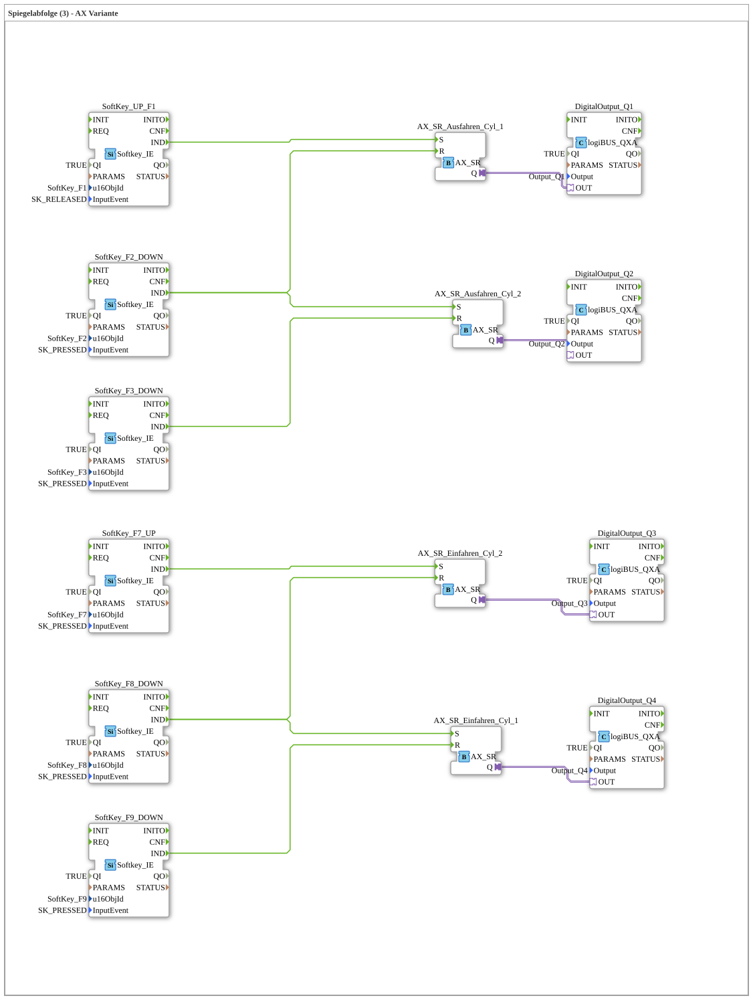

# Exercise_023b_AX2: Mirror Sequence (3) - AX Variant

* * * * * * * * * *
## Introduction
This exercise implements a **mirror sequence** for two double-acting cylinders (cylinder 1 and cylinder 2) using AX-SR modules (unidirectional adapters).
Control is achieved via eight softkeys (F1, F2, F3, F7, F8, F9) in conjunction with four digital outputs (Q1…Q4).

The behavior is symmetrical:

- **Extension** of cylinders 1 and 2 is controlled by softkeys and AX-SR modules.
- **Retraction** of cylinders 1 and 2 is controlled analogously with their own softkeys.

The SubAppType does not have its own input/output interfaces but communicates exclusively with the hardware via the integrated system modules.

## Function Blocks Used (FBs)

| Block Name | Type | Description |
|--------------|-----|--------------|
| SoftKey_UP_F1 | `isobus::UT::io::Softkey::Softkey_IE` | Softkey F1 – triggered when **key is released** (SK_RELEASED) |
| SoftKey_F2_DOWN | `isobus::UT::io::Softkey::Softkey_IE` | Softkey F2 – triggered when **key is pressed** (SK_PRESSED) |
| SoftKey_F3_DOWN | `isobus::UT::io::Softkey::Softkey_IE` | Softkey F3 – triggered when **key is pressed** (SK_PRESSED) |
| SoftKey_F7_UP | `isobus::UT::io::Softkey::Softkey_IE` | Softkey F7 – triggered when **key is pressed** (SK_PRESSED) |
| SoftKey_F8_DOWN | `isobus::UT::io::Softkey::Softkey_IE` | Softkey F8 – triggered by **pressing a key** (SK_PRESSED) |
| SoftKey_F9_DOWN | `isobus::UT::io::Softkey::Softkey_IE` | Softkey F9 – triggered by **pressing a key** (SK_PRESSED) |
| AX_SR_Extend_Cyl_1 | `adapter::events::unidirectional::AX_SR` | Set-Reset block for extending cylinder 1 (S: Set, R: Reset) |
| AX_SR_Extend_Cyl_2 | `adapter::events::unidirectional::AX_SR` | Set-Reset block for extending cylinder 2 |
| AX_SR_Retract_Cyl_1 | `adapter::events::unidirectional::AX_SR` | Set-Reset block for retracting cylinder 1 |
| AX_SR_Retract_Cyl_2 | `adapter::events::unidirectional::AX_SR` | Set-Reset block for retracting cylinder 2 |
DigitalOutput_Q1 | `logiBUS::io::DQ::logiBUS_QXA` | Digital output Q1 (active when AX_SR_Extend_Cyl_1.Q is set) |
DigitalOutput_Q2 | `logiBUS::io::DQ::logiBUS_QXA` | Digital output Q2 (active when AX_SR_Extend_Cyl_2.Q is set) |
DigitalOutput_Q3 | `logiBUS::io::DQ::logiBUS_QXA` | Digital output Q3 (active when AX_SR_Retract_Cyl_2.Q is set) |
DigitalOutput_Q4 | `logiBUS::io::DQ::logiBUS_QXA` | Digital output Q4 (active when AX_SR_Einfahren_Cyl_1.Q is set) |

### Block Parameters

All `Softkey_IE` blocks are configured with the following parameters:

- **QI** = TRUE
- **u16ObjId** = respective softkey constant (e.g., `SoftKey_F1`)
- **InputEvent** = trigger (SK_RELEASED or SK_PRESSED)

All `logiBUS_QXA` blocks are configured with the following parameters:

- **QI** = TRUE
- **Output** = respective output (Output_Q1 … Output_Q4)

The `AX_SR` blocks have no parameters; they receive events via the inputs `S` (Set) and `R` (Reset) and output their state via the adapter output. `Q` continues.

## Program Flow and Connections

The control system is divided into two independent cycles:

### Cylinder Extension

1. **Extend Cylinder 1**

- Release softkey **F1** → The event at the `IND` output of `SoftKey_UP_F1` is forwarded to the `S` input of `AX_SR_Ausfahren_Cyl_1`.
- Press softkey **F2** → The event at `SoftKey_F2_DOWN.IND` is forwarded to the `R` input of `AX_SR_Ausfahren_Cyl_1`.
- The state `Q` of `AX_SR_Ausfahren_Cyl_1` is passed via the adapter to the OUT input of `DigitalOutput_Q1` → **Output Q1** switches.

2. **Extend cylinder 2**

- Press softkey **F2** → The event from `SoftKey_F2_DOWN.IND` is routed to the `S` input of `AX_SR_Ausfahren_Cyl_2`.
- Press softkey **F3** → The event from `SoftKey_F3_DOWN.IND` is routed to the `R` input of `AX_SR_Ausfahren_Cyl_2`.
- The state `Q` from `AX_SR_Ausfahren_Cyl_2` is passed to `DigitalOutput_Q2` → **Output Q2** switches.

### Retracting the Cylinders

1. **Retract Cylinder 1**

- Press softkey **F8** → The event from `SoftKey_F8_DOWN.IND` is passed to the `S` input of `AX_SR_Einfahren_Cyl_1`.
- Press softkey **F9** → The event from `SoftKey_F9_DOWN.IND` is passed to the `R` input of `AX_SR_Einfahren_Cyl_1`.
- The state `Q` from `AX_SR_Einfahren_Cyl_1` is passed to `DigitalOutput_Q4` → **Output Q4** switches.

2. **Retract cylinder 2**

- Press softkey **F7** → The event from `SoftKey_F7_UP.IND` is forwarded to the `S` input of `AX_SR_Einfahren_Cyl_2`.
- Press softkey **F8** → The event from `SoftKey_F8_DOWN.IND` is forwarded to the `R` input of `AX_SR_Einfahren_Cyl_2`.
- The state `Q` from `AX_SR_Einfahren_Cyl_2` is passed to `DigitalOutput_Q3` → **Output Q3** switches.

#### Graphical arrangement of comments (for orientation)
- **START button Extend** (near F1)
- **End position Extend_Cyl_1** (near F2)
- **End position Extend_Cyl_2** (near F3)
- **START button Retract** (near F7)
- **End position Retract_Cyl_2** (near F8)
- **End position Retract_Cyl_1** (near F9)

## Summary

Exercise *Exercise_023b_AX2* demonstrates the use of **AX-SR adapters** to control two double-acting cylinders via softkeys.

The separate set-reset logic for extending and retracting each cylinder creates a mirror sequence in which the direction changes are triggered asynchronously by different buttons.

The controller is connected close to the hardware via the logiBUS digital outputs and can be tested directly in a 4diac IDE environment.

**Learning Objectives:**

- Understanding AX-SR function blocks (set-reset with unidirectional adapters)
- Event-driven linking of softkeys to actuators
- Structured programming of cylinder controls in 4diac

**Prerequisites:**

- Basic knowledge of 4diac and IEC 61499
- Availability of the libraries `isobus`, `logiBUS`, and `adapter::events::unidirectional`

---

### 🌐 Relevant topic subpages on ms-muc-docs.de
* [🌐 Eclipse 4diac IDE & color reference on ms-muc-docs.de](https://www.ms-muc-docs.de/iec-61499/eclipse-4diac/)

]
