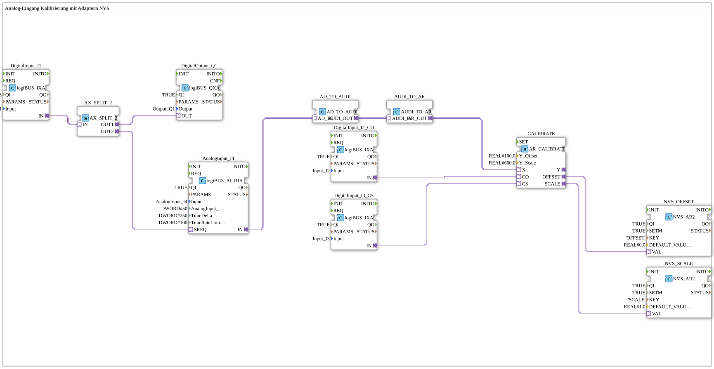

# Exercise_028a2_AR: Analog Input Calibration with NVS Adapters

* * * * * * * * * *
## Introduction
This exercise implements the calibration of an analog input. An analog value is read, transferred to a calibration block via two adapter conversions, and the determined offset and scale values are permanently stored in the NVS (Non-Volatile Storage) memory. Two digital inputs control the calibration mode (offset and scale). Another digital input serves as a trigger for the analog sampling and is simultaneously routed to a digital output.
## Function Blocks (FBs) Used
| Name | Type | Parameters |
|------|-----|------------|
| DigitalInput_I1 | `logiBUS::io::DI::logiBUS_IXA` | QI = TRUE, Input = Input_I1 |
| DigitalOutput_Q1 | `logiBUS::io::DQ::logiBUS_QXA` | QI = TRUE, Output = Output_Q1 |
| AnalogInput_I4 | `logiBUS::io::AI::logiBUS_AI_IDA` | QI = TRUE, Input = AnalogInput_I4, AnalogInput_hysteresis = 50, TimeDelta = 250, TimeRateLimit = 100 |
| CALIBRATE | `adapter::Engineering::measurements::AR_CALIBRATE` | Y_Offset = 100.0, Y_Scale = 600.0 |
| NVS_OFFSET | `logiBUS::storage::esp32_nvs::NVS_AR2` | QI = TRUE, KEY = 'OFFSET', DEFAULT_VALUE = 0.0 |
| NVS_SCALE | `logiBUS::storage::esp32_nvs::NVS_AR2` | QI = TRUE, KEY = 'SCALE', DEFAULT_VALUE = 1.0 |
| DigitalInput_I2_CO | `logiBUS::io::DI::logiBUS_IXA` | QI = TRUE, Input = Input_I2 |
| DigitalInput_I3_CS | `logiBUS::io::DI::logiBUS_IXA` | QI = TRUE, Input = Input_I3 |
| AX_SPLIT_2 | `adapter::events::unidirectional::AX_SPLIT_2` | (no parameters) |
| AD_TO_AUDI | `adapter::conversion::unidirectional::AD_TO_AUDI` | (no parameters) |
| AUDI_TO_AR | `adapter::conversion::unidirectional::AUDI_TO_AR` | (no parameters) |

### Short Description of the Function Blocks
- **DigitalInput_I1**: Reads a digital input (Input_I1) and forwards the event via the adapter output `IN`.
- **DigitalOutput_Q1**: Outputs a digital signal to output `OUT` (Output_Q1) when the adapter input `OUT` is activated.
- **AnalogInput_I4**: Analog input block. It returns an analog value upon request (SREQ). Parameterized with hysteresis, time delta, and rate limiting.
- **CALIBRATE**: Performs the calibration. Receives the raw value at adapter `X` and the control signals `CO` (Calibrate Offset) and `CS` (Calibrate Scale). Outputs the calculated offset and scale via adapters `OFFSET` and `SCALE`.
- **NVS_OFFSET / NVS_SCALE**: Stores a floating-point value in non-volatile memory under the keys 'OFFSET' or 'SCALE' with predefined default values.
- **DigitalInput_I2_CO / DigitalInput_I3_CS**: Additional digital inputs for calibration control (Input_I2 = Offset calibration, Input_I3 = Scale calibration).
- **AX_SPLIT_2**: Distributes an incoming adapter event to two outputs (OUT1 and OUT2).
- **AD_TO_AUDI**: Converts an analog data adapter (`AD_IN`) to a universal analog value adapter (`AUDI_OUT`).
- **AUDI_TO_AR**: Converts a universal analog value adapter (`AUDI_IN`) to a real adapter (`AR_OUT`). *Note: The double conversion is necessary – a direct AD→AR conversion would be equivalent to a "reinterpret_cast" and should therefore be avoided.*

## Program Flow and Connections

The process is started by the digital input `Input_I1`:

1. **Event Distribution**: The event coming from `DigitalInput_I1` (adapter `IN`) is passed to `AX_SPLIT_2`. This splits the event:

- **OUT1** → connected to `DigitalOutput_Q1.OUT` → the digital output `Output_Q1` is set.
- **OUT2** → connected to `AnalogInput_I4.SREQ` → triggers the analog sampling.

2. **Analog Measurement Value**: After sampling, `AnalogInput_I4` outputs an analog data adapter via its output `IN`. This is then passed to `AD_TO_AUDI.AD_IN`.

3. **Conversion Chain**:

- `AD_TO_AUDI` converts the analog data adapter into a universal analog value adapter (`AUDI_OUT`).
- `AUDI_TO_AR` converts this into a real-value adapter (`AR_OUT`).
- The real-value adapter is then passed to the calibration input `CALIBRATE.X`.

4. **Calibration**: Simultaneously, input `Input_I2` (via `DigitalInput_I2_CO`) and input `Input_I3` (via `DigitalInput_I3_CS`) are present at `CALIBRATE.CO`. Depending on the activated control signal, `CALIBRATE` calculates the new offset or the new scale. The default settings (Y_Offset = 100.0, Y_Scale = 600.0) serve as the basis.

5. **Persistent Storage**:

- The determined offset (adapter `OFFSET`) is transferred to `NVS_OFFSET.VAL` and stored under the key 'OFFSET'.
- The determined scaling factor (adapter `SCALE`) is transferred to `NVS_SCALE.VAL` and stored under the key 'SCALE'.

This ensures that the calibration values are retained even after a controller restart.

## Summary

This exercise demonstrates a complete signal chain from digital triggering through analog acquisition, adapter conversion, and calibration to the permanent storage of the correction values in the NVS. It illustrates the use of multiple adapter types (event, data, and real adapters) and the interaction of standard FBs from the logiBUS library with special engineering blocks. The double adapter conversion between analog data and real values is explicitly commented on to avoid typical errors when using reinterpret_cast.
