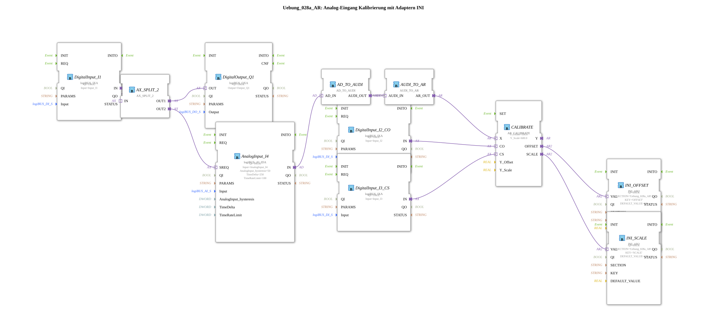

# Exercise_028a_AR: Analog Input Calibration with Adapters INI

* * * * * * * * * *
## Introduction

This exercise demonstrates the calibration of an analog input signal using adapters and the storage of calibration parameters (offset and scaling) in an INI file. The function block `AR_CALIBRATE` performs the linear calibration. The parameters are controlled via two digital inputs (`Input_I2`, `Input_I3`), and the results are stored in two separate memory blocks (`INI_AR2`). The conversion between analog and strongly typed data is performed using special adapter converters.
## Function Blocks Used

This exercise uses only directly instantiated function blocks (no sub-applications). All blocks, their parameters, and functions are described below.

- **DigitalInput_I1**
- **Type**: `logiBUS::io::DI::logiBUS_IXA`
- **Parameters**:
- `QI` = TRUE
- `Input` = `Input_I1` (physical digital input)
- **Functionality**: Reads the state of a digital input (pushbutton/switch) and outputs it via the output adapter `IN`. Serves as a trigger input for the measurement cycle.
- **DigitalOutput_Q1**
- **Type**: `logiBUS::io::DQ::logiBUS_QXA`
- **Parameters**:
- `QI` = TRUE
- `Output` = `Output_Q1` (physical digital output)
- **Functionality**: Switches a digital output according to the received signal. Here, the signal from `DigitalInput_I1` is passed through a split structure.

- **AnalogInput_I4**

- **Type**: `logiBUS::io::AI::logiBUS_AI_IDA`
- **Parameters**:
- `QI` = TRUE
- `Input` = `AnalogInput_I4` (physical analog input)
- `AnalogInput_hysteresis` = 50
- `TimeDelta` = 250 ms
- `TimeRateLimit` = 100
- **Functionality**: Reads an analog current/voltage value and provides it as an adapter interface (`IN`). The parameters are used for filtering (hysteresis, sampling rate, rate limiting).

- **CALIBRATE**

- **Type**: `adapter::Engineering::measurements::AR_CALIBRATE`
- **Parameters**:
- `Y_Offset` = 100.0
- `Y_Scale` = 600.0
- **Functionality**: Performs a linear calibration of the analog input value (as `X`). The formula is `Y = (X * Y_Scale) / 1000 + Y_Offset` (assumed, as it is not explicitly stated). The calibration can be triggered via the adapter inputs `CO` (Calibrate Offset) and `CS` (Calibrate Scale). The calculated offset and scaling values are output to `OFFSET` and `SCALE`.
... - **INI_OFFSET**

- **Type**: `eclipse4diac::storage::INI_AR2`
- **Parameters**:
- `QI` = TRUE
- `SECTION` = `'Uebung_028a_AR'`
- `KEY` = `'OFFSET'`
- `DEFAULT_VALUE` = 0.0
- **Functionality**: Reads or writes the offset value in an INI file (section `Uebung_028a_AR`, key `OFFSET`). Outputs the current value at `VAL` and allows you to save a new value via input `VAL`.

Returns the current value at output `VAL` or allows you to save a new value via input `VAL`.

- **INI_SCALE**

- **Type**: `eclipse4diac::storage::INI_AR2`
- **Parameters**:
- `QI` = TRUE
- `SECTION` = `'Uebung_028a_AR'`
- `KEY` = `'SCALE'`
- `DEFAULT_VALUE` = 1.0
- **Functionality**: Analogous to `INI_OFFSET`, but for the scaling factor (key `SCALE`).
- **DigitalInput_I2_CO**
- **Type**: `logiBUS::io::DI::logiBUS_IXA`
- **Parameters**:
- `QI` = TRUE
- `Input` = `Input_I2`
- **Function**: Reads the digital input for offset calibration (`CO`).
- **DigitalInput_I3_CS**
- **Type**: `logiBUS::io::DI::logiBUS_IXA`
- **Parameters**:
- `QI` = TRUE
- `Input` = `Input_I3`
- **Function**: Reads the digital input for scaling calibration (`CS`).
- **AX_SPLIT_2**
- **Type**: `adapter::events::unidirectional::AX_SPLIT_2`
- **Parameters**: None
- **Function**: An adapter splitter that distributes an incoming (adapter) signal to two outputs. Here, the signal from `DigitalInput_I1` is simultaneously sent to the output `DigitalOutput_Q1` and to the trigger request (`SREQ`) of the analog input.
- **AD_TO_AUDI**
- **Type**: `adapter::conversion::unidirectional::AD_TO_AUDI`
- **Parameters**: None
- **Function**: Converts the analog adapter type (presumably `AnalogData`) to a universal `AUDI` adapter (generic analog value). Necessary for type matching between different adapter definitions.
- **AUDI_TO_AR**
- **Type**: `adapter::conversion::unidirectional::AUDI_TO_AR`
- **Parameters**: None
- **Function**: Converts the `AUDI` adapter back into the analog input adapter (`AR`) required for `AR_CALIBRATE`. This double conversion is necessary because a direct `AD_TO_AR` adapter would be equivalent to a "reinterpret_cast" and the type information would be lost.

## Program Flow and Connections

1. **Digital input I1** serves as the start pulse for a measurement. Its signal is distributed via the splitter `AX_SPLIT_2` to the output `DigitalOutput_Q1` (e.g., status LED) and to the `SREQ` input of the analog input `AnalogInput_I4`.
2. **AnalogInput_I4** then acquires the analog measurement value and delivers it as an adapter output `IN` to the converter `AD_TO_AUDI`.
3. The converter chain `AD_TO_AUDI` → `AUDI_TO_AR` adapts the type so that the value can be connected to the `X` input of `CALIBRATE`.
4. **DigitalInput_I2_CO** (Input I2) triggers the offset calibration: When this input is active, `CALIBRATE` performs an offset correction and passes the new offset value to `INI_OFFSET`, which saves it to the INI file.
5. **DigitalInput_I3_CS** (Input I3) triggers the scaling calibration accordingly; the new scaling factor is passed to `INI_SCALE` and saved.
6. The saved values from `INI_OFFSET` and `INI_SCALE` can be reloaded on subsequent controller restarts, thus permanently retaining the calibration.

DigitalInput_I3_CS** (Input I3) triggers the scaling calibration accordingly; the new scaling factor is passed to `INI_SCALE` and saved. **Important Note**: The double conversion of `AD_TO_AUDI` and `AUDI_TO_AR`This is intentionally implemented to ensure type compatibility. A direct converter would simply reinterpret the data, which can lead to malfunctions in practice.

**Learning Objectives of this Exercise**:

- Working with analog input adapters and their parameterization.
- Using adapter converters for type adaptation.
- Using INI memory blocks for permanently storing configuration parameters.
- Understanding the calibration logic in automation technology.

**Difficulty Level**: Medium (Basic knowledge of 4diac/adapter concepts required).

## Summary

The exercise `Uebung_028a_AR` implements a complete analog input calibration, where offset and scaling are learned via two digital inputs and persisted in an INI file. The measurement sequence is initiated by another digital input. The adapter converters used (`AD_TO_AUDI`, `AUDI_TO_AR`) demonstrate the type-correct processing of analog signals in the 4diac IDE. The overall system provides a flexible foundation for industrial measurement tasks with storage of calibration parameters.

These adapter converters (`AD_TO_AUDI`, `AUDI_TO_AR`) demonstrate the correct processing of analog signals in the 4diac IDE.

---

### 🌐 Related topic subpages on ms-muc-docs.de

- [🌐 Eclipse 4diac IDE & Color Reference on ms-muc-docs.de](https://www.ms-muc-docs.de/iec-61499/eclipse-4diac/)

]
