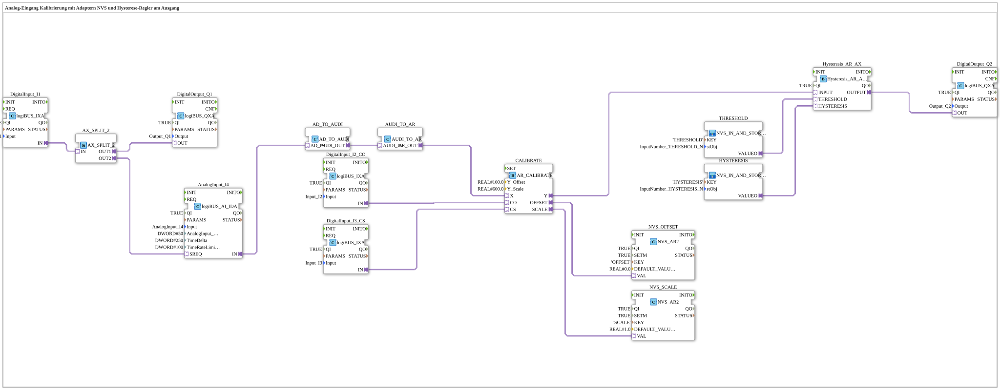

# Exercise_028b2_AR: Analog Input Calibration with NVS Adapters and Hysteresis Controller at the Output

* * * * * * * * * *
## Introduction
This exercise implements analog input calibration with offset and scaling adjustment. The calibration parameters are persistently stored in NVS (Non-Volatile Storage). Additionally, a hysteresis controller is used, which reacts to the calibrated analog value. The threshold values and hysteresis bands for the controller are also loaded from NVS. The entire process is controlled by digital inputs and output via digital outputs.
## Function Blocks (FBs) Used
- **DigitalInput_I1** (Type: `logiBUS::io::DI::logiBUS_IXA`): Digital input that starts the output process.
- Parameters: `QI=TRUE`, `Input=Input_I1`
- **DigitalOutput_Q1** (Type: `logiBUS::io::DQ::logiBUS_QXA`): Digital output for direct transmission of the input status.
- Parameters: `QI=TRUE`, `Output=Output_Q1`
- **AnalogInput_I4** (Type: `logiBUS::io::AI::logiBUS_AI_IDA`): Analog input with configurable hysteresis and rate limiting.
- Parameters: `QI=TRUE`, `Input=AnalogInput_I4`, `AnalogInput_hysteresis=50`, `TimeDelta=250`, `TimeRateLimit=100`
- **AX_SPLIT_2** (Type: `adapter::events::unidirectional::AX_SPLIT_2`): Splits an event across two outputs (splits the INIT event stream).
- **AD_TO_AUDI** (Type: `adapter::conversion::unidirectional::AD_TO_AUDI`): Converts an analog data adapter (`AD`) into a universal audit adapter (`AUDI`).
- **AUDI_TO_AR** (Type: `adapter::conversion::unidirectional::AUDI_TO_AR`): Converts the audit adapter (`AUDI`) back into a `AR` analog adapter for further processing.
- **CALIBRATE** (Type: `adapter::Engineering::measurements::AR_CALIBRATE`): Performs calibration – calculating offset and scaling.
- Parameters: `Y_Offset=100.0`, `Y_Scale=600.0`
- **NVS_OFFSET** (Type: `logiBUS::storage::esp32_nvs::NVS_AR2`): Persistently stores the determined offset value in the NVS.
- Parameters: `QI=TRUE`, `KEY='OFFSET'`, `DEFAULT_VALUE=0.0`
- **NVS_SCALE** (Type: `logiBUS::storage::esp32_nvs::NVS_AR2`): Persistently stores the determined scaling factor in the NVS.
- Parameters: `QI=TRUE`, `KEY='SCALE'`, `DEFAULT_VALUE=1.0`
- **DigitalInput_I2_CO** (Type: `logiBUS::io::DI::logiBUS_IXA`): Digital input for triggering offset calibration.
- Parameters: `QI=TRUE`, `Input=Input_I2`
- **DigitalInput_I3_CS** (Type: `logiBUS::io::DI::logiBUS_IXA`): Digital input for triggering scaling calibration.
- Parameters: `QI=TRUE`, `Input=Input_I3`
- **Hysteresis_AR_AX** (Type: `logiBUS::signalprocessing::hysteresis::Hysteresis_AR_AX`): Hysteresis controller with analog input and output.
- Parameter: `QI=TRUE`
- **DigitalOutput_Q2** (Type: `logiBUS::io::DQ::logiBUS_QXA`): Digital output for the hysteresis signal.
- Parameters: `QI=TRUE`, `Output=Output_Q2`

### Sub-modules: `THRESHOLD`
- **Type**: `MyLib::sys::NVS_IN_AND_STORE_AR`
- **Internal Function Blocks Used**: The internal structure is not defined in the XML file. It is assumed that this sub-module reads a threshold value from the NVS (under the key `'THRESHOLD'`) and provides it as an analog output (`VALUEO`). The parameter `stObj=InputNumber_THRESHOLD` refers to a structure object for initialization.

**Type**: `MyLib::sys::NVS_IN_AND_STORE_AR`

**Internal Function Blocks Used**:** The internal structure is not defined in the XML file. - **Functionality**: The sub-block loads the stored threshold value from the NVS at startup or upon an event and outputs it at output `VALUEO`. It is written back when the value changes.

### Sub-blocks: `HYSTERESIS`
- **Type**: `MyLib::sys::NVS_IN_AND_STORE_AR`
- **Internal Function Blocks Used**: Analogous to the `THRESHOLD` block, but with the key `'HYSTERESIS'` and the structure object `InputNumber_HYSTERESIS`.
- **Functionality**: Reads the hysteresis value (bandwidth) from the NVS and makes it available to the hysteresis controller via output `VALUEO`.

## Program Flow and Connections

1. **Initialization**: The digital input `DigitalInput_I1` is split into two paths via the adapter `AX_SPLIT_2`:

- Path 1 → `DigitalOutput_Q1` (direct output)
- Path 2 → `AnalogInput_I4.SREQ` (event for reading the analog value)

2. **Analog Value Processing**:

- The analog input `AnalogInput_I4` is read, and the value is passed via the adapter chain `AD_TO_AUDI` → `AUDI_TO_AR` to the calibration module `CALIBRATE.X` (Note: A double conversion is necessary because a direct `AD_TO_AR` (as a `reinterpret_cast` would behave.)

3. **Calibration**:

- The calibration process is started via the digital inputs `DigitalInput_I2_CO` (offset calibration) and `DigitalInput_I3_CS` (scale calibration).
- `CALIBRATE` calculates the offset and scale based on the reference values `Y_Offset=100.0` and `Y_Scale=600.0`.
- The calculated parameters are transferred to `NVS_OFFSET` and `NVS_SCALE` and stored.

4. **Hysteresis Control**:

- The calibrated value `CALIBRATE.Y` is passed to the hysteresis controller `Hysteresis_AR_AX.INPUT`.
- The threshold value (`THRESHOLD.VALUEO`) and the hysteresis (`HYSTERESIS.VALUEO`) are loaded from the NVS and fed to the controller.
- The output `Hysteresis_AR_AX.OUTPUT` controls the digital output `DigitalOutput_Q2`.

**Learning Objectives**:

- Understanding analog signal processing with adapters and conversions in 4diac.
- Implementing persistent calibration (offset and scaling) in the NVS.
- Using a hysteresis controller with externally configurable parameters.
- Control of the process via digital inputs.

**Difficulty Level**: Advanced
**Prerequisites**: Basic knowledge of the 4diac IDE, working with analog inputs/outputs, simple adapters, and NVS memory.

## Summary

This exercise demonstrates a complete analog measurement chain: from reading the raw analog value and calibration with persistent storage to rule-based output via a hysteresis comparator. The use of adapters for type conversion and sub-modules for reusing NVS accesses makes the setup modular and expandable. Calibration can be adjusted at any time using digital buttons without requiring changes to the program code.

# Summary

This exercise demonstrates a complete analog measurement chain: from reading the raw analog value and calibration with persistent storage to rule-based output via a hysteresis comparator. ---

### 🌐 Related topic subpages on ms-muc-docs.de
* [🌐 Eclipse 4diac IDE & Color Reference on ms-muc-docs.de](https://www.ms-muc-docs.de/iec-61499/eclipse-4diac/)

]
