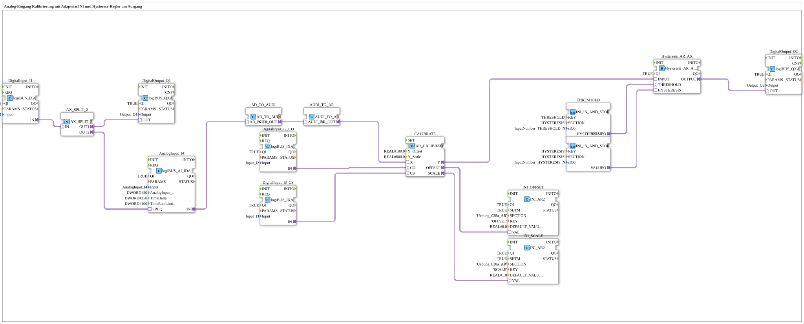

# Exercise_028b_AR: Analog Input Calibration with Adapters, INI, and Hysteresis Controller at the Output

* * * * * * * * * *
## Introduction
This exercise demonstrates the calibration of an analog input signal using adapters and INI-based storage of the calibration parameters. The calibrated signal is then passed through a hysteresis controller, whose threshold values are also read from an INI file. The exercise demonstrates the integration of analog and digital inputs/outputs, adapter conversions, and the persistent storage of parameters.
## Function Blocks (FBs) Used

### Main FBs
- **DigitalInput_I1** / **DigitalInput_I2_CO** / **DigitalInput_I3_CS**: 
Digital inputs (Type `logiBUS::io::DI::logiBUS_IXA`)

- Parameters: `QI` = TRUE; `Input` = associated logiBUS input (I1, I2, I3)
- **DigitalOutput_Q1** / **DigitalOutput_Q2**: 
Digital outputs (Type `logiBUS::io::DQ::logiBUS_QXA`)

- Parameters: `QI` = TRUE; `Output` = associated logiBUS output (Q1, Q2)
- **AnalogInput_I4**:

Analog input (Type `logiBUS::io::AI::logiBUS_AI_IDA`)

- Parameters: `QI` = TRUE; `Input` = AnalogInput_I4; `AnalogInput_hysteresis` = 50; `TimeDelta` = 250; `TimeRateLimit` = 100
- **CALIBRATE**:

Calibration adapter (Type `adapter::Engineering::measurements::AR_CALIBRATE`)

- Parameters: `Y_Offset` = 100.0; `Y_Scale` = 600.0
- Performs a linear calibration (offset and scaling) and outputs the calibrated values as well as the actual offset/scaling parameters.
- **INI_OFFSET** / **INI_SCALE**:

INI memory blocks (type `eclipse4diac::storage::INI_AR2`)

- Parameters: `QI` = TRUE; `SECTION` = `'Uebung_028a_AR'`; `KEY` = `'OFFSET'` or `'SCALE'`; `DEFAULT_VALUE` = 0.0 or 1.0
- Stores the offset and scaling values calculated by the calibration adapter persistently in an INI file.
- **AX_SPLIT_2**:

Event Splitter (Type `adapter::events::unidirectional::AX_SPLIT_2`)

- Distributes an incoming event (AX) to two outputs.
- **Hysteresis_AR_AX**:

Hysteresis Controller (Type `logiBUS::signalprocessing::hysteresis::Hysteresis_AR_AX`)

- Parameter: `QI` = TRUE
- Compares the calibrated analog input with a threshold and a hysteresis value and switches the output accordingly.
- **AD_TO_AUDI** / **AUDI_TO_AR**:

Conversion adapter (type `adapter::conversion::unidirectional::AD_TO_AUDI` or `AUDI_TO_AR`)

- Converts the analog signal from adapter representation `AD` to `AUDI` and back to `AR`.
- **Note**: A direct conversion of `AD_TO_AR` would result in the same output as `reinterpret_cast` – the separate use of both adapters is intended.

``` ### Sub-modules

- **THRESHOLD** (Type `MyLib::sys::INI_IN_AND_STORE_AR`)
- **Parameters**:
- `KEY` = `'THRESHOLD'`
- `SECTION` = `'HYSTERESIS'`
- `stObj` = `InputNumber_THRESHOLD`
- **Functionality**: Reads the hysteresis threshold from the INI file (section `HYSTERESIS`, key `THRESHOLD`) and outputs it at `VALUEO`. The value is interpreted as a structure of type `InputNumber_THRESHOLD`.
- **HYSTERESIS** (Type `MyLib::sys::INI_IN_AND_STORE_AR`)
- **Parameters**:
- `KEY` = `'HYSTERESIS'`
- `SECTION` = `'HYSTERESIS'`
- `stObj` = `InputNumber_HYSTERESIS`

**Functionality**: Analogous to THRESHOLD, but for the hysteresis value. Outputs the input value at output `VALUEO`.

## Program Flow and Connections

1. **Event Control**: The digital input **DigitalInput_I1** provides an event that is distributed via **AX_SPLIT_2** to two paths:

- Path 1: directly to the digital output **DigitalOutput_Q1** (e.g., as an acknowledgment).
- Path 2: to the analog input **AnalogInput_I4** (via the `SREQ` connection) to trigger a measurement.

2. **Analog Value Processing**:

- The measured value from **AnalogInput_I4** (adapter `AD`) is converted via **AD_TO_AUDI** and **AUDI_TO_AR** into the representation suitable for the calibration adapter (`AR`).
- The converted value is sent to input `X` of the calibration adapter **CALIBRATE**.

3. **Calibration**:

- The digital inputs **DigitalInput_I2_CO** and **DigitalInput_I3_CS** serve as control signals for calibration (`CO` = calibration offset, `CS` = calibration scale).
- **CALIBRATE** calculates the corrected values from the raw value and the reference points and outputs them as `Y` (calibrated measured value), `OFFSET`, and `SCALE`.

4. **Persistent Storage**:

- The values `OFFSET` and `SCALE` are stored by **INI_OFFSET** and **INI_SCALE** in the INI file (section `Uebung_028a_AR`).

5. **Hysteresis Function**:

- The calibrated measurement `Y` is passed to the input `INPUT` of the hysteresis controller **Hysteresis_AR_AX**.
- The threshold values `THRESHOLD` and `HYSTERESIS` are read from the INI file (section `HYSTERESIS`) by the sub-functions **THRESHOLD** and **HYSTERESIS** and applied to the corresponding terminals of the controller.
- The output `OUTPUT` of the hysteresis controller controls the digital output **DigitalOutput_Q2**.

``` **Learning Objectives**:

- Understanding adapter conversion between analog signal types (`AD`, `AUDI`, `AR`)
- Working with **INI** blocks for persistent storage and loading of calibration parameters
- Using a calibration adapter (offset/scaling)
- Implementing a hysteresis function for threshold monitoring

## Summary

Exercise **Exercise_028b_AR** implements a complete chain for processing an analog input signal: measurement, calibration, storage of the calibration data, and subsequent hysteresis evaluation. By combining digital events, adapter conversions, and INI-based parameter management, a practical example of industrial analog signal processing in 4diac is presented.

---

### 🌐 Related topic subpages on ms-muc-docs.de
* [🌐 Eclipse 4diac IDE & Color Reference on ms-muc-docs.de](https://www.ms-muc-docs.de/iec-61499/eclipse-4diac/)

]