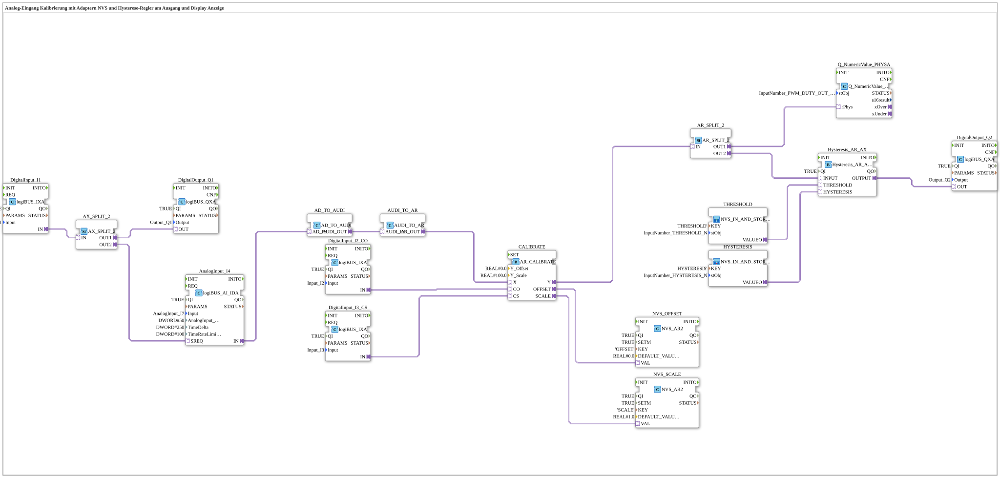

# Exercise_028c2_AR: Analog Input Calibration with Adapters, NVS and Hysteresis Controller at Output, and Display

* * * * * * * * * *
This exercise demonstrates the calibration of an analog input signal using NVS (Non-Volatile Storage) for offset and scaling. The calibrated signal is split into two paths: one for displaying a physical value (e.g., on a display), and the other for a hysteresis controller that drives a digital output. Calibration can be initiated via digital inputs (offset and scaling commands). The hysteresis thresholds are loaded from the NVS using two sub-applications.

## Function Blocks Used (FBs)

## Introduction

### Sub-Blocks: `THRESHOLD` and `HYSTERESIS`

- **Type**: `MyLib::sys::NVS_IN_AND_STORE_AR`
- **Internal FBs Used**: Not specified in detail, based on NVS memory access.
- **Description**: Both sub-applications are used to read (and optionally store) an analog value (AR) from the NVS. The value is addressed via the parameter `KEY` (e.g., `'THRESHOLD'` or `'HYSTERESIS'`). The output `VALUEO` provides the stored value. Additionally, a structure object (`stObj`) is used for data transfer.

| Name | Type | Parameters (selection) |
|------|-----|----------------------|
| `DigitalInput_I1` | `logiBUS::io::DI::logiBUS_IXA` | `Input = Input_I1` |
| `DigitalOutput_Q1` | `logiBUS::io::DQ::logiBUS_QXA` | `Output = Output_Q1` |
| `AnalogInput_I4` | `logiBUS::io::AI::logiBUS_AI_IDA` | `AnalogInput_hysteresis=50`, `TimeDelta=250`, `TimeRateLimit=100` |
| `CALIBRATE` | `adapter::Engineering::measurements::AR_CALIBRATE` | `Y_Offset=0.0`, `Y_Scale=100.0` |
| `NVS_OFFSET` | `logiBUS::storage::esp32_nvs::NVS_AR2` | `KEY='OFFSET'`, `DEFAULT_VALUE=0.0` |
| `NVS_SCALE` | `logiBUS::storage::esp32_nvs::NVS_AR2` | `KEY='SCALE'`, `DEFAULT_VALUE=1.0` |
| DigitalInput_I2_CO` | `logiBUS::io::DI::logiBUS_IXA` | `Input = Input_I2` (Calibration Offset Command) |
| DigitalInput_I3_CS` | `logiBUS::io::DI::logiBUS_IXA` | `Input = Input_I3` (Calibration Scaling Command) |
| AX_SPLIT_2` | `adapter::events::unidirectional::AX_SPLIT_2` | – |
| THRESHOLD` | SubApp `MyLib::sys::NVS_IN_AND_STORE_AR` | `KEY='THRESHOLD'`, `stObj=InputNumber_THRESHOLD` |
| `HYSTERESIS` | SubApp `MyLib::sys::NVS_IN_AND_STORE_AR` | `KEY='HYSTERESIS'`, `stObj=InputNumber_HYSTERESIS` |
| `Hysteresis_AR_AX` | `logiBUS::signalprocessing::hysteresis::Hysteresis_AR_AX` | `QI=TRUE` |
| `AR_SPLIT_2` | `adapter::events::unidirectional::AR_SPLIT_2` | – |
| `Q_NumericValue_PHYSA` | `isobus::UT::Q::Q_NumericValue_PHYSA` | `stObj=InputNumber_PWM_DUTY_OUT` (Display) |
| `AD_TO_AUDI` | `adapter::conversion::unidirectional::AD_TO_AUDI` | – |
| `AUDI_TO_AR` | `adapter::conversion::unidirectional::AUDI_TO_AR` | – |
| `DigitalOutput_Q2` | `logiBUS::io::DQ::logiBUS_QXA` | `Output = Output_Q2` |

- **AnalogInput_I4**: Reads an analog value (e.g., voltage) and outputs it as an adapter interface (`AD`).
- **CALIBRATE**: Applies offset and scaling to the incoming analog value: `Y = (X + Offset) * Scale`. The offset and scaling values can be updated via the digital inputs `CO` and `CS` and then stored in the NVS modules.
- **NVS_OFFSET, NVS_SCALE**: Permanently store the calibration values in the ESP32's flash memory. The output `VAL` provides the currently stored value.
- **Hysteresis_AR_AX**: Compares the calibrated value with a threshold and a hysteresis value. The output `OUTPUT` switches when the value exceeds the threshold (or falls below it, including the hysteresis).
- **Q_NumericValue_PHYSA**: Prepares the calibrated value for display on a screen or other output device.
- **AX_SPLIT_2, AR_SPLIT_2**: Distribute a signal (event or data) to two outputs.
1. **Analog Input**: The analog module `AnalogInput_I4` (logiBUS AI) provides an analog measurement value as a `AD` adapter.
2. **Conversion**: The value is converted to a real-world value (`AR`) using `AD_TO_AUDI` and `AUDI_TO_AR`. A comment indicates that a direct conversion (`AD_TO_AR`) would result in the same value as `reinterpret_cast` – the double conversion ensures correct value transfer.
3. **Calibration**: The value (`AR`) is passed to `CALIBRATE.X`. The digital inputs `I2` (CO) and `I3` (CS) trigger the calculation of offset (`CO` event) and scaling (`CS` event). The calculated values are stored via the NVS function blocks.

- `DigitalInput_I2_CO` → `CALIBRATE.CO` (Determine offset)

- `DigitalInput_I3_CS` → `CALIBRATE.CS` (Determine scaling)
4. **Split of the calibrated value**: The output `CALIBRATE.Y` is split via `AR_SPLIT_2` to two paths:
- Path 1: Display → `Q_NumericValue_PHYSA.rPhys` (e.g., `InputNumber_PWM_DUTY_OUT`)
- Path 2: Hysteresis → `Hysteresis_AR_AX.INPUT`
5. **Hysteresis**: The sub-applications `THRESHOLD` and The threshold values are provided by `HYSTERESIS` (`THRESHOLD.VALUEO` → `Hysteresis_AR_AX.THRESHOLD` and `HYSTERESIS.VALUEO` → `Hysteresis_AR_AX.HYSTERESIS`). The hysteresis block compares the input with these values and switches its output `OUTPUT`.
6. **Digital Outputs**:
- `DigitalOutput_Q1` is controlled by the event from `DigitalInput_I1` via `AX_SPLIT_2` (serves, for example, as enable or status).
- `Hysteresis_AR_AX.OUTPUT` switches the digital output `DigitalOutput_Q2` (e.g., for a switching function).

**Important Note**: The double adapter conversion (`AD_TO_AUDI` + `AUDI_TO_AR`) is necessary to ensure correct value transmission (see comment in the network).

This exercise demonstrates how to calibrate an analog input signal with offset and scaling correction. The calibration parameters are permanently stored in the NVS and can be updated via digital buttons. The calibrated value is used for both a display and a hysteresis switching function. The circuit illustrates how to handle adapter conversions, NVS memory access, and the distribution of data flows in the 4diac IDE.

---

- [🌐 Eclipse 4diac IDE & Color Reference on ms-muc-docs.de](https://www.ms-muc-docs.de/iec-61499/eclipse-4diac/)
- [🌐 ESP32 & ESP32-S3 DevKit on ms-muc-docs.de](https://www.ms-muc-docs.de/elektrotechnik/mikroelektronik/esp32/esp32-s3-devkit/)
- [🌐 The PWM Signal & Infographic on ms-muc-docs.de](https://www.ms-muc-docs.de/automatisierung/das-pwm-signal-die-kunst-spannung-zu-zerhacken/das-pwm-signal-die-kunst-spannung-zu-zerhacken-website/)

]

### Übersicht aller verwendeten Funktionsbausteine

### Kurzbeschreibung der wichtigsten Komponenten

## Program Flow and Connections

## Summary

### 🌐 Passende Themen-Unterseiten auf ms-muc-docs.de
