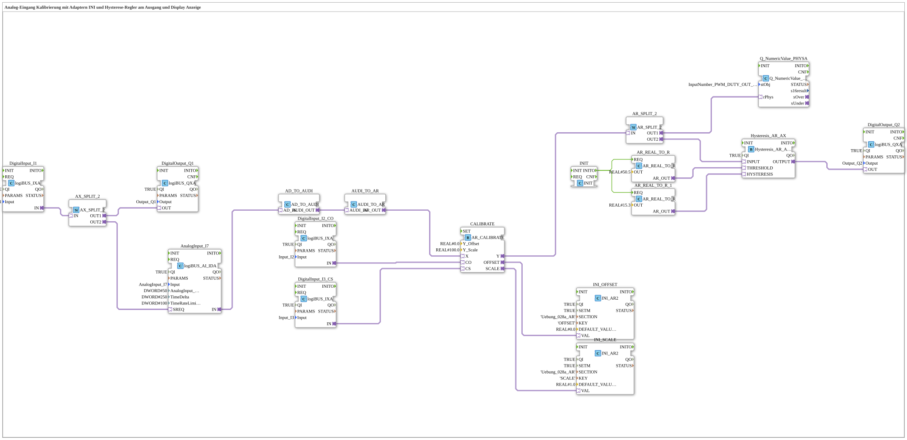

# Exercise_028c3_AR: Analog Input Calibration with INI Adapter and Hysteresis Controller at Output and Display

* * * * * * * * * *
## Introduction
This exercise demonstrates the calibration of an analog input (AnalogInput_I7) using a calibration adapter (AR_CALIBRATE) that loads an offset and a scaling factor from an INI file. The calibrated signal is passed to a hysteresis controller (Hysteresis_AR_AX), which switches a digital output (Output_Q2). Simultaneously, the calibrated value is displayed on a screen (Q_NumericValue_PHYSA). The exercise uses two inputs (I2, I3) to trigger the calibration and another input (I1) as an enable signal.

```
## Function Blocks (FBs) Used

### Sub-Blocks: None (all FBs are system-defined)
- **AnalogInput_I7** (Type: `logiBUS::io::AI::logiBUS_AI_IDA`)
- **Internal Parameters Used**: `AnalogInput_hysteresis = 50`, `TimeDelta = 250`, `TimeRateLimit = 100`
- **Functionality**: Reads the physical analog value (e.g., voltage) from input I7. The parameters define hysteresis, sampling time, and rate limit.
- **DigitalInput_I1** (Type: `logiBUS::io::DI::logiBUS_IXA`)
- **Functionality**: Reads the digital input I1. Used as an enable signal for output Q1.
- **DigitalInput_I2_CO** (Type: `logiBUS::io::DI::logiBUS_IXA`)
- **Function**: Reads digital input I2 to trigger the calibration commit (CO).
- **DigitalInput_I3_CS** (Type: `logiBUS::io::DI::logiBUS_IXA`)
- **Function**: Reads digital input I3 to trigger the calibration read start (CS).
- **DigitalOutput_Q1** (Type: `logiBUS::io::DQ::logiBUS_QXA`)
- **Function**: Sets digital output Q1 based on input I1 (enable).
- **DigitalOutput_Q2** (Type: `logiBUS::io::DQ::logiBUS_QXA`)
- **Function**: Sets digital output Q2 based on the hysteresis controller output.
- **CALIBRATE** (Type: `adapter::Engineering::measurements::AR_CALIBRATE`)
- **Internal Parameters Used**: `Y_Offset = 0.0`, `Y_Scale = 100.0`
- **Functionality**: Performs a calibration of the analog input value. Calculates an offset and scaling factor, which is written to the INI file. Inputs: X (raw value), CO (commit trigger), CS (read trigger). Outputs: Y (calibrated value), OFFSET, SCALE.

``` - **INI_OFFSET** (Type: `eclipse4diac::storage::INI_AR2`)

- **Internal Parameters Used**: `SECTION = 'Uebung_028a_AR'`, `KEY = 'OFFSET'`, `DEFAULT_VALUE = 0.0`
- **Functionality**: Reads the offset value from an INI file and provides it as an analogous value.
- **INI_SCALE** (Type: `eclipse4diac::storage::INI_AR2`)
- **Internal Parameters Used**: `SECTION = 'Uebung_028a_AR'`, `KEY = 'SCALE'`, `DEFAULT_VALUE = 1.0`
- **Functionality**: Reads the scale factor from an INI file and provides it as an analogous value.
- **Hysteresis_AR_AX** (Type: `logiBUS::signalprocessing::hysteresis::Hysteresis_AR_AX`)
- **Internal Parameters Used**: `QI = TRUE`
- **Functionality**: Compares the calibrated input value with a threshold and a hysteresis value. The output is set when the value exceeds the threshold and reset when it falls below the lower threshold (threshold – hysteresis).
- **Q_NumericValue_PHYSA** (Type: `isobus::UT::Q::Q_NumericValue_PHYSA`)
- **Internal Parameters Used**: `stObj = InputNumber_PWM_DUTY_OUT`
- **Functionality**: Displays an analog value on a display (e.g., as a numeric value).
- **AX_SPLIT_2** (Type: `adapter::events::unidirectional::AX_SPLIT_2`)
- **Functionality**: Distributes a digital signal (AX) to two outputs (OUT1, OUT2). Here: The input from DigitalInput_I1 is split to DigitalOutput_Q1 and used as a trigger for AnalogInput_I7.
- **AR_SPLIT_2** (Type: `adapter::events::unidirectional::AR_SPLIT_2`)
- **Functionality**: Distributes an analog value (AR) to two outputs (OUT1, OUT2). Here: The calibrated value is sent to the display and the hysteresis controller.
- **AD_TO_AUDI** (Type: `adapter::conversion::unidirectional::AD_TO_AUDI`)
- **Functionality**: Converts an AD (Analog-to-Digital) value to an AUDIO value. Used to adjust the signal representation.
- **AUDI_TO_AR** (Type: `adapter::conversion::unidirectional::AUDI_TO_AR`)
- **Functionality**: Converts an AUDI value back into an AR value (analog real value). Note: Two conversions are necessary because a direct AD_TO_AR would act like a "reinterpret_cast".
- **AR_REAL_TO_R** (x2) (Type: `adapter::conversion::unidirectional::AR_REAL_TO_R`)
- **Internal Parameters Used**: First: `OUT = 50.5`, Second: `OUT = 15.3`
- **Functionality**: Converts a constant real value into an AR signal. Serves as the threshold (THRESHOLD = 50.5) and hysteresis width (HYSTERESIS = 15.3) for the hysteresis controller.
- **INIT** (Type: `iec61131::bitwiseOperators::INIT`)
- **Functionality**: Generates a one-time initialization event (INITO) at system startup. This event triggers the two AR_REAL_TO_R blocks to set the constant values.

## Program Flow and Connections

1. **Initialization**: At startup, the INIT block triggers the two AR_REAL_TO_R blocks, which set the constant threshold values (50.5 and 15.3) on the analog bus.

2. **Analog Value Acquisition**: The AnalogInput_I7 reads the raw value from input I7. This raw value is transferred to the CALIBRATE block via the conversion chain AD_TO_AUDI and AUDI_TO_AR.

3. **Calibration**: The digital inputs I2 (CO) and I3 (CS) control the calibration:

- When CS (I3 = TRUE), a new calibration cycle is started: The current raw value (X) is measured, and the offset and scaling are calculated.
- When CO (I2 = TRUE), the calculated values are written to the INI file (via INI_OFFSET and INI_SCALE).
- The calibrated output Y is routed to the splitter AR_SPLIT_2.

4. **Signal Distribution**:

- AR_SPLIT_2.OUT1 routes the calibrated value to the display (Q_NumericValue_PHYSA).
- AR_SPLIT_2.OUT2 routes the calibrated value to the hysteresis controller (Hysteresis_AR_AX).

5. **Hysteresis Control**: The hysteresis controller compares the calibrated input value with the threshold (50.5) and the hysteresis value (15.3). The output becomes active when the value exceeds 50.5 + 15.3/2 (depending on the implementation; typically: activation at > 50.5, reset at < 50.5 - 15.3), and switches the digital output Q2.

6. **Enable Signal**: The digital input I1 is routed via the splitter AX_SPLIT_2 to output Q1 (directly forwarded) and simultaneously to AnalogInput_I7 (as a trigger for the measurement). Therefore, the analog value can only be read when I1 is active.

**Note**: Comments on the network indicate that the double conversion (AD_TO_AUDI → AUDI_TO_AR) is necessary to ensure correct signal representation. A direct AD_TO_AR would perform the bit interpretation of the analog-to-digital converter without going through the audio bus, which can lead to incorrect values.

```## Summary

The exercise "Exercise_028c3_AR" implements a complete analog input calibration with persistent storage of offset and scaling in an INI file. The calibrated value is visualized on a display and simultaneously fed to a hysteresis controller, which switches a digital output. Control is achieved via three digital inputs: Enable (I1), Commit (I2), and Start (I3). This exercise teaches the use of adapters, signal conversions, and the integration of INI memory modules in 4diac.

---

### 🌐 Related topic subpages on ms-muc-docs.de
* [🌐 Eclipse 4diac IDE & Color Reference on ms-muc-docs.de](https://www.ms-muc-docs.de/iec-61499/eclipse-4diac/)
* [🌐 The PWM Signal & Infographic on ms-muc-docs.de](https://www.ms-muc-docs.de/automatisierung/das-pwm-signal-die-kunst-spannung-zu-zerhacken/das-pwm-signal-die-kunst-spannung-zu-zerhacken-website/)

]
