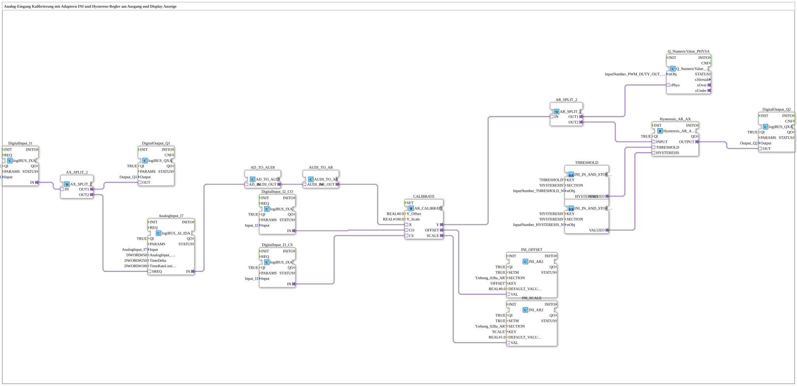

# Exercise_028c_AR: Analog Input Calibration with Adapters, INI and Hysteresis Controller at Output, and Display

*Image of the exercise to follow*
---
## Introduction

This exercise demonstrates the calibration of an analog input (AnalogInput_I7) using offset and scaling adapters (AR_CALIBRATE). The calibration values are persistently stored via INI function blocks (INI_AR2). Additionally, a hysteresis controller is applied to the calibrated analog signal, with the threshold and hysteresis also loaded via INI (SubApp THRESHOLD and HYSTERESIS). The hysteresis result is output to a digital output (Output_Q2), while the calibrated value is simultaneously displayed on a screen (Q_NumericValue_PHYSA). Digital inputs control the calibration (Calibrate On/Off and Calibrate Set) as well as an additional digital output (Output_Q1).

...)) ) ``) ``) ``) ``) ` control the calibration (`Calibrate On/Off (Calibrate On/Off, (Calibrate Set)) as well as an additional digital output
## Function Blocks (FBs) Used

### Sub-Blocks: `THRESHOLD` and `HYSTERESIS`

- **Type**: `MyLib::sys::INI_IN_AND_STORE_AR`
- **Parameters**:
- `SECTION`: Section name in the INI configuration (`'HYSTERESIS'`)
- `KEY`: Key name (`'THRESHOLD'` or `'HYSTERESIS'`)
- `stObj`: Reference to a pool object for value display (e.g., `InputNumber_THRESHOLD`)
- **Functionality**:

Reads the data under [missing information] for initialization. The function block `SECTION`/`KEY` retrieves the stored value from the INI file (or a persistent storage structure) and makes it available as the output value (`VALUO`). This value can be updated during runtime by other function blocks (e.g., HMI). When changes are made, the new value is saved back.

### Other Function Blocks

| Function Block Name | Type | Parameters | Description |
|--------------|-----|------------|--------------|
| `AnalogInput_I7` | `logiBUS::io::AI::logiBUS_AI_IDA` | QI=TRUE, Input="AnalogInput_I7", AnalogInput_hysteresis=50, TimeDelta=250, TimeRateLimit=100 | Analog input, provides an adapter `AD_IN` (analog/digital value). |
| `DigitalInput_I1` | `logiBUS::io::DI::logiBUS_IXA` | QI=TRUE, Input="Input_I1" | Digital input I1, controls two outputs (Q1 and SREQ on the analog input) via adapter `AX_SPLIT_2`. |
| `DigitalInput_I2_CO` | `logiBUS::io::DI::logiBUS_IXA` | QI=TRUE, Input="Input_I2" | Digital input I2 (Calibrate On/Off). |
| `DigitalInput_I3_CS` | `logiBUS::io::DI::logiBUS_IXA` | QI=TRUE, Input="Input_I3" | Digital input I3 (Calibrate Set). |
| `DigitalOutput_Q1` | `logiBUS::io::DQ::logiBUS_QXA` | QI=TRUE, Output="Output_Q1" | Digital output Q1 (e.g., acknowledgement for I1). |
| `DigitalOutput_Q2` | `logiBUS::io::DQ::logiBUS_QXA` | QI=TRUE, Output="Output_Q2" | Digital output Q2 (Hysteresis result). |
| `CALIBRATE` | `adapter::Engineering::measurements::AR_CALIBRATE` | Y_Offset=0.0, Y_Scale=100.0 | Calibration adapter: calculates `Y = (X * Y_Scale) + Y_Offset`. Inputs: X (Analog Value), CO (Calibrate On), CS (Calibrate Set). Outputs: Y (Calibrated Value), OFFSET, SCALE. |
| `INI_OFFSET` | `eclipse4diac::storage::INI_AR2` | QI=TRUE, SECTION="'Uebung_028a_AR'", KEY="'OFFSET'", DEFAULT_VALUE=0.0 | Reads/stores the offset value (from the CALIBRATE adapter). |
| `INI_SCALE` | `eclipse4diac::storage::INI_AR2` | QI=TRUE, SECTION="'Uebung_028a_AR'", KEY="'SCALE'", DEFAULT_VALUE=1.0 | Reads/stores the scaling factor. |
| `AX_SPLIT_2` | `adapter::events::unidirectional::AX_SPLIT_2` | - | Distributes a digital adapter (AX) to two outputs. |
| `AR_SPLIT_2` | `adapter::events::unidirectional::AR_SPLIT_2` | - | Distributes an analog adapter (AR) to two outputs. |
| `AD_TO_AUDI` | `adapter::conversion::unidirectional::AD_TO_AUDI` | - | Converts an AD adapter (Analog/Digital) to an AUDI adapter (universal data format). |
| `AUDI_TO_AR` | `adapter::conversion::unidirectional::AUDI_TO_AR` | - | Converts an AUDI adapter back to an AR adapter (analog real value). The double conversion is necessary because direct type conversion is not possible (similar to `reinterpret_cast`). |
| `Hysteresis_AR_AX` | `logiBUS::signalprocessing::hysteresis::Hysteresis_AR_AX` | QI=TRUE | Hysteresis function on analog values. Inputs: `INPUT` (AR), `THRESHOLD` (AR), `HYSTERESIS` (AR). Output: `OUTPUT` (AX, digital). |
| `Q_NumericValue_PHYSA` | `isobus::UT::Q::Q_NumericValue_PHYSA` | stObj=InputNumber_PWM_DUTY_OUT | Displays an analog value on a display or numeric indicator. |

## Program Flow and Connections

1. **Analog Input**:

AnalogInput_I7` continuously provides the raw value of the analog input on adapter `IN`. This raw value is converted into an AR adapter (real value) via `AD_TO_AUDI` and `AUDI_TO_AR` and passed to input `X` of the calibration adapter `CALIBRATE`.

2. **Calibration**:

The digital inputs `Input_I2` (CO = Calibrate On) and `Input_I3` (CS = Calibrate Set) control the calibration process. Pressing CS while CO is active takes the current measured value and calculates the offset and scaling so that the output value `Y` corresponds to the desired setpoint. The determined values `OFFSET` and `SCALE` are stored via the INI blocks `INI_OFFSET` and `INI_SCALE`.

*Note*: The INI blocks are configured with `SECTION` = `'Uebung_028a_AR'`.

3. **Value Distribution**:

The calibrated value `Y` is distributed via `AR_SPLIT_2` to two paths:

- Path 1 to `Q_NumericValue_PHYSA` (display)
- Path 2 to the hysteresis block `Hysteresis_AR_AX` (input `INPUT`)
4. **Hysteresis**:

The subapps `THRESHOLD` and `HYSTERESIS` read the parameters (threshold and hysteresis band) from the INI configuration (section `'HYSTERESIS'`). These values are passed to the hysteresis block. The hysteresis block compares the calibrated value with the threshold, taking the hysteresis band into account, and outputs a digital signal (`OUTPUT`).

5. **Digital Outputs**:
- `DigitalInput_I1` is split via `AX_SPLIT_2`: One branch controls `DigitalOutput_Q1`, the other branch triggers the analog input (`SREQ`) to initiate a sample.
- The result of the hysteresis (`Hysteresis_AR_AX.OUTPUT`) is directly fed to `DigitalOutput_Q2`.
6. **Special Feature**:

The double conversion (`AD_TO_AUDI` → `AUDI_TO_AR`) is necessary because the analog (AD) value cannot be directly converted into an AR adapter. The AUDI adapter serves as an intermediate format.

## Summary

In this exercise, an analog input is calibrated. The calibration values are persistently stored in INI files and reloaded upon recommissioning. A hysteresis controller evaluates the calibrated value and switches a digital output. Simultaneously, the value is displayed.

**Learning Objectives**:

- Calibration of an analog sensor using offset and scaling
- Persistent storage of configuration values using INI blocks
- Application of a hysteresis controller
- Signal splitting with adapters and correct conversion between different data types
- Interaction of analog and digital inputs/outputs in 4diac

**Difficulty Level**: Advanced
**Prerequisites**: Basic knowledge of the 4diac IDE, working with adapters and logiBUS modules, understanding of signal processing and INI configuration.

**Note**: Before starting, the INI sections `'Uebung_028a_AR'` and `'HYSTERESIS'` must be present in the configuration file. The corresponding numeric pool objects (e.g., `InputNumber_THRESHOLD`) must be defined in the project.

---

### 🌐 Related topic subpages on ms-muc-docs.de

- [🌐 Eclipse 4diac IDE & Color Reference on ms-muc-docs.de](https://www.ms-muc-docs.de/iec-61499/eclipse-4diac/)
- [🌐 The PWM Signal & Infographic on ms-muc-docs.de](https://www.ms-muc-docs.de/automatisierung/das-pwm-signal-die-kunst-spannung-zu-zerhacken/das-pwm-signal-die-kunst-spannung-zu-zerhacken-website/)

]
