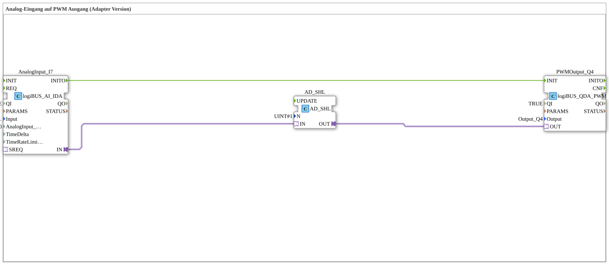

# Exercise_034_AD: Analog Input to PWM Output (Adapter Version)

Analog Input to PWM Output (Adapter Version)

* * * * * * * * * *

## Introduction

This exercise demonstrates the use of an analog input to control a PWM output via an adapter connection. The analog input signal is first processed by a bit shift (left shift) before being passed to the PWM output. The PWM output is initialized by an event triggered by the analog input.

## Function Blocks (FBs) Used

### Sub-Blocks: AnalogInput\_I7

- **Type**: `logiBUS::io::AI::logiBUS_AI_IDA`
- **Internal FBs Used**: None (Hardware Driver Block)
- **Parameters**:
- `QI` = `TRUE`
- `Input` = `logiBUS_AI::AnalogInput_I7`
- `AnalogInput_hysteresis` = `50`
- **Event Output/Input**:
- Event output `INITO` (triggered upon successful initialization)
- **Data Output/Input**:
- Adapter output `IN` (represents the (Read analog value as adapter)
- **Functionality**: Reads the analog input value of the connected logiBUS module. The parameter `AnalogInput_hysteresis` reduces signal noise. Upon successful initialization, the event `INITO` is sent.

Read analog value as adapter

**Functionality**: Reads the analog input value of the connected logiBUS module. The parameter `AnalogInput_hysteresis` reduces signal noise.

### Sub-Blocks: PWMOutput\_Q4

- **Type**: `logiBUS::io::DQ::logiBUS_QDA_PWM`
- **Internal Function Blocks Used**: None (Hardware Driver Block)
- **Parameters**:
- `QI` = `TRUE`
- `Output` = `Output_Q4`
- **Event Output/Input**:
- Event input `INIT` (triggers initialization and adoption of the PWM value)
- **Data Output/Input**:
- Adapter input `OUT` (receives the adapter with the PWM setpoint)
- **Functionality**: Controls the digital output channel Q4 as a PWM output. The value received via the adapter input `OUT` determines the duty cycle (pulse width). The output is activated by the event `INIT`.

### Sub-Blocks: AD\_SHL

- **Type**: `adapter::iec61131::bitwise::AD_SHL`
- **Internal Function Blocks Used**: None (pure logic)
- **Parameters**:
- `N` = `UINT#1` (shift by 1 bit to the left)
- **Event Output/Input**: None (static processing without events)
- **Data Output/Input**:
- Adapter input `IN` (receives the analog value as an adapter)
- Adapter output `OUT` (outputs the shifted value as an adapter)
- **Functionality**: Performs a bitwise left shift by the specified number of bits (here 1) on the received data value. This is equivalent to multiplying by 2. The shifted value is provided via the adapter output.

## Program Flow and Connections

The process begins with the initialization of the analog input (`AnalogInput_I7`). Once this is successfully initialized (event `INITO`), the initialization event of the PWM output (`PWMOutput_Q4`) is triggered via the event connection:

- `AnalogInput_I7.INITO` → `PWMOutput_Q4.INIT`

Simultaneously, the data is transferred via adapter connections:

1. The analog value is forwarded from the adapter output `AnalogInput_I7.IN` to the adapter input `AD_SHL.IN`.
2. The shifted value resulting from `AD_SHL.OUT` is passed to the adapter input `PWMOutput_Q4.OUT`.

Thus, all data transmission is adaptable and bidirectional via adapter interfaces, without separate data lines. The bit shift amplifies the analog input value by a factor of 2 (corresponding to a doubling) before it is output as a PWM duty cycle.

**Learning Objectives**:

- Understanding adapter communication in the 4diac IDE
- Integration of analog inputs (logiBUS) and PWM outputs
- Application of bitwise operations (Shift Left) in signal processing
- Linking initialization events between hardware drivers

**Difficulty Level**: Easy

**Required Prior Knowledge**: Basic knowledge of the 4diac IDE and logiBUS hardware

## Summary

The exercise "Exercise_034_AD" demonstrates a simple yet practical application: converting an analog measurement value into a PWM signal using adapter connections. The analog value is amplified by a left shift and passed directly to the PWM output. Adapter technology enables flexible and type-safe data transmission without separate data connections. This example is suitable for applications such as brightness control, speed control, or signal conversion in automation technology.

### 🌐 Related topic subpages on ms-muc-docs.de

- [🌐 Eclipse 4diac IDE & Color Reference on ms-muc-docs.de](https://www.ms-muc-docs.de/iec-61499/eclipse-4diac/)
- [🌐 The PWM Signal & Infographic on ms-muc-docs.de](https://www.ms-muc-docs.de/automatisierung/das-pwm-signal-die-kunst-spannung-zu-zerhacken/das-pwm-signal-die-kunst-spannung-zu-zerhacken-website/)

]
