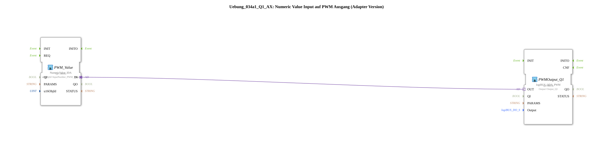

# Exercise_034a1_Q1_AX: Numeric Value Input to PWM Output (Adapter Version)

* * * * * * * * * *
## Introduction
This exercise demonstrates the simple connection of a **numeric value input** (ISOBUS NumericValue) to a **PWM output** via a direct adapter connection. After confirmation (OK button), the entered numeric value is output to the PWM output of the logiBUS module (channel Q1).
This exercise is implemented as a **SubAppType** and uses only adapters for signal transmission, thus eliminating the need for separate data and event connections.

## Function Blocks (FBs) Used

### Sub-Blocks: `Uebung_034a1_Q1_AX`
- **Type**: SubAppType (compound block)
- **Internal FBs Used**:
- **`PWM_Value`**: `isobus::UT::io::NumericValue::NumericValue_IDA`
- Parameters:
- `QI` = `TRUE` (Block activated)
- `u16ObjId` = `InputNumber_PWM_Value` (ISOBUS object ID for numeric input)
- **Functionality**: Reads a numeric value entered by the user from an ISOBUS object (e.g., terminal) and makes it available via the adapter output `OUT`. The data will only be updated after pressing the OK button on the terminal.
- **`PWMOutput_Q1`**: `logiBUS::io::DQ::logiBUS_QDA_PWM`
- Parameters:
- `QI` = `TRUE` (Block activated)
- `Output` = `Output_Q1` (logiBUS output channel Q1)
- **Functionality**: Converts the numerical value received via the adapter input `IN` into a PWM signal on the specified logiBUS output (`Output_Q1`). The value determines the duty cycle of the PWM.

## Program Flow and Connections

1. The user enters a numerical value at an ISOBUS terminal via the object `InputNumber_PWM_Value`.

2. After pressing the OK button, the value is received by the function block `PWM_Value` and made available at its adapter output `IN`.

3. The adapter output is directly connected to the adapter input `OUT` of the function block `PWMOutput_Q1`:

Verbindung: PWM_Value.IN → PWMOutput_Q1.OUT
4. `PWMOutput_Q1` converts the received value into a PWM duty cycle on the logiBUS output `Output_Q1`.

**Note**: As noted in the network comment, the updated value is **not** transmitted with every keystroke (e.g., when turning an encoder), but only after pressing the OK button. This behavior is defined by the function block `NumericValue_IDA`.

## Summary

This exercise demonstrates a **minimal configuration for controlling a PWM output** using an input number. It illustrates the use of **adapter connections** for data transmission between the ISOBUS input and the actuator. The setup is simple but requires an understanding of ISOBUS communication and PWM parameterization. This exercise is suitable for beginners using the 4diac IDE and logiBUS hardware.

---

### 🌐 Related topic subpages on ms-muc-docs.de
* [🌐 Eclipse 4diac IDE & Color Reference on ms-muc-docs.de](https://www.ms-muc-docs.de/iec-61499/eclipse-4diac/)
* [🌐 The PWM Signal & Infographic on ms-muc-docs.de](https://www.ms-muc-docs.de/automatisierung/das-pwm-signal-die-kunst-spannung-zu-zerhacken/das-pwm-signal-die-kunst-spannung-zu-zerhacken-website/)

]
