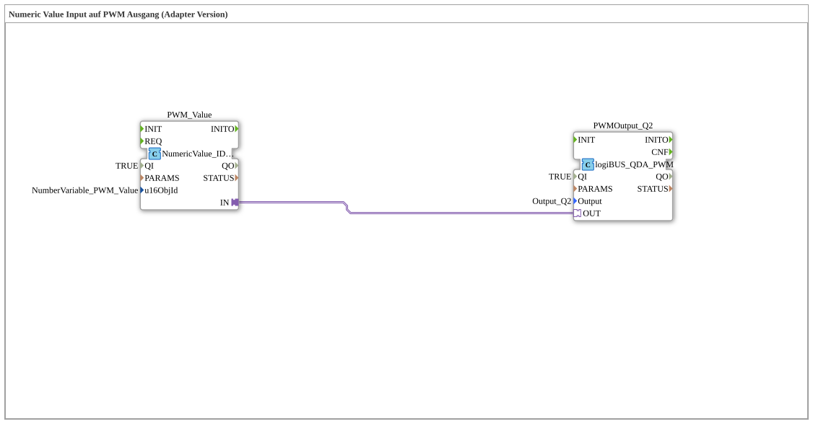

# Exercise_034a1_Q2_AX: Numeric Value Input to PWM Output (Adapter Version)

* * * * * * * * * *
## Introduction

This exercise demonstrates the coupling of a numeric input value (via an iSoBUS numeric value service) with a PWM output (logiBUS). The numeric value entered by the user is directly converted into a PWM signal and output at output `Output_Q2`. Communication between the two function blocks takes place via an adapter connection, which allows for modular and flexible wiring.
## Function Blocks Used (FBs)

Two function blocks are used in the subapplication network:

- **PWM_Value**

*Type*: `isobus::UT::io::NumericValue::NumericValue_IDA`

*Task*: Receives a numeric value from the iSoBUS network via the object ID `InputNumber_PWM_Value`. The data is available at the output after user confirmation (e.g., pressing the OK button).

*Parameters*:

- `QI` (power-on signal) = `TRUE` (permanently active)
- `u16ObjId` = `InputNumber_PWM_Value` (iSoBUS object ID of the input value)
- **PWMOutput_Q2**

*Type*: `logiBUS::io::DQ::logiBUS_QDA_PWM`

*Task*: Converts the incoming numerical value into a PWM signal and outputs it via the logiBUS output `Output_Q2`.

*Parameters*:

- `QI` (power-on signal) = `TRUE` (permanently active)
- `Output` = `Output_Q2` (logiBUS output address)

**Important Note:**

The data transfer event is only triggered when the entered numeric value is confirmed with the OK button – not with every button press. See the comment in the network:

> ATTENTION!!

> The event only appears in the adapter
> when the numeric value is confirmed with OK.

> not when a button is pressed.

## Program Flow and Connections

1. The function block `PWM_Value` waits for a valid numeric value from the iSoBUS input field.
2. After user confirmation (OK button), a data event with the numerical value is sent via the **adapter output** `IN`.
3. The adapter connection forwards this signal to the **adapter input** `OUT` of the function block `PWMOutput_Q2`.
4. `PWMOutput_Q2` converts the received value into a PWM signal with the corresponding pulse width and controls the connected logiBUS output `Output_Q2`.

**Important prerequisites:**

- The two function blocks are rigidly connected via their adapter interfaces (no dynamic connections).
- The underlying iSoBUS object (`InputNumber_PWM_Value`) must be configured in the system.
- The logiBUS output module (`Output_Q2`) must be present and addressed.

## Summary

This exercise demonstrates how a numerical user input from an iSoBUS service is directly converted into a PWM output signal via an adapter connection. Using adapters simplifies the wiring and increases the reusability of the components. After completing this exercise, the learner will be able to combine iSoBUS input fields with logiBUS PWM outputs and understand the unique aspect of event triggering (acknowledgment instead of a button press).

---

### 🌐 Related topic subpages on ms-muc-docs.de

* [🌐 The PWM signal & infographic on ms-muc-docs.de](https://www.ms-muc-docs.de/automatisierung/das-pwm-signal-die-kunst-spannung-zu-zerhacken/das-pwm-signal-die-kunst-spannung-zu-zerhacken-website/)

]
