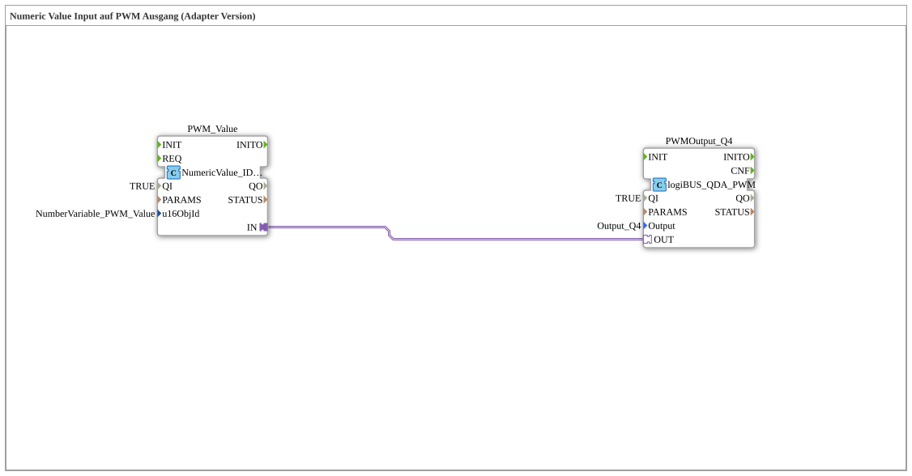

# Exercise_034a1_Q4_AX: Numeric Value Input to PWM Output (Adapter Version)

* * * * * * * * * *
## Introduction

This exercise demonstrates controlling a PWM output (logiBUS Output Q4) using a numeric input value. Communication between the input block and the output block is via adapter connections ("Adapter Version"). An integrated comment indicates that the value transfer event is only triggered when the entered numeric value is confirmed with "OK"—not simply by pressing a key.

## Function Blocks (FBs) Used

### Sub-Blocks: `PWM_Value`

- **Type**: `isobus::UT::io::NumericValue::NumericValue_IDA`
- **Internal FBs Used**: (No other internal FBs, as this is an atomic FB. The FB itself is part of the library `isobus`.)
- **Parameters**:
- `QI` = `TRUE`
- `u16ObjId` = `InputNumber_PWM_Value` (refers to a numeric value instance defined in the project)
- **Functionality**:

The FB reads the numeric value entered by the user (e.g., from an HMI input field) and displays it. The output is provided via its adapter interface (`IN`). Output is only generated after the input has been confirmed with "OK". Event control is handled implicitly via the adapter.

### Sub-Blocks: `PWMOutput_Q4`

- **Type**: `logiBUS::io::DQ::logiBUS_QDA_PWM`
- **Internal Function Blocks Used**: (No other internal function blocks, atomic function block from the logiBUS library)
- **Parameters**:
- `QI` = `TRUE`
- `Output` = `Output_Q4` (logical name of the physical PWM output on the logiBUS module)
- **Functionality**:

The function block receives the current setpoint (e.g., a number from 0 to 1000, etc.) via its adapter input (`OUT`) and outputs it as a PWM signal on the specified channel. `Output_Q4` is available. The value corresponds to the duty cycle of the PWM.

## Program Flow and Connections

The network flow consists of two function blocks that communicate exclusively via an adapter connection:

- **Source**: `PWM_Value.IN` (output side of the adapter)
- **Destination**: `PWMOutput_Q4.OUT` (input side of the adapter)

The adapter connection transmits the numeric value, including the associated event control. As soon as the user confirms the value in the HMI, the event is forwarded via the adapter to the PWM output block, which then updates the PWM signal.

**Note** (from the comment in the network):

The event is only sent via the adapter when the numeric input is acknowledged with "OK"—not simply by pressing a key or changing the input field. This must be taken into account when planning the user interface.

| Connection | From | To |
|------------|-----|------|
| Adapter | `PWM_Value.IN` | `PWMOutput_Q4.OUT` |

## Summary

Exercise `Uebung_034a1_Q4_AX` connects a numeric input function block (`NumericValue_IDA`) to a PWM output function block (`logiBUS_QDA_PWM`) via an adapter. This enables simple interaction between user input and hardware output. The key feature is the event-driven transfer of the value only after confirmation, which allows for a clean separation of input changes and output updates.

Exercise `Uebung_034a1_Q4_AX` connects a numeric input function block (`NumericValue_IDA`) to a PWM output function block (`logiBUS_QDA_PWM`) using an adapter. ---

### 🌐 Related topic subpages on ms-muc-docs.de

* [🌐 The PWM signal & infographic on ms-muc-docs.de](https://www.ms-muc-docs.de/automatisierung/das-pwm-signal-die-kunst-spannung-zu-zerhacken/das-pwm-signal-die-kunst-spannung-zu-zerhacken-website/)
