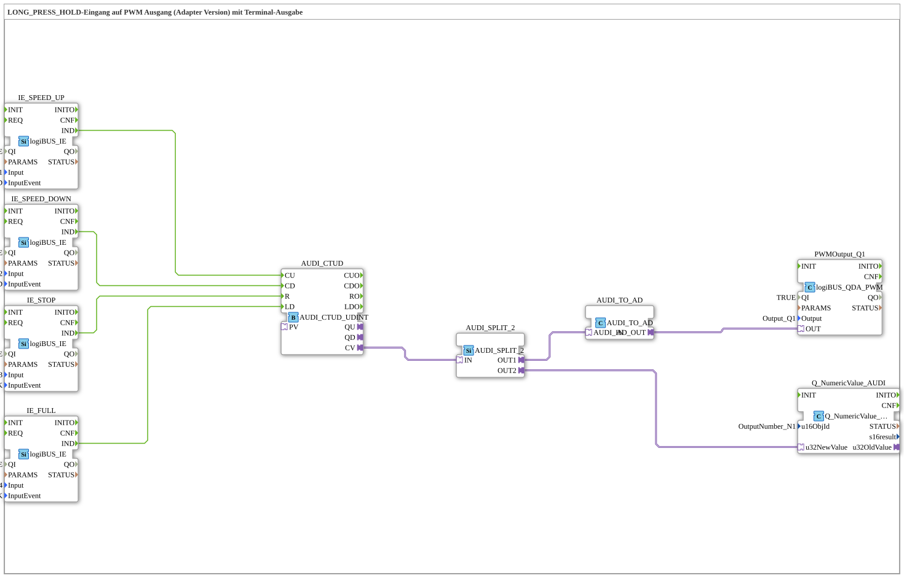

# Exercise_034b_AUDI: LONG_PRESS_HOLD Input to PWM Output (Adapter Version) with Terminal Output

* * * * * * * * * *
## Introduction

This exercise demonstrates the use of **LONG_PRESS_HOLD** inputs to control a PWM output.
The PWM value can be increased, decreased, reset, or set to a maximum value using four pushbuttons.

The current counter value is also output to a terminal.

The entire circuit is implemented as a **SubApp** with adapter-based data conversion.

## Function Blocks Used (FBs)

The SubApp contains the following function blocks:

### Sub-Block: IE_SPEED_UP

- **Type**: `logiBUS::io::DI::logiBUS_IE`
- **Parameters**:
- `QI` = TRUE
- `Input` = Input_I1 (physical input)
- `InputEvent` = `BUTTON_LONG_PRESS_HOLD`
- **Event Output**: `IND` (triggered by long press)
- **Functionality**: Detects a long press-hold event at the first digital input and outputs an IND event to increment the counter.

### Sub-module: IE_SPEED_DOWN

- **Type**: `logiBUS::io::DI::logiBUS_IE`
- **Parameters**:
- `QI` = TRUE
- `Input` = Input_I2
- `InputEvent` = `BUTTON_LONG_PRESS_HOLD`
- **Event Output**: `IND`
- **Function**: Detects a long press-hold at the second input and triggers the countdown.

### Sub-module: IE_STOP

- **Type**: `logiBUS::io::DI::logiBUS_IE`
- **Parameters**:
- `QI` = TRUE
- `Input` = Input_I3
- `InputEvent` = `BUTTON_SINGLE_CLICK`
- **Event Output**: `IND`
- **Function**: Detects a single click at the third input and resets the counter.

### Sub-module: IE_FULL

- **Type**: `logiBUS::io::DI::logiBUS_IE`
- **Parameters**:
- `QI` = TRUE
- `Input` = Input_I4
- `InputEvent` = `BUTTON_SINGLE_CLICK`
- **Event Output**: `IND`
- **Functionality**: Detects a single click at the fourth input and loads a preset maximum value into the counter.

### Sub-module: AUDI_CTUD

- **Type**: `adapter::events::unidirectional::AUDI_CTUD_UDINT` (Up/Down Counter)
- **Parameters**: None (default configuration)
- **Event Inputs**:
- `CU` (Count Up)
- `CD` (Count Down)
- `R` (Reset)
- `LD` (Load)
- **Data Output**: `CV` (Current Counter Value, Type UDINT)
- **Functionality**: Counts up on each `CU` event and down on each `CD` event. The counter is set to 0 when `R` is executed, and to an internal default value (e.g., 10000) when `LD` is executed.

### Sub-module: AUDI_SPLIT_2

- **Type**: `adapter::events::unidirectional::AUDI_SPLIT_2` (Signal Distributor)
- **Parameters**: None
- **Adapter Input**: `IN` (Data)
- **Adapter Outputs**: `OUT1`, `OUT2` (Same value on both outputs)
- **Functionality**: Distributes the incoming counter value to two parallel paths – one for PWM conversion and one for terminal output.

### Sub-module: AUDI_TO_AD

- **Type**: `adapter::conversion::unidirectional::AUDI_TO_AD` (converter)
- **Parameters**: None
- **Adapter input**: `AUDI_IN`
- **Adapter output**: `AD_OUT` (analog value, e.g., 0–10000)
- **Function**: Converts the counter value (AUDI format) into an analog value suitable for the PWM stage.

### Sub-module: PWMOutput_Q1

- **Type**: `logiBUS::io::DQ::logiBUS_QDA_PWM`
- **Parameters**:
- `QI` = TRUE (enabled)
- `Output` = `Output_Q1` (physical output)
- **Data input**: `OUT` (from the converter)
- **Function**: Outputs a PWM signal proportional to the analog input value at output `Q1`.

### Sub-module: Q_NumericValue_AUDI

- **Type**: `isobus::UT::Q::Q_NumericValue_AUDI`
- **Parameters**:
- `u16ObjId` = `OutputNumber_N1` (Target address for the terminal)
- **Data input**: `u32NewValue` (Current counter value)
- **Function**: Sends the counter value to the configured output number of the terminal for numerical display.

## Program Flow and Connections

The event and data flows are linked as follows:

- **Event Connections** (from the `IE` blocks to the counter):
- `IE_SPEED_UP.IND` → `AUDI_CTUD.CU` (count up)
- `IE_SPEED_DOWN.IND` → `AUDI_CTUD.CD` (count down)
- `IE_STOP.IND` → `AUDI_CTUD.R` (reset)
- `IE_FULL.IND` → `AUDI_CTUD.LD` (load maximum value)
- **Data Connections** (adapters):
- `AUDI_CTUD.CV` → `AUDI_SPLIT_2.IN`
- `AUDI_SPLIT_2.OUT1` → `AUDI_TO_AD.AUDI_IN`
- `AUDI_TO_AD.AD_OUT` → `PWMOutput_Q1.OUT`
- `AUDI_SPLIT_2.OUT2` → `Q_NumericValue_AUDI.u32NewValue`

**Procedure**:

A long press and hold on the speed up/down buttons increments or decrements the up/down counter. A single click on *Stop* resets the counter, and *Full* loads a full value. The counter value is converted into a PWM signal via a splitter and output, and also displayed on the terminal.

**Learning Objectives**:

- Understanding the coupling of event and data flows in 4diac
- Using long-press-hold and single-click events
- Adapter-based data conversion and signal distribution
- Integrating terminal outputs for value display

**Difficulty Level**: Medium
**Prerequisites**: Basic operation of the 4diac IDE, familiarity with logiBUS function blocks

## Summary

The exercise **Exercise_034b_AUDI** implements speed control using four pushbuttons.

Long-press-hold increases or decreases the PWM signal, single-click resets or sets it to maximum.

The architecture uses adapters to split and convert the counter value.

The terminal output allows for easy monitoring of the current value – ideal for learning adapter-based data flows and combining event and data processing.

### 🌐 Related topic subpages on ms-muc-docs.de

* [🌐 Eclipse 4diac IDE & Color Reference on ms-muc-docs.de](https://www.ms-muc-docs.de/iec-61499/eclipse-4diac/)
* [🌐 The PWM Signal & Infographic on ms-muc-docs.de](https://www.ms-muc-docs.de/automatisierung/das-pwm-signal-die-kunst-spannung-zu-zerhacken/das-pwm-signal-die-kunst-spannung-zu-zerhacken-website/)

]
