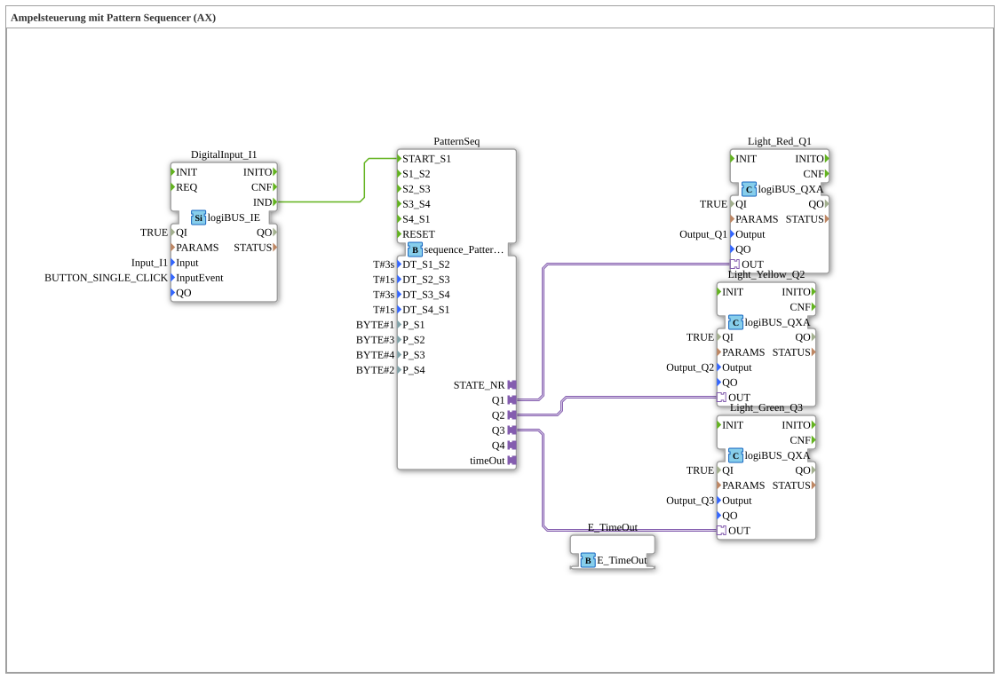

Here is the documentation for exercise `Uebung_035a1_AX` based on the provided data.
# Exercise_035a1_AX: Traffic Light Control with Pattern Sequencer (AX)

* * * * * * * * * *
## Introduction
This exercise implements **traffic light control** using a **pattern sequencer**. The goal is to control a classic traffic light sequence (red -> red/yellow -> green -> yellow -> red) using defined time intervals and bit patterns. The exercise utilizes adapter technology (AX) for connecting the outputs and timing.

## Function Blocks Used

In this exercise, various function blocks are interconnected within `SubAppNetwork`. The most important components are described in detail below.

### Sub-modules: PatternSeq

This module is the core of the control system and regulates the timing and output patterns of the traffic light phases.

`` - **Type**: `logiBUS::utils::sequence::pattern::sequence_Pattern_04_04_loop_AX`
- **Internal Parameters Used**:
- **DT_S1_S2** = `T#3s` (Phase 1 Duration: Red)
- **DT_S2_S3** = `T#1s` (Phase 2 Duration: Red-Yellow)
- **DT_S3_S4** = `T#3s` (Phase 3 Duration: Green)
- **DT_S4_S1** = `T#1s` (Phase 4 Duration: Yellow)
- **P_S1** = `1` (Phase 1 Pattern: 001 -> Q1 active)
- **P_S2** = `3` (Pattern Phase 2: 011 -> Q1 & Q2 active)
- **P_S3** = `4` (Pattern Phase 3: 100 -> Q3 active)
- **P_S4** = `2` (Pattern Phase 4: 010 -> Q2 active)
- **Event/Adapter Connections**:
- **START_S1**: Starts the sequence at step 1.
- **Q1, Q2, Q3**: Adapter outputs for controlling the lamps.
- **timeOut**: Adapter for connecting to the timer service.
- **Functionality**: The function block cycles through 4 steps. For each step, a bit pattern (`P_SX`) is applied to the outputs and held for the defined time (`DT_SX_SY`).

### Sub-Blocks: DigitalInput_I1

This block processes the input signal to start the traffic light sequence.

- **Type**: `logiBUS::io::DI::logiBUS_IE`
- **Configuration**:
- **Parameters**: `Input` = `Input_I1`
- **Parameters**: `InputEvent` = `BUTTON_SINGLE_CLICK`
- **Functionality**: Detects a single click on input I1 and triggers an event (`IND`).

### Sub-Blocks: Outputs (Light_Red, Light_Yellow, Light_Green)

These blocks represent the physical outputs of the traffic light.

- **Type**: `logiBUS::io::DQ::logiBUS_QXA`
- **Instances**:
- **Light_Red_Q1**: Connected to `Output_Q1` (Red)
- **Light_Yellow_Q2**: Connected to `Output_Q2` (Yellow)
- **Light_Green_Q3**: Connected to `Output_Q3` (Green)
- **Functionality**: They receive signals via adapter connections and switch the corresponding hardware outputs.

### Sub-Blocks: E_TimeOut
Provides the timer functionality for the sequencer.

- **Type**: `iec61499::events::E_TimeOut`
- **Functionality**: Serves as a service interface to implement the time delays of the sequence steps.

## Program Flow and Connections

The traffic light control process is as follows:

1. **Start Condition**: The program waits for a signal from the block `DigitalInput_I1`. When the button on `Input_I1` is simply clicked (`BUTTON_SINGLE_CLICK`), the output `IND` sends an event to the input `START_S1` of the block `PatternSeq`.

2. **Pattern Sequence**:

The `PatternSeq` block controls the traffic light phases based on the configured parameters. The outputs are controlled using binary code (Q3, Q2, Q1):

* **Phase 1 (Red)**: Duration 3s (`DT_S1_S2`). Parameter `P_S1 = 1` (Binary `001`) activates adapter output `Q1` -> **Red Light**.
* **Phase 2 (Red-Yellow)**: Duration 1s (`DT_S2_S3`). Parameter `P_S2 = 3` (binary `011`) activates `Q1` and `Q2` -> **Red and Yellow Lights**.
* **Phase 3 (Green)**: Duration 3s (`DT_S3_S4`). Parameter `P_S3 = 4` (binary `100`) activates `Q3` -> **Green Light**.
* **Phase 4 (Yellow)**: Duration 1s (`DT_S4_S1`). Parameter `P_S4 = 2` (binary `010`) activates `Q2` -> **Yellow Light**.

3. **Connections**:

* The logic uses **adapter connections** (recognizable by the `logiBUS_QXA` type and the nested connections), which makes the wiring in the diagram clearer, as data and events are transmitted in bundles.
* The `E_TimeOut` block is connected to the sequencer via the `timeOut` adapter to process the timer events (`T#3s`, `T#1s`, etc.) internally.
*
## Summary
The exercise `Uebung_035a1_AX` efficiently demonstrates how complex state machines, such as a traffic light controller, can be simplified using a **pattern sequencer**. Instead of programming each state transition individually, phase times and output patterns are parameterized. The use of `logiBUS` adapters (AX/QXA) also showcases a modern method of block communication in 4diac.

---

### 🌐 Related topic subpages on ms-muc-docs.de
* [🌐 Eclipse 4diac IDE & color reference on ms-muc-docs.de ](https://www.ms-muc-docs.de/iec-61499/eclipse-4diac/)
