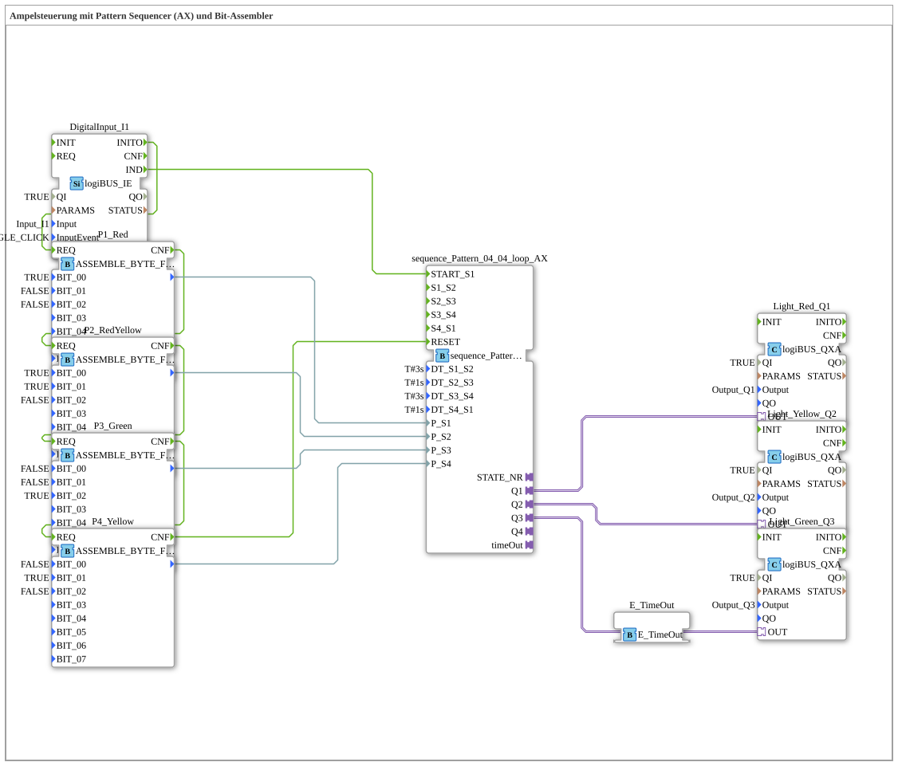

Here is the documentation for the exercise based on the provided XML data.
# Exercise_035a1b_AX: Traffic Light Control with Pattern Sequencer (AX) and Bit Assembler

* * * * * * * * * *
## Introduction

Exercise **Exercise_035a1b_AX** implements a classic traffic light control system. It uses a **Pattern Sequencer** in loop mode. The unique aspect of this exercise lies in the definition of the traffic light phases: Instead of hard-coding the outputs directly in the sequencer, the bit patterns for the individual phases (red, red-yellow, green, yellow) are dynamically generated using **bit assemblers** (`ASSEMBLE_BYTE_FROM_BOOLS`) and passed to the sequencer as parameters.

## Function Blocks (FBs) Used

In this subapplication, various function blocks are interconnected to implement the control logic.

### Main Control Block: `sequence_Pattern_04_04_loop_AX`

This block is the core of the control system. It executes four steps in an endless loop.

- **Type**: `logiBUS::utils::sequence::pattern::sequence_Pattern_04_04_loop_AX`
- **Function**: It switches the outputs based on byte patterns (`P_S1` to `P_S4`) and holds each step for a defined duration.
- **Configuration**:
- `DT_S1_S2` = `T#3s` (Red Phase Duration)
- `DT_S2_S3` = `T#1s` (Red-Yellow Phase Duration)
- `DT_S3_S4` = `T#3s` (Green Phase Duration)
- `DT_S4_S1` = `T#1s` (Yellow Phase Duration)

### Pattern Generation: `ASSEMBLE_BYTE_FROM_BOOLS`

Four instances of this block are used to define the light patterns for the four traffic light phases. Each block converts individual Boolean signals into a byte, which is interpreted by the sequencer.

1. **Instance `P1_Red`**:
- **Purpose**: Defines the red phase.
- **Parameters**: `BIT_00` = `TRUE` (Red active).
2. **Instance `P2_RedYellow`**:
- **Purpose**: Defines the red-yellow phase.
- **Parameters**: `BIT_00` = `TRUE` (Red), `BIT_01` = `TRUE` (Yellow).
3. **Instance `P3_Green`**:
- **Purpose**: Defines the green phase.
- **Parameter**: `BIT_02` = `TRUE` (Green).
4. **Instance `P4_Yellow`**:
- **Purpose**: Defines the yellow phase.
- **Parameter**: `BIT_01` = `TRUE` (Yellow).

### Input/Output Blocks

- **`DigitalInput_I1`** (`logiBUS::io::DI::logiBUS_IE`):
- Represents the button to start the sequence.
- Responds to the event `BUTTON_SINGLE_CLICK`.
- **`Light_Red_Q1`**, **`Light_Yellow_Q2`**, **`Light_Green_Q3`** (`logiBUS::io::DQ::logiBUS_QXA`):
- Represent the physical traffic light lights.
- Are controlled by the sequencer via adapter connections (`OUT`).

## Program Flow and Connections

The control process is divided into the initialization of the patterns and the actual traffic light cycle.

### 1. Initialization

In order for the sequencer to know which lights should illuminate in which step, the bit patterns (`P1` to `P4`) must first be calculated and transmitted.

- The initialization signal (`INITO`) from input block `DigitalInput_I1` starts a chain.
- It triggers the `REQ` inputs of the assembler blocks sequentially: `P1_Red` -> `P2_RedYellow` -> `P3_Green` -> `P4_Yellow`.
- At the end of this chain, the `RESET` input of the sequencer (`sequence_Pattern_04_04_loop_AX`) is triggered. This transfers the generated byte patterns to the sequencer inputs `P_S1` to `P_S4`.

### 2. Start and Cycle

- A simple click (`BUTTON_SINGLE_CLICK`) on input `DigitalInput_I1` sends an event to `START_S1` of the sequencer.
- The sequencer now begins its sequence:
1. **Step 1**: Pattern from `P1_Red` is output (red light on). Wait 3 seconds.
2. **Step 2**: Pattern from `P2_RedYellow` is output (red and yellow lights on). Wait 1 second.
3. **Step 3**: Pattern from `P3_Green` is output (green light on). Wait 3 seconds.
4. **Step 4**: Pattern from `P4_Yellow` is output (yellow light on). Waiting time: 1 second.
- Since this is a loop block, the cycle automatically restarts at step 1 after step 4.

### 3. Outputs

The sequencer outputs (`Q1`, `Q2`, `Q3`) are implemented as adapters and directly connected to the output blocks for the lamps. The byte pattern is mapped internally in the sequencer to these adapters (bit 0 -> Q1, bit 1 -> Q2, bit 2 -> Q3).

## Summary

This exercise demonstrates an advanced method of sequence control. By separating **time flow** (sequencer) and **state definition** (bit assembly), the code becomes more modular. Changes to the traffic light phases (e.g., which lights are illuminated) can be easily made in the `ASSEMBLE_BYTE_FROM_BOOLS` blocks without having to modify the sequencer's logic itself. The control system replicates the typical German traffic light cycle.
