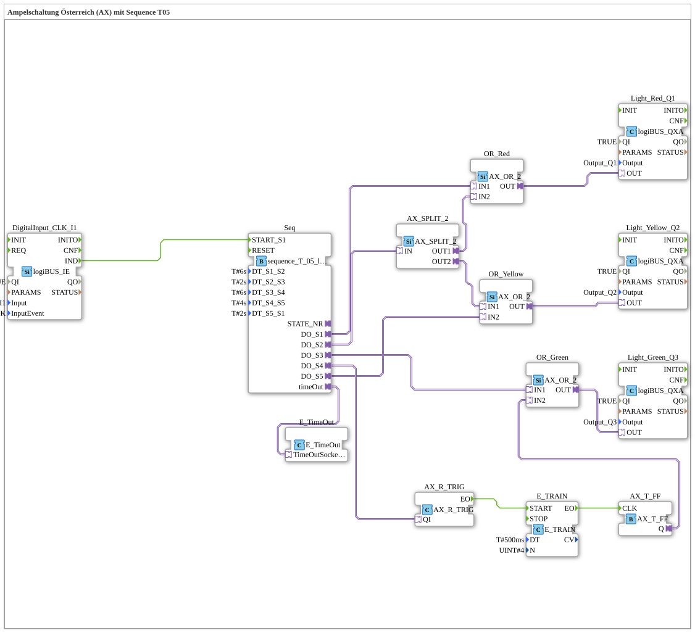

Here is the documentation for exercise `Uebung_035a2_AX` based on the provided data.
# Exercise_035a2_AX: Traffic Light System Austria (AX) with Sequence T05

* * * * * * * * * *
This exercise implements a **traffic light system based on the Austrian model (AX)** using the IEC 61499 standard. Unlike the German traffic light system (red -> red/yellow -> green -> yellow -> red), the Austrian sequence includes a **flashing green phase** before switching to yellow.

Control is achieved via a timed sequence with 5 steps (`sequence_T_05_loop_AX`), where the different phases are logically linked to the outputs for red, yellow, and green.

This block controls the timing of the traffic light phases.

- **Type**: `logiBUS::utils::sequence::timed::sequence_T_05_loop_AX`
- **Functionality**: It cycles through 5 states (S1 to S5). The duration of each state is defined via parameters.

- `DT_S1_S2` = `T#6s` (Phase 1: Red)
- `DT_S2_S3` = `T#2s` (Phase 2: Red + Yellow)
- `DT_S3_S4` = `T#6s` (Phase 3: Green)
- `DT_S4_S5` = `T#4s` (Phase 4: Flashing Green)
- `DT_S5_S1` = `T#2s` (Phase 5: Yellow)

- **`DigitalInput_CLK_I1`** (`logiBUS::io::DI::logiBUS_IE`):
- Serves as the start signal for the sequence.
- Parameter: Responds to `BUTTON_SINGLE_CLICK` at input `Input_I1`.
- **`Light_Red_Q1`, `Light_Yellow_Q2`, `Light_Green_Q3`** (`logiBUS::io::DQ::logiBUS_QXA`):
- Represent the physical traffic light signals (red, yellow, green).
- Linked to `Output_Q1`, `Output_Q2`, `Output_Q3`.

- **`OR_Red`, `OR_Yellow`, `OR_Green`** (`adapter::booleanOperators::AX_OR_2`):
- OR gates that combine signals from different sequence steps (e.g., yellow lights up alone in phase 5, but also together with red in phase 2).
- **`AX_SPLIT_2`** (`adapter::events::unidirectional::AX_SPLIT_2`):
- Splits a signal into two paths. Used to control red and yellow simultaneously in phase 2.
- **`E_TimeOut`** (`iec61499::events::E_TimeOut`):
- Handles the timing for the sequence.
- **Blink Logic for Green**:
- **`AX_R_TRIG`** (`adapter::events::unidirectional::AX_R_TRIG`): Detects the rising edge (start of the blink phase).
- **`E_TRAIN`** (`iec61499::events::E_TRAIN`): Generates a series of events (pulses).
- Parameter `DT` = `T#500ms` (interval).
- Parameter `N` = `4` (number of pulses).
- **`AX_T_FF`** (`adapter::events::unidirectional::AX_T_FF`): Toggle flip-flop that switches the output (blinking) based on pulses from `E_TRAIN`.

The program is started by clicking the button (`Input_I1`), which triggers the event `START_S1` in the sequence function block `Seq`. The sequence is as follows:

1. **Phase 1 (Red - 6s):**

- `Seq` activates output `DO_S1`.
- Signal goes to `OR_Red` -> `Light_Red_Q1` lights up.

2. **Phase 2 (Red & Yellow - 2s):**

- `Seq` activates output `DO_S2`.
- Signal goes to `AX_SPLIT_2`.
- `AX_SPLIT_2` sends a signal to `OR_Red` (red remains on) and `OR_Yellow` (yellow lights up).

3. **Phase 3 (Green - 6s):**

- `Seq` activates output `DO_S3`.
- Signal goes to `OR_Green` -> `Light_Green_Q3` is constantly lit.

4. **Phase 4 (Green Flashing - 4s):**

- `Seq` activates output `DO_S4`.
- The signal triggers `AX_R_TRIG`, which starts the `E_TRAIN` module.
- `E_TRAIN` sends pulses to the toggle flip-flop `AX_T_FF`.
- The flip-flop's output `Q` changes its state every 500ms and is connected to `OR_Green`.
- Result: The green light flashes 4 times (controlled by parameter N=4).

5. **Phase 5 (Yellow - 2s):**

- `Seq` activates output `DO_S5`.
- Signal goes to `OR_Yellow` -> `Light_Yellow_Q2` lights up.

After Phase 5, a cycle is complete. Depending on the internal implementation of the `sequence_T_05_loop_AX` block, the sequence restarts or waits for a new input signal.

The exercise `Uebung_035a2_AX` demonstrates a complex traffic light control system with a specific country variant (Austria). Particular attention is paid to the use of adapter modules (`AX_SPLIT`, `AX_OR`) for signal distribution and the construction of a flasher unit using `E_TRAIN` and `AX_T_FF` to implement the "green flashing" before the yellow phase.

## Introduction
## Function Blocks Used (FBs)
### Haupt-Steuerungsbaustein: `Seq`
### Ein- und Ausgabebausteine
### Logik- und Hilfsbausteine
## Program Flow and Connections
## Summary