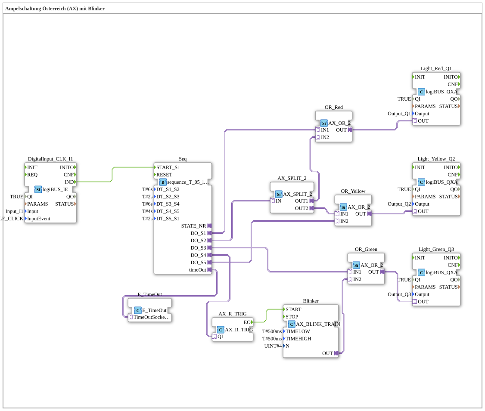

Here is the documentation for exercise `Uebung_035a3_AX` based on the provided data.

# Exercise_035a3_AX: Traffic Light System Austria (AX) with Flashing Indicators

* * * * * * * * * *

## Introduction

This exercise implements a traffic light system based on the Austrian model ("Traffic Light System Austria (AX) with Flashing Indicators"). Unlike standard traffic light systems, this sequence includes the "green-flashing" phase before changing to yellow, as well as the "red-yellow" phase before changing to green. Control is achieved via a sequential function block, which is triggered by a push button.

## Function Blocks Used

This sub-application uses various logic blocks, timers, and I/O drivers to control the traffic light phases.

### Main Control Blocks

#### **Seq** (`logiBUS::utils::sequence::timed::sequence_T_05_loop_AX`)

This block is the core of the sequence control. It defines 5 time-controlled states (S1 to S5) that are traversed in a loop.

- **Type**: Sequence Controller (Timed Loop)
- **Parameters**:

- `DT_S1_S2` = `T#6s` (Duration Phase 1: Red)

- `DT_S2_S3` = `T#2s` (Duration Phase 2: Red-Yellow)

- `DT_S3_S4` = `T#6s` (Duration Phase 3: Green)

- `DT_S4_S5` = `T#4s` (Duration Phase 4: Flashing Green)

- `DT_S5_S1` = `T#2s` (Duration Phase 5: Yellow)

- **Functionality**: After activation The outputs `START_S1` are sequentially activated for the defined duration by `DO_S1` through `DO_S5`.

#### **Blinker** (`adapter::events::unidirectional::signals::AX_BLINK_TRAIN`)

This function block generates the blink signal for the green phase.

- **Type**: Signal Generator / Flasher
- **Parameters**:

- `TIMELOW` = `T#500ms` (Off Time)

- `TIMEHIGH` = `T#500ms` (On Time)

- `N` = `4` (Number of Flashes)

- **Functionality**: As soon as the module is triggered, it sends 4 flashes (500ms on/off each) to the output. This creates the 4-flash pattern typical for Austria at the end of the green light phase.

### Logic and Auxiliary Blocks

* **OR_Red, OR_Yellow, OR_Green** (`adapter::booleanOperators::AX_OR_2`): OR gates to route different sequence steps to the same lamp (e.g., red lights up alone in S1, but also together with yellow in S2).

* **AX_SPLIT_2** (`adapter::events::unidirectional::AX_SPLIT_2`): A signal splitter that divides an input signal into two paths.

* **AX_R_TRIG** (`adapter::events::unidirectional::AX_R_TRIG`): Rising trigger for precise start of the blinker.

* **E_TimeOut** (`iec61499::events::E_TimeOut`): Handles sequence timeouts.

### Input/Output Blocks

* **DigitalInput_CLK_I1** (`logiBUS::io::DI::logiBUS_IE`): Reads the button `Input_I1` (Event: `BUTTON_SINGLE_CLICK`).

* **Light_Red_Q1** (`logiBUS::io::DQ::logiBUS_QXA`): Controls the red lamp (`Output_Q1`).

* **Light_Yellow_Q2** (`logiBUS::io::DQ::logiBUS_QXA`): Controls the yellow lamp (`Output_Q2`).

* **Light_Green_Q3** (`logiBUS::io::DQ::logiBUS_QXA`): Controls the green lamp (`Output_Q3`).

## Program Flow and Connections

The process is started by a single click on the button (`Input_I1`), which triggers the event `START_S1` at the sequence block **Seq**. The following loop then runs:

1. **Red Phase (S1 - 6s)**:

- Output `DO_S1` is active.

- Signal goes to `OR_Red` -> `Light_Red_Q1` (Red on).

2. **Red-Yellow Phase (S2 - 2s)**:

- Output `DO_S2` is active.

- Signal goes to `AX_SPLIT_2`.

- From there, it is split as follows:

- `OR_Red` -> `Light_Red_Q1` (Red remains on).

- `OR_Yellow` -> `Light_Yellow_Q2` (Yellow turns on).

3. **Green Phase (S3 - 6s)**:

- Output `DO_S3` is active.

- Signal goes to `OR_Green` -> `Light_Green_Q3` (Green on).

4. **Green Flashing Phase (S4 - 4s)**:

- Output `DO_S4` is active.

- Signal triggers the **Flasher** block via `AX_R_TRIG`.

- The flasher sends a pulse sequence to `OR_Green`.

- Result: The green light (`Light_Green_Q3`) flashes 4 times (for a total of 4 seconds).

5. **Yellow Phase (S5 - 2s)**:

- Output `DO_S5` is active.

- Signal goes to `OR_Yellow` -> `Light_Yellow_Q2` (yellow light on).

After phase 5, the cycle starts again at phase 1 (red).

## Summary

This exercise demonstrates the creation of a more complex traffic light control system using logiBUS adapters. Particular attention is paid to the correct implementation of the Austrian signal sequence (including green flashing and red-yellow phases). Learning objectives include handling time-controlled sequence blocks (`sequence_T_05_loop_AX`), using signal splitters and logical OR operations to control outputs from multiple states, and integrating a blink generator.