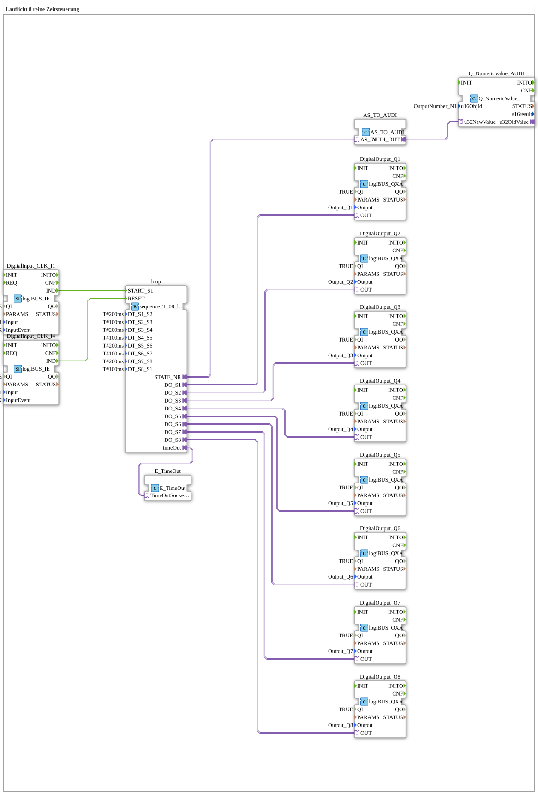

# Exercise_038_AX: Running Light 8 Pure Time Control

[(https://notebooklm.google.com/notebook/041f4df4-b729-484d-b786-b6dcdf151961)
This article describes the logiBUS® exercise `Uebung_038_AX`. We will build a classic sequencer.
----
## Objective of the Exercise

Implementation of an automatic sequence of 8 steps.

-----

## Description and Components

[cite_start]The sub-application `Uebung_038_AX.SUB` uses a sequencer module to switch 8 outputs sequentially.[cite: 1]

### Function Blocks (FBs)

- **`sequence_T_08_loop_AX`**: A complex function block that manages 8 states (`S1` to `S8`). The transition between states is time-controlled.
- **Parameters `DT_S1_S2` etc.**: Define the dwell time in each step (e.g., 200 ms or 100 ms).
- **`Q_NumericValue`**: Displays the current step number on the ISOBUS terminal.
- **`E_TimeOut`**: Monitors the sequence (watchdog).

-----

## Functionality

1. Start via button `I1` -> sequence jumps to `S1`.
2. Output `DO_S1` becomes active -> `Q1` lights up.
3. After `T#200ms`, the sequence automatically switches to `S2`.
4. `DO_S1` goes out, `DO_S2` turns on -> `Q2` lights up.
5. ... this continues until `S8`.
6. After `S8`, it jumps back to `S1` (loop).
7. Reset via button `I4` -> Everything off.

-----

## Application Example

**Advertising Lighting** or **Process Control**: First fill with water, then heat, then wash, then pump out.
