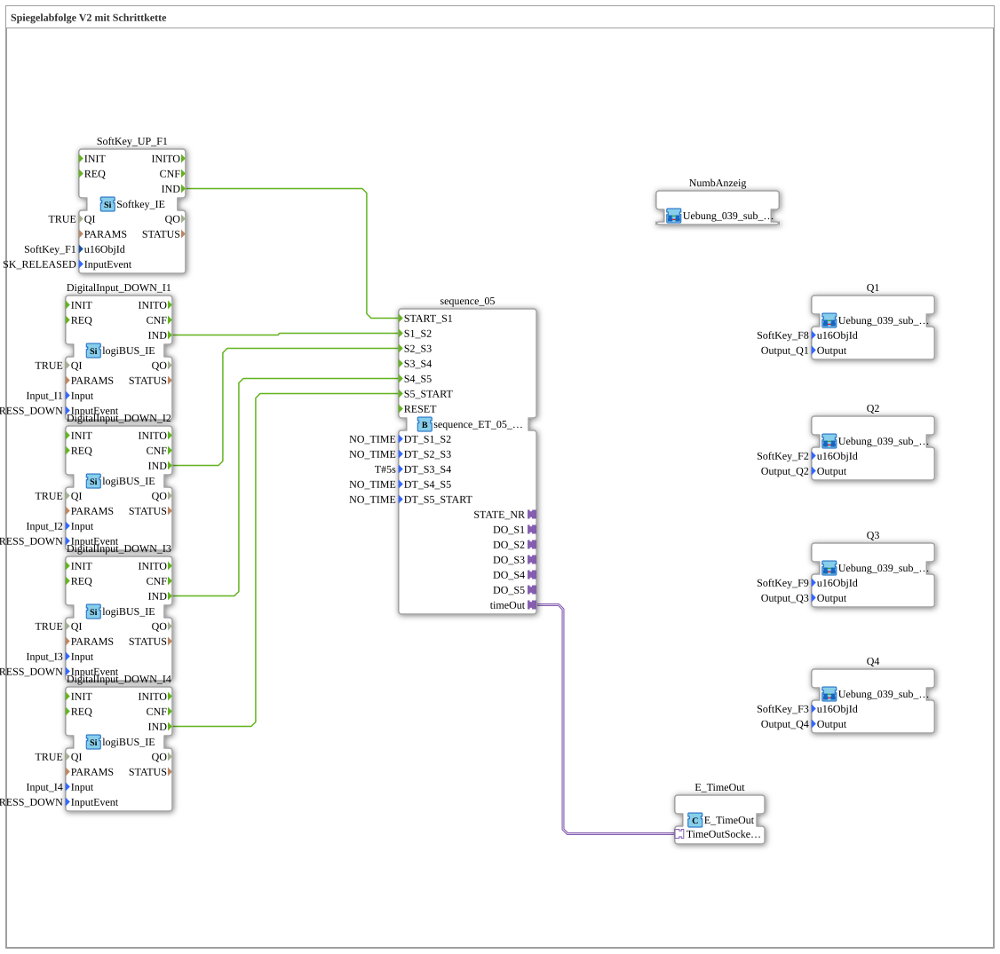

# Exercise_039_AX: Mirror Sequence V2 with Step Chain

This article describes the logiBUS® exercise `Uebung_039_AX`. This exercise is specifically designed for controlling hydraulic or pneumatic directional control valves and utilizes AX adapter technology throughout
----

## Objective of the Exercise

Implementation of a complex mirror sequence. Unlike simple cylinders, directional control valves often require states to be maintained (center position locked), which necessitates precise timing and event-based control of the coils
-----

## Description and Components

The sub-application `Uebung_039_AX.SUB` uses an AX-optimized 5-step sequencer (`sequence_ET_05_AX`).

The hardware is controlled via standardized AX sub-applications (`Uebung_039_sub_Outputs_AX`), which also provide visual feedback on the ISOBUS terminal regarding the respective valve status by changing the color of the corresponding softkeys.

-----

## Functionality

The chain is manually controlled by physical pushbuttons (`I1` to `I4`), with a central time step (5 seconds for `DT_S3_S4`) inserting an automatic safety or waiting phase. This demonstrates the combination of free operation and enforced process times.

The use of **AX adapters** between the sequencer and the output sub-applications significantly simplifies the wiring, as status events and switching states are transmitted via a single connection.

## 🛠️ Related exercises

- [Uebung_039_sub_Outputs_AX](Uebung_039_sub_Outputs_AX.md)
- [Uebung_039_sub_NumbAnAnzeige_AX](Uebung_039_sub_NumbAnzeig_AX.md)
