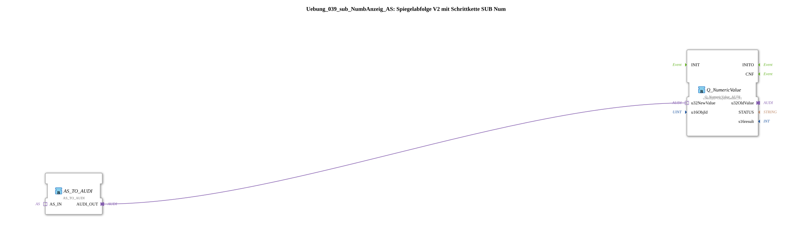

# Exercise_039_sub_NumbDisplay_AS: Mirror Sequence V2 with Step Chain SUB Num

* * * * * * * * * *
## Introduction

This exercise presents a subapplication (subapp) for the 4diac IDE that displays a data value received via an adapter (AS interface) as a numeric value on an ISOBUS-compatible terminal. The subapp is called "Mirror Sequence V2 with Step Chain SUB Num" and serves to easily display a numeric value in an agricultural control system.
The subapp receives an adapter connection of type `STATE_NR` (unidirectional) and converts it into an ISOBUS message suitable for display. The value to be displayed is referenced via a standard object identifier (`OutputNumber_N1`).

## Function Blocks Used (FBs)

The sub-app contains two function blocks that handle signal processing and terminal communication.

### FB: `Q_NumericValue`

- **Type**: `isobus::UT::Q::Q_NumericValue_AUDI`
- **Parameters**:
- `u16ObjId` = `OutputNumber_N1` (predefined object identifier from `UT::DefaultPool`)
- **Function**: Displays a numeric value on an ISOBUS terminal. The input `u32NewValue` expects the current numeric value as a 32-bit unsigned integer. The display is shown using the object ID specified by `u16ObjId`.

### FB: `AS_TO_AUDI`

- **Type**: `adapter::conversion::unidirectional::AS_TO_AUDI`
- **Parameters**: None
- **Function**: Converts the data and event of a unidirectional AS adapter into a format usable by AUDI-compatible FBs (such as `Q_NumericValue_AUDI`). The output `AUDI_OUT` provides the converted signal for further processing.

## Program Flow and Connections

The sub-app has an adapter socket `STATE_NR` of type `unidirectional::AS`. This socket is connected to a higher-level control network that provides the current status information (e.g., a numerical value from a step sequence).

1. The AS adapter signal received via `STATE_NR` is forwarded to function block `AS_TO_AUDI`.
2. `AS_TO_AUDI` converts the data (e.g., a numerical value) into an AUDI-compliant representation and outputs it via output `AUDI_OUT`.
3. Output `AUDI_OUT` is connected to input `u32NewValue` of function block `Q_NumericValue`.
4. `Q_NumericValue` then updates the display on the ISOBUS terminal under the predefined object ID `OutputNumber_N1`.

... The entire processing is event-driven: As soon as the AS adapter input changes, the value is converted and the terminal display is updated.

## Summary

The sub-application `Uebung_039_sub_NumbAnzeig_AS` implements a standardized interface for displaying a numeric value on an ISOBUS terminal. By using the adapter conversion `AS_TO_AUDI` and the display block `Q_NumericValue_AUDI`, it can be integrated into higher-level controllers that use an AS interface standard.

**Learning objectives of this exercise:**

- Understanding the adapter conversion between AS and AUDI.
- Integrating predefined ISOBUS objects (`OutputNumber_N1`) into custom sub-applications.
- Building a simple signal processing chain for terminal display.

**Required prior knowledge:**

- Basic knowledge of the 4diac IDE and IEC 61499 modeling.
- Basic knowledge of ISOBUS and its object pool concept.

The exercise can be loaded directly into the 4diac IDE and tested with a suitable higher-level network (e.g., a step sequence).

--

### 🌐 Related topic subpages on ms-muc-docs.de

- [🌐 Eclipse 4diac IDE & color reference on ms-muc-docs.de](https://www.ms-muc-docs.de/iec-61499/eclipse-4diac/)
