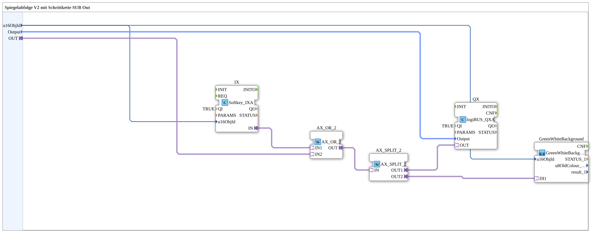

# Exercise_039_sub_Outputs_AX: Mirror Sequence V2 with Step Chain SUB Out

* * * * * * * * * *
## Introduction
This documentation describes the sub-application `Uebung_039_sub_Outputs_AX`. This module is part of a more complex control system (presumably "Mirror Sequence V2 with Step Chain") and serves as an interface between the control logic, the hardware, and the user interface (ISOBUS VT).
The main purpose of this module is to control a digital output, where two sources can activate the signal: an automatic signal from the program (via an AX adapter) or manual activation via a softkey on the terminal. The status is also visually reported.

## Function Blocks Used (FBs)

In this sub-application, various function blocks are interconnected to implement the input, logic, and output functions.

### Sub-Blocks: Exercise_039_sub_Outputs_AX

This block encapsulates the logic for a single actuator/output using AX adapter technology.

- **Type**: SubAppType
- **Internal Function Blocks Used**:
- **QX**: `logiBUS::io::DQ::logiBUS_QXA`
- **Description**: Driver block for a physical digital output on the logiBUS.
- **Parameters**: `QI` = `TRUE` (block is enabled).
- **Data Input**:
- `Output`: Connected to the external input `Output` (defines the hardware address).
- **Adapter Connection**:
- `OUT`: Receives the switching signal (event + data) from the `AX_OR` block.
- **IX**: `isobus::UT::io::Softkey::Softkey_IX`
- **Description**: Input block for reading a softkey (button) on an ISOBUS terminal.
- **Parameters**: `QI` = `TRUE`.
- **Data Input**: `u16ObjId` (object ID of the softkey).
- **Adapter Connection**:
- `IN`: Current status of the button as an AX adapter.
- **AX_OR**: `adapter::logic::unidirectional::AX_OR_2`
- **Description**: Logical OR gate for AX adapters.
- **Adapter Connections**:
- `IN1`: Connected to `IX.IN` (softkey status).
- `IN2`: Connected to the external adapter input `OUT` (control signal).
- **Functionality**: The output is activated when either the softkey is pressed OR the external control signal is present.
- **GreenWhiteBackground**: `MyLib::sys::GreenWhiteBackground_AX`
- **Description**: Another sub-application for visualization that controls the background of the softkey.
- **Parameters**:
- `u16ObjId`: The ID of the object to be colored.
- **Adapter Connection**:
- `DI1`: Connected to the result of the OR logic (`AX_OR.OUT`).
- **Functionality**:

This function block consistently uses **AX adapters** to bundle event and data flows. It checks whether there is a request to set the output (manually via softkey `IX` or automatically via adapter `OUT`). The result of the OR operation controls the hardware output `QXA` and simultaneously updates the visualization `GreenWhiteBackground_AX`.

## Program Flow and Connections

The flow within the sub-application is greatly simplified by the AX adapter connections:

1. **Initialization**:

* The object ID for the softkey (`u16ObjId`) and the hardware address (`Output`) are passed to the corresponding function blocks.

2. **Logical Link (AX_OR)**:

* The function block `AX_OR` bundles the logic:
* `IN1`: Softkey status.
* `IN2`: External adapter input `OUT` (e.g., from a step sequence).
* An external event `REQ` can additionally trigger the logic.

3. **Output and Feedback**:

* The output of `AX_OR` is directly connected to the hardware output `QX`.
* In parallel, it controls the background of the softkey via `GreenWhiteBackground`.

## Summary

Uebung_039_sub_Outputs_AX` is the AX-optimized version of the output control. The use of adapters reduces internal complexity and increases reusability in systems that rely entirely on AX adapters.

## 🛠️ Related Exercises
* [Exercise_039_AX](Uebung_039_AX.md)]
