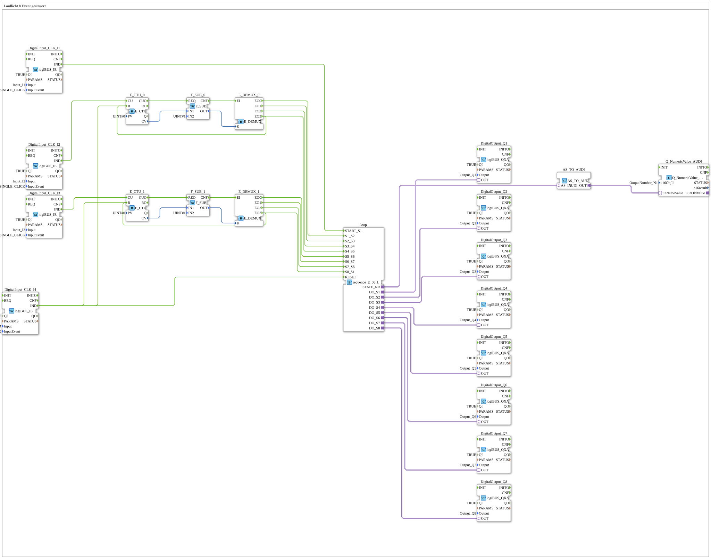

# Exercise_040_AX: 8-Event Controlled Running Light

This article describes the logiBUS® exercise `Uebung_040_AX`. Unlike exercise 038, this sequence of steps does not advance automatically but waits for events.
----
## Objective of the Exercise

Manual advancement of a sequence of steps.

-----

## Description and Components

[cite_start]The subapplication `Uebung_040_AX.SUB` uses `sequence_E_08_loop_AX`. Here, the inputs for the transitions (`S1_S2`, `S2_S3`, ...) are brought out as event inputs[cite: 1].

### Logic for Step Advancement

To avoid needing 8 buttons, a logic circuit was built using counters (`E_CTU`) and demultiplexers (`E_DEMUX`):

* **Button `I2`**: Controls steps 1-4. Each click increments the counter `E_CTU_0`. The demultiplexer then routes the event to the correct transition input (`S1_S2`, `S2_S3`, etc.).
* **Button `I3`**: Controls steps 5-8 analogously.

-----

## Functionality

1. Start with `I1` -> Step 1 is active.
2. Press `I2` -> Counter reading 1 -> Demux output 0 -> Event on `S1_S2` -> Switch to Step 2.
3. Press `I2` -> Counter reading 2 -> Demux output 1 -> Event on `S2_S3` -> Switch to Step 3.
4. ...

This simulates a machine where the operator must manually enable each step ("step operation").

-----

## Application Example

**Commissioning or Maintenance**: The technician advances the machine step by step to check that each subprocess functions correctly before switching to automatic operation.

---

### 🌐 Related topic subpages on ms-muc-docs.de

* [🌐 E_CTU Event Counter module on ms-muc-docs.de](https://www.ms-muc-docs.de/iec-61499/event-function-blocks/e_ctu/)
