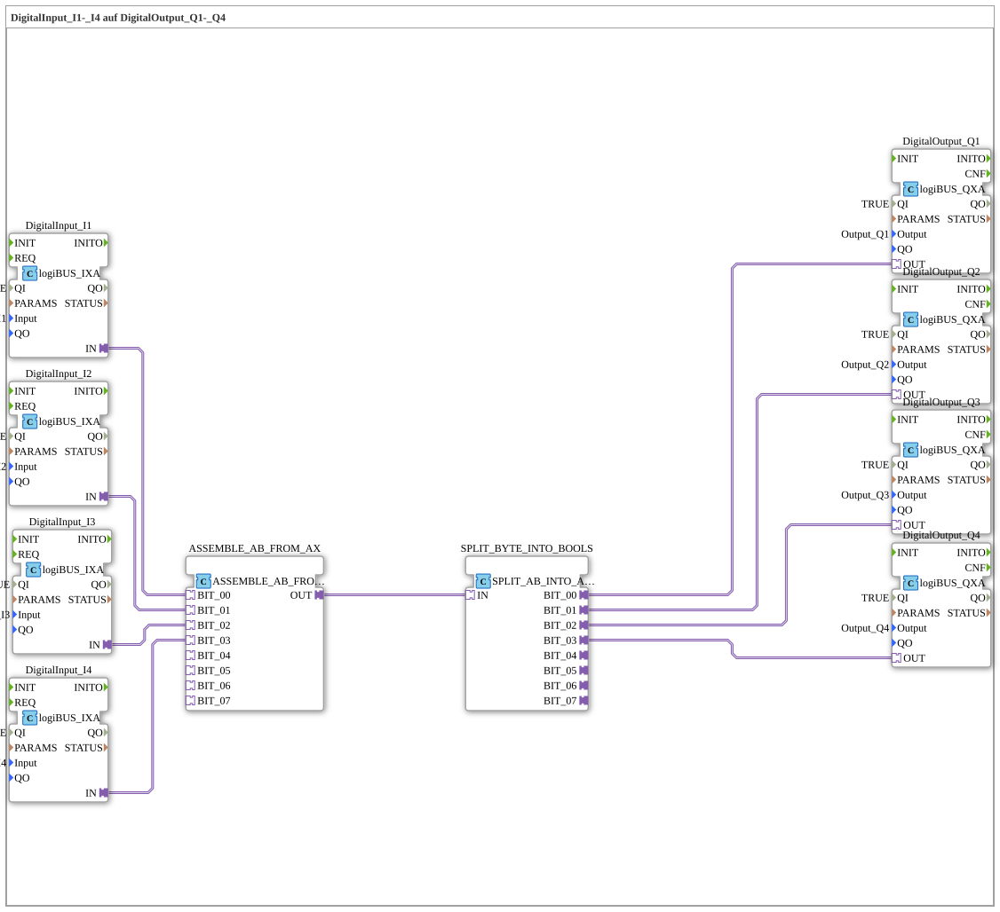

# Exercise_053_AB: DigitalInput_I1-_I4 to DigitalOutput_Q1-_Q4

* * * * * * * * * *
## Introduction

This exercise demonstrates how four digital inputs (I1 to I4) are combined into a single byte using an adapter and then split back into four digital outputs (Q1 to Q4). It demonstrates how parallel binary signals can be converted into a data bus and recovered using the function blocks `ASSEMBLE_AB_FROM_AX` and `SPLIT_AB_INTO_AX`.
## Function Blocks (FBs) Used

- **DigitalInput_I1 .. DigitalInput_I4** (Type `logiBUS::io::DI::logiBUS_IXA`)

Reading the physical inputs **Input_I1** to **Input_I4**. Each of these function blocks is enabled with `QI=TRUE`.

- **DigitalOutput_Q1 .. DigitalOutput_Q4** (Type `logiBUS::io::DQ::logiBUS_QXA`)

Writes to the physical outputs **Output_Q1** through **Output_Q4**. Here too, `QI=TRUE` is set.

- **ASSEMBLE_BYTE_FROM_BOOLS** (Type `adapter::assembling::ASSEMBLE_AB_FROM_AX`)

Assembles a byte from the four Boolean values at the adapter sockets `BIT_00` through `BIT_03` and outputs it to socket `OUT`.

- **Parameters**: None
- **Inputs (Adapter)**: `BIT_00`, `BIT_01`, `BIT_02`, `BIT_03` (one Boolean each)
- **Output (Adapter)**: `OUT` (Byte)
- **SPLIT_BYTE_INTO_BOOLS** (Type `adapter::splitting::SPLIT_AB_INTO_AX`)

Accepts one byte at adapter socket `IN` and splits the bits individually at sockets `BIT_00` to `BIT_03`.

- **Parameters**: None
- **Input (Adapter)**: `IN` (Byte)
- **Outputs (Adapter)**: `BIT_00`, `BIT_01`, `BIT_02`, `BIT_03` (one Boolean each)

### Sub-Blocks: (none)

This exercise uses only the standard function blocks listed above. No other sub-applications are embedded.

## Program Flow and Connections

1. The **digital inputs** I1 to I4 are read via function blocks `DigitalInput_I1` to `DigitalInput_I4`. Its outputs (`IN`) provide the Boolean states of the connected sensors.
2. These four Boolean values are routed via adapter connections to sockets `BIT_00` to `BIT_03` of the function block **`ASSEMBLE_BYTE_FROM_BOOLS`**.
- `DigitalInput_I1.IN` → `ASSEMBLE_BYTE_FROM_BOOLS.BIT_00`
- `DigitalInput_I2.IN` → `ASSEMBLE_BYTE_FROM_BOOLS.BIT_01`
- `DigitalInput_I3.IN` → `ASSEMBLE_BYTE_FROM_BOOLS.BIT_02`
- `DigitalInput_I4.IN` → `ASSEMBLE_BYTE_FROM_BOOLS.BIT_03`
3. The **assemble module** packs the four bits into a byte (least significant bit = BIT_00) and outputs this byte at its output `OUT`.
4. This output is directly connected to the input `IN` of the module **`SPLIT_BYTE_INTO_BOOLS`**.
- `ASSEMBLE_BYTE_FROM_BOOLS.OUT` → `SPLIT_BYTE_INTO_BOOLS.IN`
5. The **Split Block** splits the byte back into four individual Boolean values at its output sockets `BIT_00` to `BIT_03`.

6. These values are then connected to the **digital outputs** Q1 to Q4:

- `SPLIT_BYTE_INTO_BOOLS.BIT_00` → `DigitalOutput_Q1.OUT`
- `SPLIT_BYTE_INTO_BOOLS.BIT_01` → `DigitalOutput_Q2.OUT`
- `SPLIT_BYTE_INTO_BOOLS.BIT_02` → `DigitalOutput_Q3.OUT`
- `SPLIT_BYTE_INTO_BOOLS.BIT_03` → `DigitalOutput_Q4.OUT`

This directly transfers the input states to the corresponding outputs. Using these adapters helps you understand byte merging and splitting in the 4diac IDE.

## Summary

This exercise demonstrates how to implement data flow from four digital inputs to four digital outputs using a byte adapter network. The function blocks `ASSEMBLE_AB_FROM_AX` and `SPLIT_AB_INTO_AX` are used to combine and separate multiple Boolean signals into a single byte. This exercise provides fundamental knowledge of working with adapter blocks and data bus structures in IEC 61499 programming.

---

### 🌐 Related topic subpages on ms-muc-docs.de

* [🌐 Eclipse 4diac IDE & color reference on ms-muc-docs.de ](https://www.ms-muc-docs.de/iec-61499/eclipse-4diac/)

]
