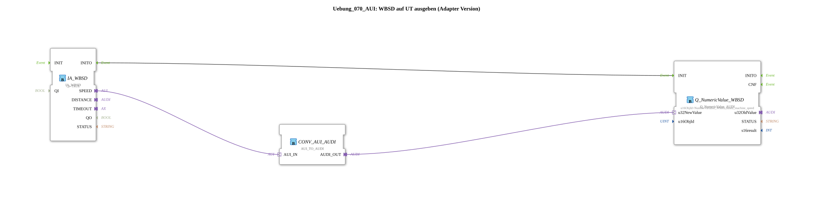

# Exercise_070_AUI: Outputting WBSD to a UT (Adapter Version)

* * * * * * * * * *
## Introduction

This exercise demonstrates the output of wheel-based machine speed (WBSD) to a Universal Terminal (UT) using adapters. Unlike the basic exercise (Exercise_070), this exercise uses an adapter-based connection between the sensor interface and the output module. Communication is via the proprietary AUI protocol, which must be converted to an AUDI protocol for connection to the UT module.
## Function Blocks Used (FBs)

The exercise consists of three predefined function blocks connected in the SubApp network:

- **IA_WBSD** – Input adapter for wheel-based machine speed
- **Q_NumericValue_WBSD** – Output block for displaying the numeric value on the UT
- **CONV_AUI_AUDI** – Adapter converter from AUI to AUDI

### IA_WBSD

- **Type**: `isobus::tecu::IA_WBSD`
- **Parameters**:
- `QI` = `TRUE` (Block is active)
- **Functionality**:

The block provides the current speed data (wheel-based machine speed) via an **adapter output** (`SPEED`) Available. It serves as an interface to the vehicle's sensors.

### Q_NumericValue_WBSD

- **Type**: `isobus::UT::Q::Q_NumericValue_AUDI`
- **Parameters**:
- `u16ObjId` = `NumberVariable_Wheel_based_machine_speed` (reference to the object ID of the numeric variable entry in the UT)
- **Functionality**:

This function block sends a numeric value to the Universal Terminal. The object ID determines which variable (here, the wheel speed) is visualized on the UT.

### CONV_AUI_AUDI

- **Type**: `adapter::conversion::unidirectional::AUI_TO_AUDI`
- **Parameters**: none
- **Function**:

This function block converts the AUI adapter interface (`AUI_IN`) into an AUDI adapter interface (`AUDI_OUT`). This enables communication between the IA_WBSD (AUI-based) and the Q_NumericValue_WBSD (AUDI-based).

## Program Flow and Connections

The data flow in the exercise is as follows:

1. The **IA_WBSD** function block acquires the wheel-based machine speed and makes it available via the adapter output `SPEED`.
2. The connection `IA_WBSD.SPEED → CONV_AUI_AUDI.AUI_IN` transmits the AUI signal to the conversion block.
3. **CONV_AUI_AUDI** converts the AUI protocol to the AUDI protocol and outputs the result at output `AUDI_OUT`.
4. The connection `CONV_AUI_AUDI.AUDI_OUT → Q_NumericValue_WBSD.u32NewValue` delivers the converted data value to the output block.
5. **Q_NumericValue_WBSD** sends the value under the assigned object ID (`NumberVariable_Wheel_based_machine_speed`) to the UT, where the speed is displayed.

All communication takes place exclusively via adapter connections – neither event nor data lines in the conventional sense are used.

## Summary

The exercise **Exercise_070_AUI** covers the following learning content:

- Using **adapter connections** in IEC 61499 applications
- **Protocol conversion** between AUI and AUDI using specialized conversion blocks
- **Output of numeric variables** on a Universal Terminal via predefined object IDs
- Understanding the **data flow** between the sensor interface (IA) and the UT output (Q)

The difficulty level is classified as **advanced**, as basic knowledge of adapter interfaces and the UT system is required. The exercise can be loaded and simulated directly in the 4diac IDE.

---

### 🌐 Related topic subpages on ms-muc-docs.de

* [🌐 Eclipse 4diac IDE & Color Reference on ms-muc-docs.de](https://www.ms-muc-docs.de/iec-61499/eclipse-4diac/)

]
