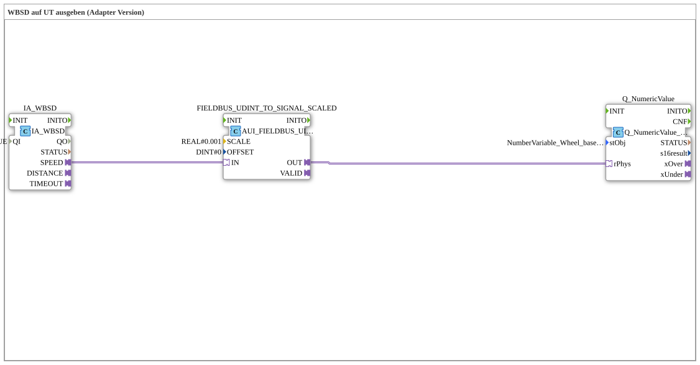

# Exercise_070c_AUI: Outputting WBSD to UT (Adapter Version)

*No image available.*

* * * * * * * * * *
## Introduction

This exercise demonstrates how to acquire a wheel-based machine speed (WBSD) via ISOBUS and output it to a UT (Universal Terminal). The implementation is a sub-application (SubApp) and uses adapter connections for communication between the function blocks. The goal is to scale the input value using an adapter and output it as a numerical value to the UT.

## Function Blocks Used

The SubApp contains three function blocks connected via adapters. There are no further sub-blocks (the SubApp type itself is the top level).

### IA_WBSD

- **Type**: `isobus::tecu::IA_WBSD`

- **Description**: This function block provides the adapter for wheel-based speed (WBSD). It outputs a speed value via the output adapter `SPEED`.

- **Parameters**:

- `QI` = `TRUE` (Qualifier for activation)

### FIELDBUS_UDINT_TO_SIGNAL_SCALED

- **Type**: `logiBUS::signalprocessing::fieldbus::AUI_FIELDBUS_UINT_TO_SIGNAL_SCALED`

- **Description**: This function block scales the incoming integer value (UDINT) into a physical signal value. It is used to convert the speed value supplied by `IA_WBSD` into a unit understandable to the UT.
...### FIELDBUS_UDINT_TO_SIGNAL_SCALED

### FIELDBUS_UDINT_TO_SIGNAL_SCALED

### FIELDBUS_UDINT_TO_SIGNAL_SCALED

### FIELDBUS_UDINT_TO_SIGNAL_SCALED

### FIELDBUS_UDINT_TO_SIGNAL_SCALED

### FIELDBUS_UDINT_TO_SIGNAL_SCALED

### FIELDBUS_UDINT_TO_SIGNAL_SCALED

### FIELDBUS_UDINT_TO_SIGNAL_S - **Parameters**:

- `SCALE` = `REAL#0.001` (Scaling Factor)

- `OFFSET` = `DINT#0` (Offset)

### Q_NumericValue

- **Type**: `isobus::UT::Q::Q_NumericValue_PHYSA`

- **Description**: This function block displays a numeric value (e.g., speed) on the Universal Terminal. It references a UT variable from the ISOBUS pool.

### Q_NumericValue

- **Type**: `isobus::UT::Q::Q_NumericValue_PHYSA`

- **Description**: This function block displays a numeric value (e.g., speed) on the Universal Terminal. It references a UT variable from the ISOBUS pool. - **Parameters**:

- `stObj` = `NumberVariable_Wheel_based_machine_speed` (Reference to the corresponding variable in the UT pool; imported from `Uebungen::const::UT::TECU::DefaultPool_TECU_Numeric`)

## Program Flow and Connections

The SubApp has no dedicated input/output interfaces (SubAppInterfaceList is empty). All data processing is performed internally via adapter connections:

1. The block `IA_WBSD` receives the wheel-based speed (presumably from the ISOBUS network) and outputs it via its adapter output `SPEED`.

2. `SPEED` is forwarded via an adapter connection to the input `IN` of the scaling block `FIELDBUS_UDINT_TO_SIGNAL_SCALED`. 3. The scaling block multiplies the value by `0.001` and adds no offset (0). The result is available at output `OUT`.

4. The scaled signal is then passed via another adapter connection to the `rPhys` input of block `Q_NumericValue`.

5. Block `Q_NumericValue` sets the received physical value to the UT variable `NumberVariable_Wheel_based_machine_speed`, so that the speed is displayed at the terminal.

**Special Features**:

- The exercise operates **without external events** – the blocks are purely data-driven (no visible event connections).

- The adapters used allow for flexible coupling of the functions without requiring all blocks to be on the same network.

- The UT variable must be present in the target system as `NumberVariable_Wheel_based_machine_speed` (imported from the pool `DefaultPool_TECU_Numeric`).

## Summary

Exercise `Uebung_070c_AUI` demonstrates the scaled output of a wheel-based machine speed to a Universal Terminal using adapter technology. The value is first acquired via the ISOBUS adapter, scaled by a factor of 0.001, and then displayed as a numerical variable on the UT. This procedure is typical for connecting sensor data to a user interface in agricultural machinery according to the ISOBUS standard.