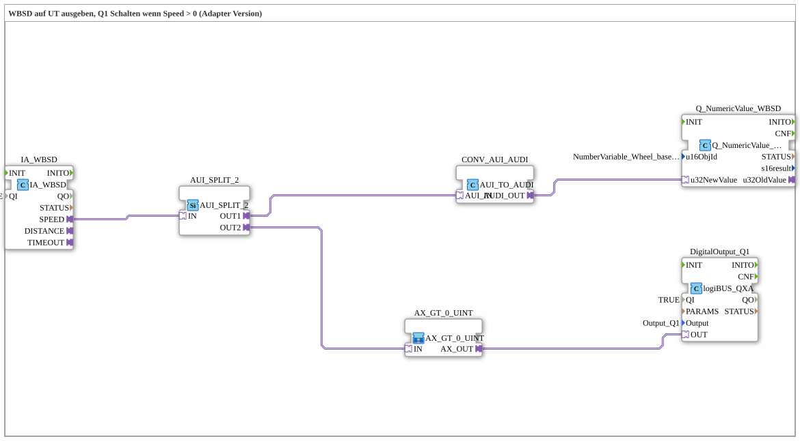

# Exercise_071_AUI: Output WBSD to UT, Switch Q1 when Speed > 0 (Adapter Version)

* * * * * * * * * *
## Introduction
This exercise demonstrates the use of adapters and a custom sub-app to output the **Wheel Based Machine Speed (WBSD)** from an ISOBUS IA WBSD block via the **Universal Task (UT)** and simultaneously switch a digital output Q1 as soon as the speed is greater than 0. All communication takes place via adapter interfaces, which enables a modular and type-safe connection of the function blocks.
## Function Blocks (FBs) Used
### Main FBs (at the top level)
- **IA_WBSD**: `isobus::tecu::IA_WBSD`

ISOBUS adapter block for the Wheel Based Machine Speed. Parameter: `QI` = TRUE (enabled).

- **Q_NumericValue_WBSD**: `isobus::UT::Q::Q_NumericValue_AUDI`

Block for sending a numeric value (speed) to the UT. Parameter: `u16ObjId` = `NumberVariable_Wheel_based_machine_speed` (object reference from a constant pool).

- **DigitalOutput_Q1**: `logiBUS::io::DQ::logiBUS_QXA`

Digital output block for the logiBUS. Parameter: `QI` = TRUE, `Output` = `Output_Q1` (defined constant for the output).

- **CONV_AUI_AUDI**: `adapter::conversion::unidirectional::AUI_TO_AUDI`

Converts an AUI adapter (unidirectional) to an AUDI adapter (unidirectional) – presumably to adapt the interface.

- **AUI_SPLIT_2**: `adapter::events::unidirectional::AUI_SPLIT_2`

Distributes an incoming AUI event to two outputs (OUT1, OUT2) – here for parallel forwarding of speed data.

### Sub-Blocks: `AX_GT_0_UINT`
- **Type**: `MyLib::sys::AX_GT_0_UINT` (user-defined SubApp)
- **Internal Function Blocks Used**: (Details are unavailable as the SubApp is defined externally. It likely contains a comparison block for unsigned integers.)
- **Functionality**:

This SubApp checks if the incoming value (of type UINT) is greater than 0. If so, the output adapter `AX_OUT` is activated. This output then controls the digital output Q1 (via the adapter group with `DigitalOutput_Q1.OUT`).

## Program Flow and Connections

1. The adapter `IA_WBSD` continuously provides the current wheel speed via the adapter output `SPEED` (AUI format).

2. The split block `AUI_SPLIT_2` receives the speed and forwards it to two paths:

- **OUT1** → `CONV_AUI_AUDI` → `Q_NumericValue_WBSD`: The speed is output as a numeric value via the UT (object reference `NumberVariable_Wheel_based_machine_speed`).
- **OUT2** → `AX_GT_0_UINT`: The speed is checked for > 0.

3. If the check is successful, the subapp `AX_GT_0_UINT` activates the output adapter `AX_OUT`.

**OUT2** → `AX_GT_0_UINT` 4. The adapter output `AX_OUT` feeds the input `OUT` of the digital output module `DigitalOutput_Q1`, so that Q1 (e.g., a relay or a lamp) is switched on as long as the speed is greater than 0.

**Learning Objectives**:

- Using ISOBUS and logiBUS modules in 4diac.
- Working with adapters (AUI/AUDI) and adapter splitters.
- Integrating a self-created sub-app (AX_GT_0_UINT) into a larger network.
- Practical automation task: Speed output and threshold monitoring.

**Difficulty Level**: Advanced (basic knowledge of IEC 61499 and adapter concepts required).

**Note**: This exercise is provided as an **adapter version** of the basic exercise `Uebung_071`. A functioning ISOBUS UT and logiBUS output in the target environment is required.

## Summary
Exercise `Uebung_071_AUI` demonstrates a typical agricultural automation task: outputting machine speed to a universal terminal and simultaneously activating a digital output upon movement. All communication connections were implemented using adapters, increasing the reusability and interchangeability of the modules. The use of the sub-app `AX_GT_0_UINT` illustrates how custom, small logic modules can be integrated decentrally into the overall system.

## Summary ---

### 🌐 Related topic subpages on ms-muc-docs.de
* [🌐 Eclipse 4diac IDE & Color Reference on ms-muc-docs.de](https://www.ms-muc-docs.de/iec-61499/eclipse-4diac/)

]
