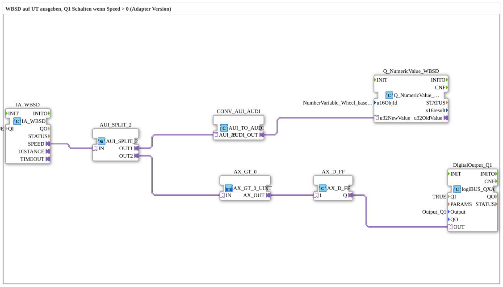

# Exercise_071a_AUI: Output WBSD to UT, Switch Q1 when Speed > 0 (Adapter Version)

(Output WBSD to UT, Switch Q1 when Speed > 0 – Adapter Version)

* * * * * * * * * *
## Introduction

This exercise demonstrates the use of adapter interfaces (AUI/AUDI) in 4diac to read a wheel-based machine speed (WBSD), display it on a Universal Terminal (UT), and switch a digital output (Q1) when the speed is greater than zero. All the logic is implemented as a sub-application using adapter connections.

*
## Function Blocks (FBs) Used

### Sub-Block: `AX_GT_0`

- **Type**: `MyLib::sys::AX_GT_0_UINT` (SubApp)
- **Internal FBs Used**: Not specified (belongs to the library `MyLib::sys`)
- **Functionality**: This block receives an integer value via an adapter input (AUI) and checks if it is greater than zero. A Boolean signal (TRUE/FALSE) representing the result of the comparison is provided at output `AX_OUT`.

### Other Function Blocks Used

| Block Name | Type | Parameters | Short Description |
|--------------|-----|-----------|------------------|
| `IA_WBSD` | `isobus::tecu::IA_WBSD` | `QI` = TRUE | Returns the wheel-based machine speed via an AUI interface. |
| `AUI_SPLIT_2` | `adapter::events::unidirectional::AUI_SPLIT_2` | – | Distributes an incoming AUI signal to two identical outputs. |
| `CONV_AUI_AUDI` | `adapter::conversion::unidirectional::AUI_TO_AUDI` | – | Converts an AUI signal to the AUDI format expected by UT display modules. |
| `Q_NumericValue_WBSD` | `isobus::UT::Q::Q_NumericValue_AUDI` | `u16ObjId` = `NumberVariable_Wheel_based_machine_speed` | Displays the numerical value of the speed on the UT (object ID from the pool configuration). |
| `AX_GT_0` | `MyLib::sys::AX_GT_0_UINT` | – (SubApp) | Checks if the incoming value is > 0 (see above). |
| `AX_D_FF` | `adapter::events::unidirectional::AX_D_FF` | – | Sets a flip-flop that maintains the Boolean state and passes it to the output. |
| `DigitalOutput_Q1` | `logiBUS::io::DQ::logiBUS_QXA` | `QI` = TRUE, `Output` = `Output_Q1` | Switches the digital output Q1 of the logiBUS module according to the incoming signal. |

## Program Flow and Connections

1. The function block `IA_WBSD` provides the current machine speed as an AUI data signal.
2. This signal is forwarded via an adapter connection to `AUI_SPLIT_2`, which splits it into two parallel paths:
- **Path 1 (Display)**: The AUI signal is converted into an AUDI signal via `CONV_AUI_AUDI`. This is then passed to `Q_NumericValue_WBSD`, which displays the numerical value on the Universal Terminal (UT). The object ID `NumberVariable_Wheel_based_machine_speed` determines which parameter of the pool configuration is displayed.
- **Path 2 (Threshold Check)**: The AUI signal is directly connected to the sub-block `AX_GT_0`. This checks whether the value is greater than zero.
3. The result of the check (`AX_OUT`) is passed to the flip-flop block `AX_D_FF`. This stabilizes the signal and prevents momentary fluctuations.
4. The output of `AX_D_FF` is routed to `DigitalOutput_Q1` via an adapter connection. If the speed is > 0, `DigitalOutput_Q1` activates the logiBUS output Q1; otherwise, Q1 remains off.

**Dependencies**:

- The constants `NumberVariable_Wheel_based_machine_speed` and `Output_Q1` must be defined in the project as `Uebungen::const::UT::TECU::DefaultPool_TECU` and `logiBUS::io::DQ::logiBUS_DO`, respectively.
- The function block `logiBUS_QXA` requires a valid logiBUS hardware configuration.

## Summary

Exercise **Exercise_071a_AUI** demonstrates a typical application of adapter interfaces in automation technology using 4diac. The learner will become familiar with the following concepts:

- **Adapter splitting, conversion, and forwarding** (AUI, AUDI)
- **Reading an ISOBUS sensor** (WBSD) and displaying it on a UT
- **Threshold comparison** and **flip-flop logic** for reliable output circuitry
- **Integration of logiBUS outputs** into a control program

After successful completion, the participant will understand the data flow structure with adapters and be able to independently implement similar tasks.

--

### 🌐 Related topic subpages on ms-muc-docs.de

* [🌐 Eclipse 4diac IDE & color reference on ms-muc-docs.de](https://www.ms-muc-docs.de/iec-61499/eclipse-4diac/)

]
