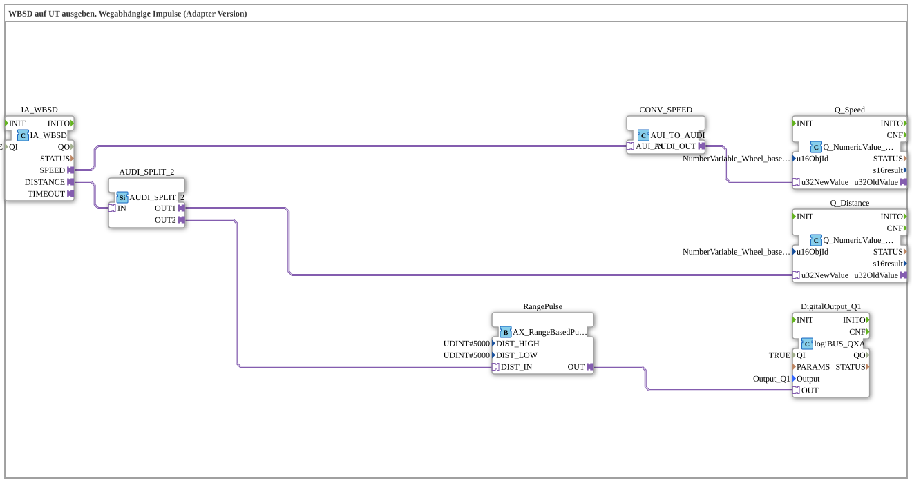

# Exercise_071b_AUI: Outputting WBSD to UT, Position-Dependent Pulses (Adapter Version)

* * * * * * * * * *
## Introduction

This exercise demonstrates the output of Wheel-Based Speed (WBSD) and Wheel-Based Distance (WBD) to a Universal Terminal (UT). Additionally, a position-dependent pulse is generated: Every 10 meters (5 meters HIGH, 5 meters LOW), a digital output switches. This is implemented using adapter interfaces and illustrates the typical data processing chain from ISOBUS sensor acquisition to UT display and logiBUS output.
## Function Blocks (FBs) Used

- **IA_WBSD** (`isobus::tecu::IA_WBSD`)
- Parameter: `QI` = `TRUE`
- Reads the vehicle's wheel-based speed and distance (ISOBUS-TECU interface).
- **AUDI_SPLIT_2** (`adapter::events::unidirectional::AUDI_SPLIT_2`)
- Distributes an incoming AUDI signal to two identical outputs (OUT1, OUT2).
- **CONV_SPEED** (`adapter::conversion::unidirectional::AUI_TO_AUDI`)
- Converts the AUI signal from the WBSD interface into an AUDI signal that can be processed by the UT and logiBUS blocks.
- **Q_Speed** (`isobus::UT::Q::Q_NumericValue_AUDI`)
- Parameter: `u16ObjId` = `NumberVariable_Wheel_based_machine_speed`
- Displays the current speed on the Universal Terminal.
- **Q_Distance** (`isobus::UT::Q::Q_NumericValue_AUDI`)
- Parameter: `u16ObjId` = `NumberVariable_Wheel_based_machine_distance`
- Displays the current distance on the Universal Terminal.
- **RangePulse** (`logiBUS::signalprocessing::distance::AX_RangeBasedPulse`)
- Parameters: `DIST_HIGH` = `5000`, `DIST_LOW` = `5000`
- Generates a pulsating signal (HIGH/LOW) for every 10-meter change in distance (5 meters HIGH, 5 meters LOW).
- **DigitalOutput_Q1** (`logiBUS::io::DQ::logiBUS_QXA`)
- Parameters: `QI` = `TRUE`, `Output` = `Output_Q1`
- Switches the logiBUS digital output Q1 according to the received signal.

## Program Flow and Connections

1. **Speed**

IA_WBSD.SPEED` → `CONV_SPEED.AUI_IN` → `CONV_SPEED.AUDI_OUT` → `Q_Speed.u32NewValue`

The wheel-based speed is converted into an audio signal via an adapter converter and displayed directly on the UT (Universal Display).

2. **Distance**

IA_WBSD.DISTANCE` → `AUDI_SPLIT_2.IN`

The distance information is split into two parallel paths:

- **Path 1 (UT Display)**: `AUDI_SPLIT_2.OUT1` → `Q_Distance.u32NewValue`

The distance is also displayed on the UT.

- **Path 2 (Pulse Generation)**: `AUDI_SPLIT_2.OUT2` → `RangePulse.DIST_IN` → `RangePulse.OUT` → `DigitalOutput_Q1.OUT`

The `RangePulse` module monitors the distance change and generates a pulse when the 5m HIGH and 5m LOW thresholds are reached. This signal is passed to digital output Q1, causing Q1 to switch periodically with a 10-meter cycle.

**Learning Objectives**

- Understand adapter-based signal processing between ISOBUS, UT, and logiBUS.
- Apply the splitting of a data signal to two separate processing paths.
- Implement position-dependent pulses using a distance pulse generator.

**Difficulty Level**: Medium
**Prerequisites**: Basic knowledge of 4diac IDE, ISOBUS, and logiBUS function blocks.

**Getting Started**: The SubApp template can be directly imported into a 4diac project and executed with a valid hardware configuration (e.g., TECU controller).

## Summary

This exercise demonstrates a complete chain from ISOBUS sensor data acquisition through adapter conversion and signal splitting to UT display and a position-dependent digital output. The wheel-based distance is used to generate a pulse on a logiBUS output every 10 meters. This implements the typical application of "outputting WBSD to UT with position pulses" in an adapter-based version.

---

### 🌐 Related topic subpages on ms-muc-docs.de

* [🌐 Eclipse 4diac IDE & color reference on ms-muc-docs.de](https://www.ms-muc-docs.de/iec-61499/eclipse-4diac/)

]
