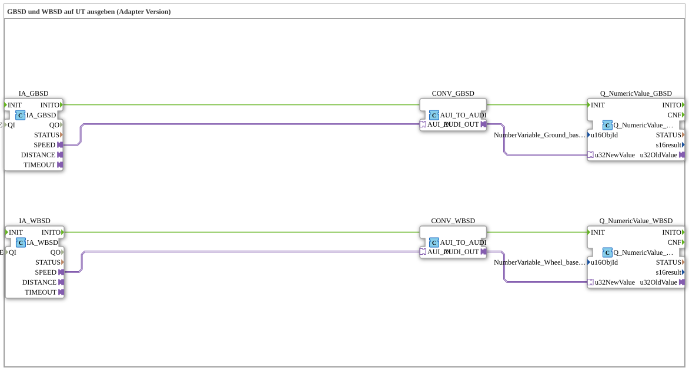

# Exercise_072_AUI: Outputting GBSD and WBSD to a UT (Adapter Version)

* * * * * * * * * *
## Introduction
This exercise demonstrates how to read the vehicle-based speed (Ground-Based Machine Speed – GBSD) and the wheel-based speed (Wheel-Based Machine Speed – WBSD) of an ISOBUS TECU (Tractor Electronic Control Unit) via an interface adapter (AUI) and display it on a Universal Terminal (UT).
The speed data provided by the adapters is first converted into a numeric AUDI interface using a unidirectional converter and then output via corresponding UT display blocks. The object IDs used are taken from a predefined constant pool.

## Function Blocks (FBs) Used

### Sub-Blocks: `IA_GBSD`
- **Type**: `isobus::tecu::IA_GBSD`
- **Parameters**:
- `QI` = `TRUE`
- **Event Output**: `INITO`
- **Adapter Output**: `SPEED` (AUI Interface)
- **Functionality**:

This block reads the current vehicle-based speed (GBSD) from the TECU and provides it as an AUI object via the adapter output `SPEED`. The parameter `QI` must be set to `TRUE` to enable data querying.

```
### Sub-Blocks: `IA_WBSD`

- **Type**: `isobus::tecu::IA_WBSD`
- **Parameters**:
- `QI` = `TRUE`
- **Event Output**: `INITO`
- **Adapter Output**: `SPEED` (AUI Interface)
- **Functionality**:

Similar to `IA_GBSD`, this block provides the wheel-based speed (WBSD) of the TECU as an AUI object via the adapter output `SPEED`.

### Sub-modules: `CONV_GBSD`
- **Type**: `adapter::conversion::unidirectional::AUI_TO_AUDI`
- **Adapter input**: `AUI_IN`
- **Adapter output**: `AUDI_OUT`
- **Function**:

The converter transforms the incoming AUI interface (e.g., a speed value) into a numeric AUDI interface. This AUDI signal is expected by the UT display modules as a 32-bit value.

### Sub-modules: `CONV_WBSD`
- **Type**: `adapter::conversion::unidirectional::AUI_TO_AUDI`
- **Adapter input**: `AUI_IN`
- **Adapter output**: `AUDI_OUT`
- **Function**:

Identical to `CONV_GBSD`. Converts the AUI signal of the wheel-based speed into an AUDI signal.

### Sub-Blocks: `Q_NumericValue_GBSD`
- **Type**: `isobus::UT::Q::Q_NumericValue_AUDI`
- **Parameters**:
- `u16ObjId` = `Uebungen::const::UT::TECU::DefaultPool_TECU::NumberVariable_Ground_based_machine_speed`
- **Event Input**: `INIT`
- **Data Input**: `u32NewValue` (AUDI Interface)
- **Functionality**:

This block displays a numeric value on the Universal Terminal. The variable representing the value is determined by the passed object ID (`u16ObjId`). After an INIT event, the value at the data input is updated on the UT.

### Sub-modules: `Q_NumericValue_WBSD`
- **Type**: `isobus::UT::Q::Q_NumericValue_AUDI`
- **Parameters**:
- `u16ObjId` = `Uebungen::const::UT::TECU::DefaultPool_TECU::NumberVariable_Wheel_based_machine_speed`
- **Event Input**: `INIT`
- **Data Input**: `u32NewValue` (AUDI Interface)
- **Functionality**:

Same functionality as `Q_NumericValue_GBSD`, but for wheel-based speed.

## Program Flow and Connections

1. **Initialization**:

Both interface adapters (`IA_GBSD` and `IA_WBSD`) are parameterized with `QI = TRUE`. After system startup, they generate an event at output `INITO`.

2. **Event Chaining**:

The event `INITO` from `IA_GBSD` is directly connected to input `INIT` from `Q_NumericValue_GBSD`.

Accordingly, `INITO` is connected to `IA_WBSD` and `INIT` to `Q_NumericValue_WBSD`. This initializes the UT display blocks after the data is read.

3. **Data Flow (Adapter Connections)**:

- The adapter output `SPEED` of `IA_GBSD` (AUI interface) is connected to the adapter input `AUI_IN` of the converter `CONV_GBSD`.
- The converter `CONV_GBSD` converts the AUI interface into an AUDI interface and outputs it at its adapter output `AUDI_OUT`.
- This output is connected to the data input `u32NewValue` of `Q_NumericValue_GBSD`.
- The same applies to the wheel-based speed (`IA_WBSD` → `CONV_WBSD` → `Q_NumericValue_WBSD`).

4. **Result**:

Two numerical values appear on the UT: the vehicle-based speed (GBSD) and the wheel-based speed (WBSD). The values are provided via the configured object IDs in the TECU's variable pool.

**Learning Objectives**:

- Understanding the AUI and AUDI interface concepts in ISOBUS applications.
- Using unidirectional adapters for interface conversion.
- Connecting TECU outputs to UT display modules.

## Summary

This exercise demonstrates the complete signal chain from reading two speed parameters from an ISOBUS TECU, through adapter-based conversion, to displaying them on a Universal Terminal. The clear separation of adapter and data interfaces supports the reusability of the function blocks and enables flexible connection to different UT configurations.
