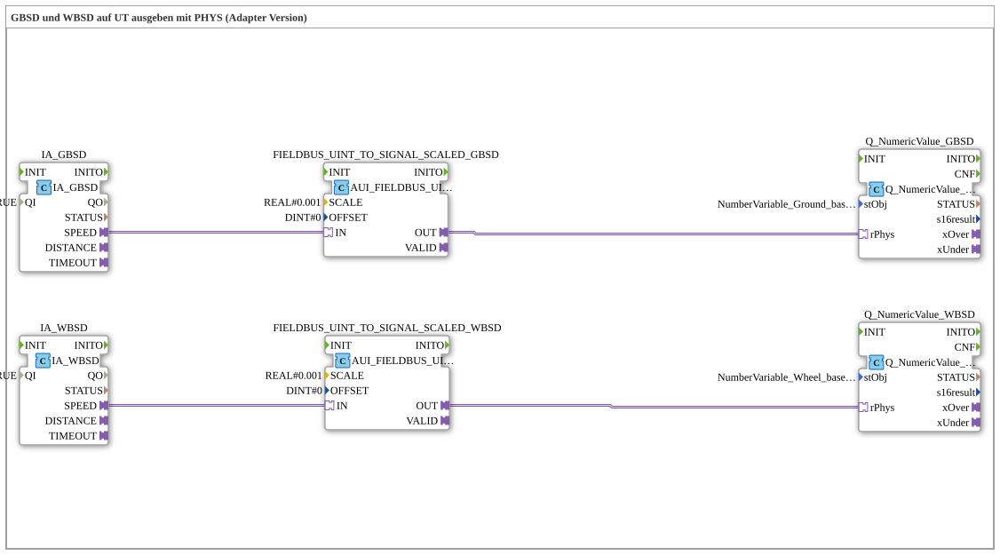

# Exercise_072c_AUI: Outputting GBSD and WBSD to a UT using PHYS (Adapter Version)

* * * * * * * * * *
## Introduction
This exercise demonstrates the behavior of the function blocks `IA_GBSD` (Ground Based Machine Speed) and `IA_WBSD` (Wheel Based Machine Speed) on an ISOBUS Universal Terminal (UT). The digital speed values (UINT) supplied by the respective ISOBUS applications are converted into physical values using a scaling function block and then displayed on the terminal via a UT adapter (`Q_NumericValue_PHYSA`). The scaling is performed with a decimal accuracy of 0.001 (e.g., conversion from mm/s to m/s).

## Function Blocks (FBs) Used
- **IA_GBSD** (Type: `isobus::tecu::IA_GBSD`)
- Parameter: `QI` = TRUE
- Returns a UINT value for the speed-based machine speed via the adapter output `SPEED`.
- **IA_WBSD** (Type: `isobus::tecu::IA_WBSD`)
- Parameter: `QI` = TRUE
- Returns a UINT value for the wheel-based machine speed via the adapter output `SPEED`.
- **FIELDBUS_UINT_TO_SIGNAL_SCALED_GBSD** (Type: `logiBUS::signalprocessing::fieldbus::AUI_FIELDBUS_UINT_TO_SIGNAL_SCALED`)
- Parameters:
- `SCALE` = REAL#0.001
- `OFFSET` = DINT#0
- Scales the incoming UINT value (IN) by a factor of 0.001 and outputs the result as a REAL signal (OUT).
- **FIELDBUS_UINT_TO_SIGNAL_SCALED_WBSD** (Type: `logiBUS::signalprocessing::fieldbus::AUI_FIELDBUS_UINT_TO_SIGNAL_SCALED`)
- Parameters:
- `SCALE` = REAL#0.001
- `OFFSET` = DINT#0
- Same functionality as the function block for GBSD.
- **Q_NumericValue_GBSD** (Type: `isobus::UT::Q::Q_NumericValue_PHYSA`)
- Parameters: `stObj` = `NumberVariable_Ground_based_machine_speed` (imported from `Uebungen::const::UT::TECU::DefaultPool_TECU_Numeric`)
- Represents the physical value (rPhys) on the UT.
- **Q_NumericValue_WBSD** (Type: `isobus::UT::Q::Q_NumericValue_PHYSA`)
- Parameters: `stObj` = `NumberVariable_Wheel_based_machine_speed` (imported from the same pool)
- Same functionality as the function block for GBSD.

## Program Flow and Connections

1. **Speed Acquisition**

- The function blocks `IA_GBSD` and `IA_WBSD` are operated with `QI` active and continuously deliver current speed values as UINT data at their adapter outputs `SPEED`.

2. **Scaling**

- The output `SPEED` of `IA_GBSD` is connected to the input `IN` of `FIELDBUS_UINT_TO_SIGNAL_SCALED_GBSD` via an adapter connection.
- Similarly, `SPEED` from `IA_WBSD` is connected to the input `IN` of `FIELDBUS_UINT_TO_SIGNAL_SCALED_WBSD`.
- Both scaling blocks multiply the incoming UINT value by `0.001` (no offset) and output the result as a REAL value.

3. **Output on the UT**

- The scaled value (output `OUT` of the scaling block) is fed as a data source to the `rPhys` input of the respective `Q_NumericValue_PHYSA` block.

These building blocks are configured with the corresponding UT objects (`NumberVariable_Ground_based_machine_speed` and `NumberVariable_Wheel_based_machine_speed`) and display the values on the Universal Terminal.

**Learning Objectives:**

- Understanding the use of adapter connections in 4diac.
- Implementing physical scaling of raw fieldbus data.
- Integrating ISOBUS application blocks with UT output blocks.

**Difficulty Level:** Medium
**Prerequisites:** Basic knowledge of the 4diac IDE, ISOBUS terminal configuration, working with adapters.

## Summary

This exercise demonstrates the continuous data flow from the ISOBUS application (IA_GBSD / IA_WBSD) through linear scaling (factor 0.001) to the visual display on a Universal Terminal. The use of adapters simplifies the connection of different component interfaces and enables a modular structure. As a result, the current speed-based and wheel-based machine speeds are displayed physically correctly on the UT.

---

### 🌐 Related topic subpages on ms-muc-docs.de
* [🌐 Eclipse 4diac IDE & color reference on ms-muc-docs.de](https://www.ms-muc-docs.de/iec-61499/eclipse-4diac/)

]