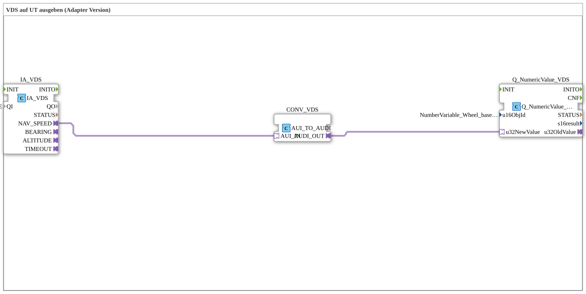

# Exercise_073_AUI: Outputting VDS to UT (Adapter Version)

* * * * * * * * * *

## Introduction

This exercise demonstrates how to output a speed value from the VDS (Vehicle Data Server) as a numerical value to the UT (Universal Terminal) via an adapter conversion. A special adapter block is used to convert the data type from AUI (Application User Interface) to AUDI (Application User Data Interface). The configuration is implemented as a subapplication.

## Function Blocks (FBs) Used

| Block Name | Type | Parameters | Short Description |
| --- | --- | --- | --- |
| **IA_VDS** | `isobus::tecu::IA_VDS` | QI = TRUE | Establishes the connection to the VDS and provides the value for the wheel-based machine speed via the adapter output `NAV_SPEED`. |
| **CONV_VDS** | `adapter::conversion::unidirectional::AUI_TO_AUDI` | – | Converts the AUI adapter interface to an AUDI interface so that the data value can be passed on to subsequent UT blocks. |
| **Q_NumericValue_VDS** | `isobus::UT::Q::Q_NumericValue_AUDI` | u16ObjId = `NumberVariable_Wheel_based_machine_speed` | Displays the received numeric value on the UT display. The object ID refers to the variable for the wheel-based machine speed. |

## Program Flow and Connections

The subapplication operates in three steps:

1. The **IA_VDS** block continuously reads the current machine speed from the VDS. The value is provided via the adapter output `NAV_SPEED` (type AUI).
2. The **converter** block `CONV_VDS` (AUI_TO_AUDI) converts the AUI interface into an AUDI interface. This is necessary because the subsequent UT block expects an AUDI input.
3. The converted value is passed via the AUDI output `CONV_VDS.AUDI_OUT` to the data input `u32NewValue` of the **Q_NumericValue_VDS** block. This is configured with the object ID `NumberVariable_Wheel_based_machine_speed` and displays the speed value on the Universal Terminal.

The following adapter connections implement the data flow:

- `IA_VDS.NAV_SPEED` → `CONV_VDS.AUI_IN`
- `CONV_VDS.AUDI_OUT` → `Q_NumericValue_VDS.u32NewValue`

## Summary

This exercise illustrates the use of adapter modules for interface conversion (AUI ↔ AUDI) within an ISOBUS application. The clear separation of data source (VDS), conversion, and output (UT) results in a modular and reusable design. The subapplication can be easily integrated into higher-level applications.
